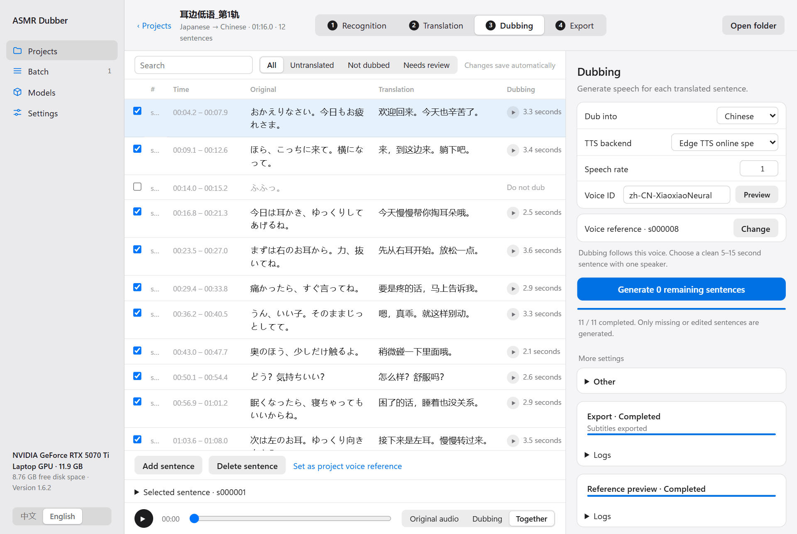
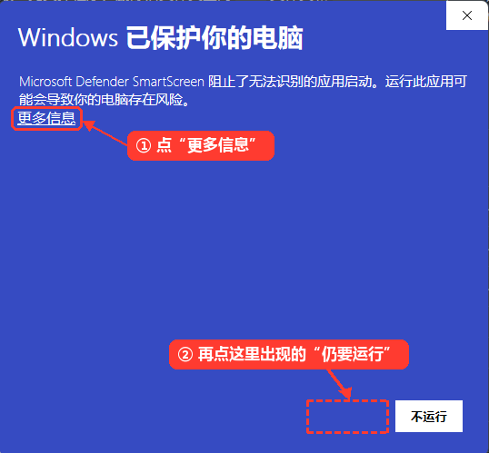
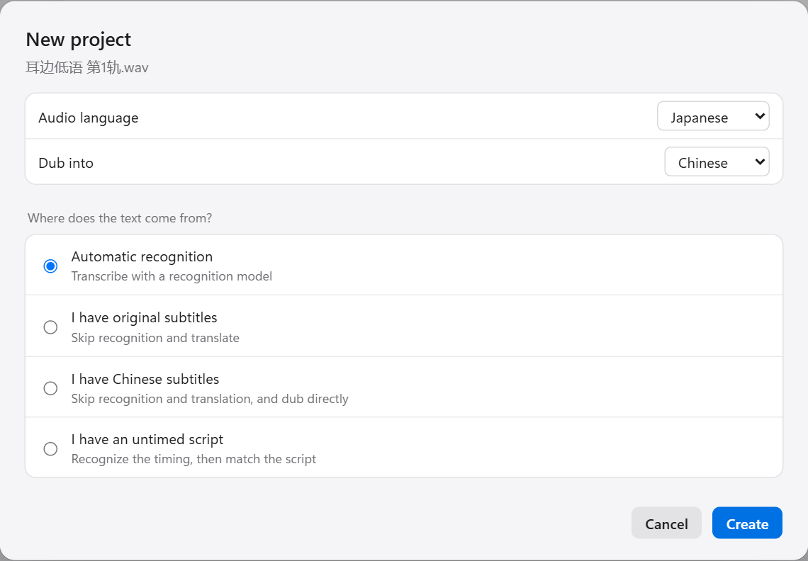

[中文](README.md) | English

# ASMR Dubber

**Dub audio works into another language. Wherever the original voice is, the dub is there too.**

Recognition, translation, voice-cloned dubbing, mixing and subtitles in one program.

Works with Japanese, English and Chinese audio or video, and dubs into Chinese or English.

[Download](https://github.com/EveningStudy/asmr-dubber/releases/latest) · [Get started](#get-started-in-three-minutes) · [User guide](docs/en/USER_GUIDE.md) · [All docs](docs/en/INDEX.md)

## Listen first

Headphones recommended.

### Sample 1 · RTF

Bilingual audio: the Japanese original is retained and mixed with Chinese dubbing processed by RTF (original spatial-cue transfer).

https://github.com/user-attachments/assets/2eddb029-1a6d-4daf-8f53-741b46141f4d

### Sample 2 · RTF

Bilingual audio: RTF-processed Chinese dubbing is mixed with the retained Japanese original.

https://github.com/user-attachments/assets/8068b982-95c0-4561-8d18-f82cb8cebb6e

### Sample 3 · RTF

Bilingual audio: the Japanese original plus RTF-processed Chinese dubbing. Compare it with the vocal-separation version below.

https://github.com/user-attachments/assets/4e7618af-ad3d-4931-9749-4b39816d01d8

### Sample 3 · RTF + vocal separation

Chinese replacement dub: separate Japanese vocals from the background, recognize and translate the speech, then synthesize Chinese dubbing. RTF transfers spatial cues from the original to the dub before mixing it with the separated background. Separation may leave Japanese speech or alter sound effects; complete removal is not guaranteed.

https://github.com/user-attachments/assets/a8841fb0-e4f1-4383-92bb-942805ff1adc

[Watch the introduction and demo of an older version on Bilibili](https://www.bilibili.com/video/BV1f43G6YEov/). Please refer to the documents for current information.

[More audio examples](https://space.bilibili.com/3747523753675973) made with this program. Results vary with the source material, models and settings.

Media is used for demonstration; contact the maintainer about rights concerns.

## What it does

| | |
|---|---|
| 🎧 **Any result you want** | A bilingual mix of original plus dub, a replacement mix with the original voice removed, a separate dub track, translated subtitles only, or a video with a cover image. |
| 🧭 **Spatial following** | Voices in these works move from ear to ear and from far to near. The program analyses the position and distance of each original line and places the dub in the same spot instead of leaving it in the centre. |
| 🎼 **Vocal separation** | Splits the original into voice and background, removes the original language, and keeps the background with the dub as a replacement mix. Laughter and sighs that have no dub can keep the original voice. |
| 🗣️ **Voice cloning** | Pick one line of the original as a reference and the dub speaks in that voice. This uses IndexTTS2 on your own GPU. |
| ✍️ **Edit any sentence** | Fix a misheard line, rewrite a translation, and only that sentence is dubbed again. |
| 📦 **A whole work in one go** | Hand a work folder to the Batch page. Every track runs through the full pipeline and can be merged into one file or turned into a video. |
| 📝 **Use existing subtitles** | Original-language subtitles skip recognition. Translated subtitles skip translation too. You can also export subtitles only. |
| 🎚️ **Every parameter is exposed** | Over two hundred settings, folded away until you need them. Changes inside a project affect only that project. |

## Get started in three minutes

The steps below use the most common case, Japanese dubbed into Chinese, as the example.

**1. Download and run.** Get the archive from [Releases](https://github.com/EveningStudy/asmr-dubber/releases/latest), extract it to a short path such as `D:\ASMR-Dubber`, and double-click `ASMR-Dubber.exe`. The interface opens in your browser. You do not need to install Python or anything else first.

On the first run Windows may show "Windows protected your PC". This appears because the program has no paid code-signing certificate, not because something is wrong. Click **More info**, then **Run anyway**.

**2. Download models.** Open **Models** and click **Download both**. This installs Parakeet for Japanese recognition and IndexTTS2 for voice cloning. If the original is English or Chinese, download Faster-Whisper for recognition instead.

**3. Add a translation key.** Open **Settings → Cloud services** and enter an API key for DeepSeek or any provider you have an account with.

**4. Make something.** Go back to **Projects**, drop in an audio file, pick the original and dubbing languages, and follow the four steps at the top: **Recognition → Translation → Dubbing → Export**.

No GPU? It still works. Use the built-in Edge TTS for dubbing (online, fixed voices) and run recognition on the CPU, which is slower.

The full walkthrough with screenshots is in the [user guide](docs/en/USER_GUIDE.md). For Linux, see [Installation and models](docs/en/INSTALLATION.md#linux-and-wsl2).

## Documentation

| I want to… | Read |
|---|---|
| Install the program and download models | [Installation and models](docs/en/INSTALLATION.md) |
| Dub one audio file from start to finish | [User guide](docs/en/USER_GUIDE.md) |
| Process a whole work folder | [Batch processing](docs/en/BATCH.md) |
| Use existing subtitles or a script | [Subtitles and scripts](docs/en/SUBTITLE_WORKFLOW.md) |
| Tune spatial following and volume, or make a replacement mix | [Mixing and spatial following](docs/en/EXPERIMENTAL_AUDIO.md) |
| Have several models cross-check recognition | [Multi-model review](docs/en/AUDIO_REVIEW_TUTORIAL.md) |
| Switch recognition models, dubbing services or translation providers | [Models and services](docs/en/BACKENDS.md) |
| Understand where settings live, free disk space, back up | [Settings and storage](docs/en/CONFIGURATION.md) |
| Look up a parameter | [Parameter reference](docs/en/PARAMETERS.md) |
| Fix an error | [Troubleshooting](docs/en/TROUBLESHOOTING.md) |

For developers: [Architecture](docs/en/ARCHITECTURE.md) · [Command line](docs/en/CLI.md) · [Contributing](CONTRIBUTING.en.md) · [All docs](docs/en/INDEX.md)

## Things to know

- **Your data lives in the program folder.** Projects, models and settings are under `.asmr-dubber`. Copy the whole folder to back up or move.
- **API keys are stored in plain text** at `.asmr-dubber/config/secrets.json`. Do not share that folder.
- **Cloud services receive your content.** Translation sends the script text. Cloud dubbing sends the translation and the reference audio. Nothing is uploaded when you use local models only.
- **Vocal separation and the replacement mix are experimental.** They can leave traces of the original voice and can damage sound effects.

## License

The project code is released under the [MIT](LICENSE) license. Models, runtimes, cloud services, input works and generated content are subject to their own terms; open-source code does not grant rights to them. See [third-party notices](docs/en/THIRD_PARTY_NOTICES.md).

## Friends

- [LINUX DO](https://linux.do/): a new kind of community
