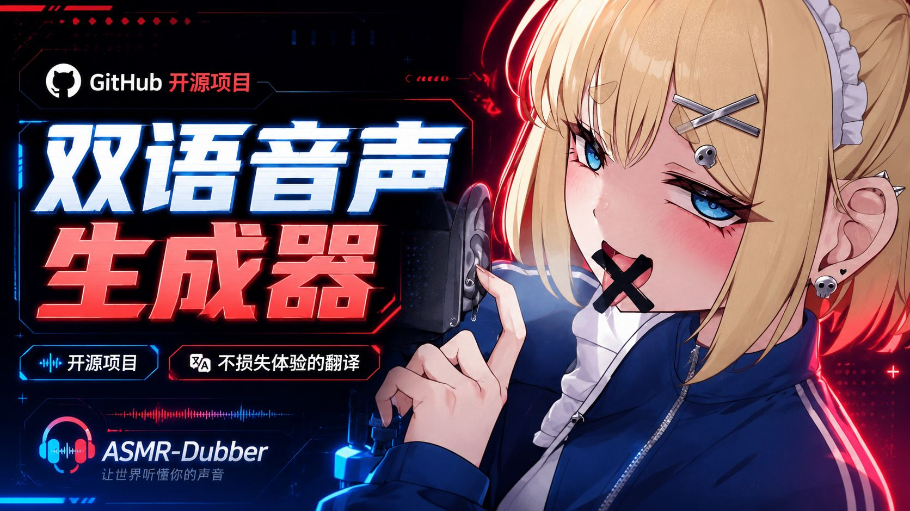
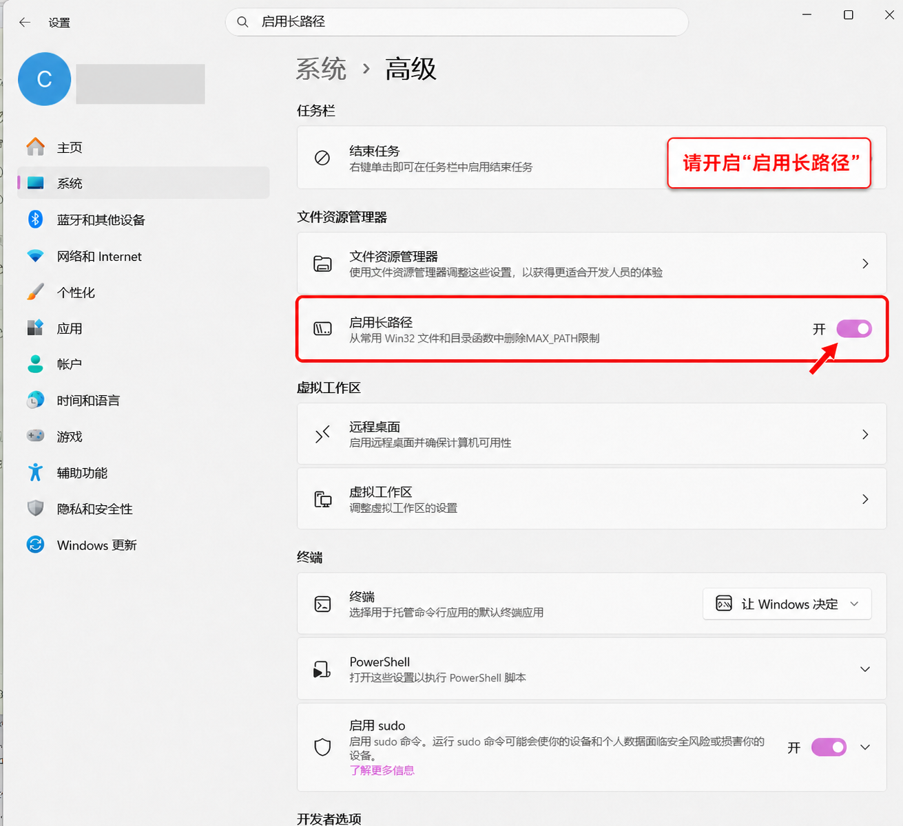
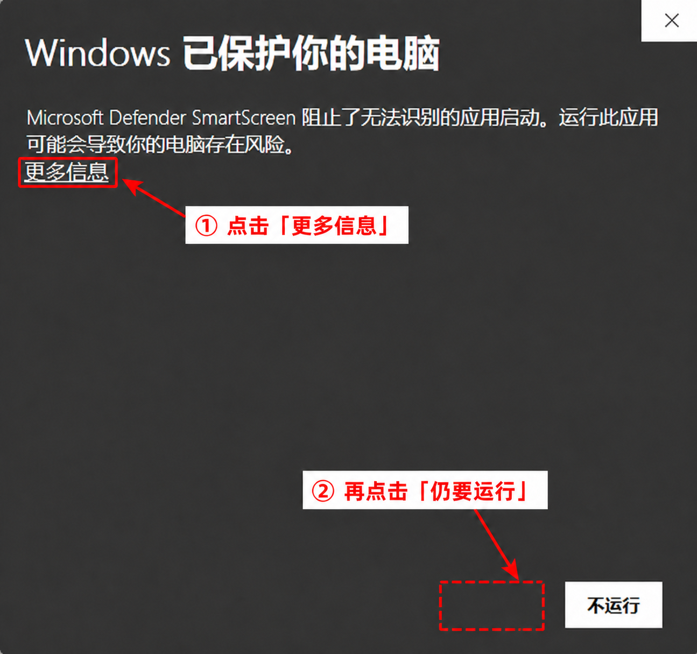
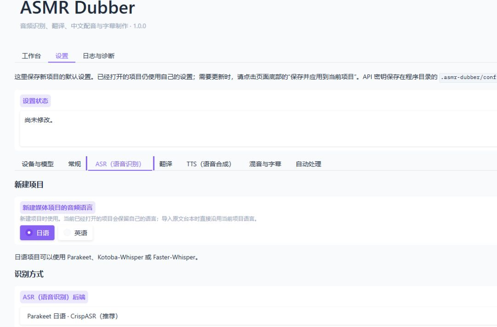
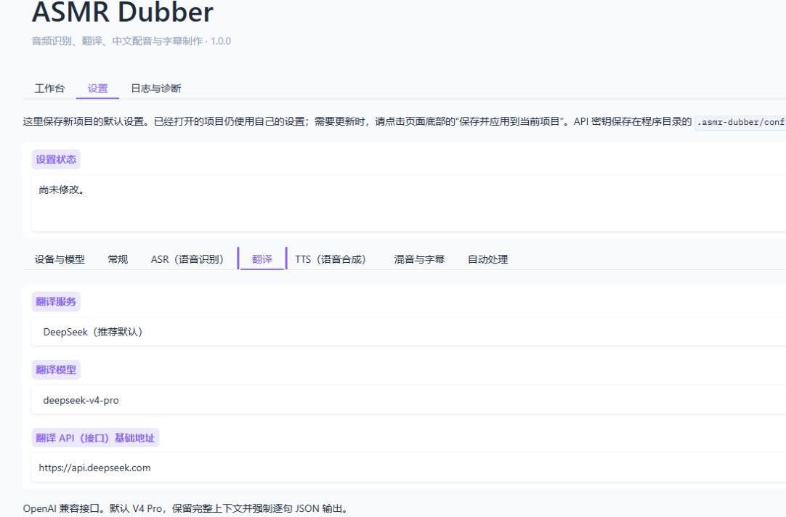
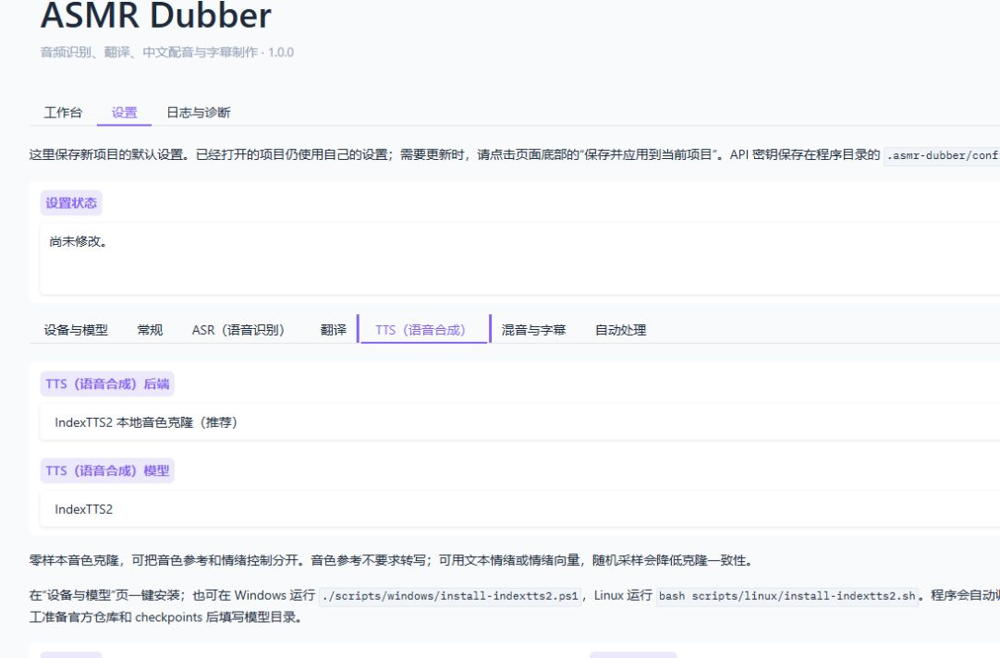
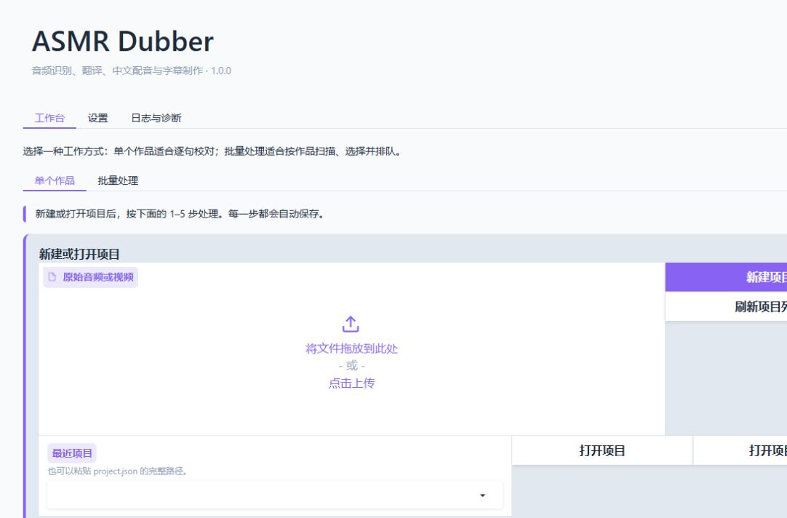
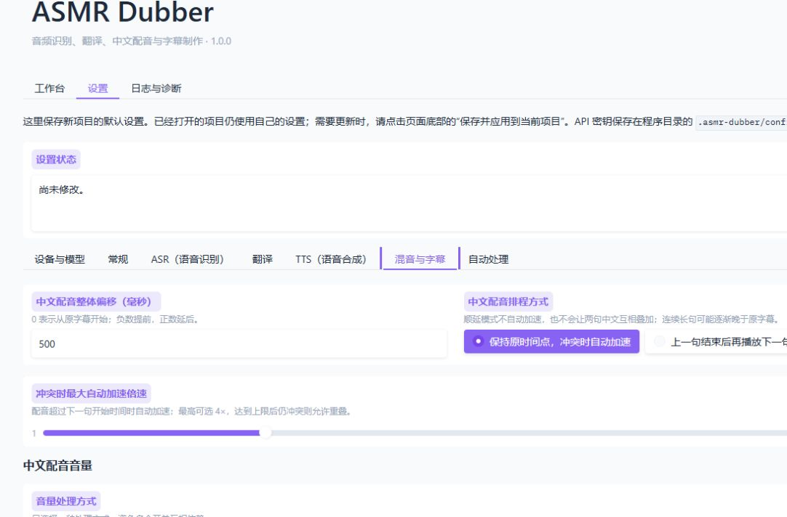
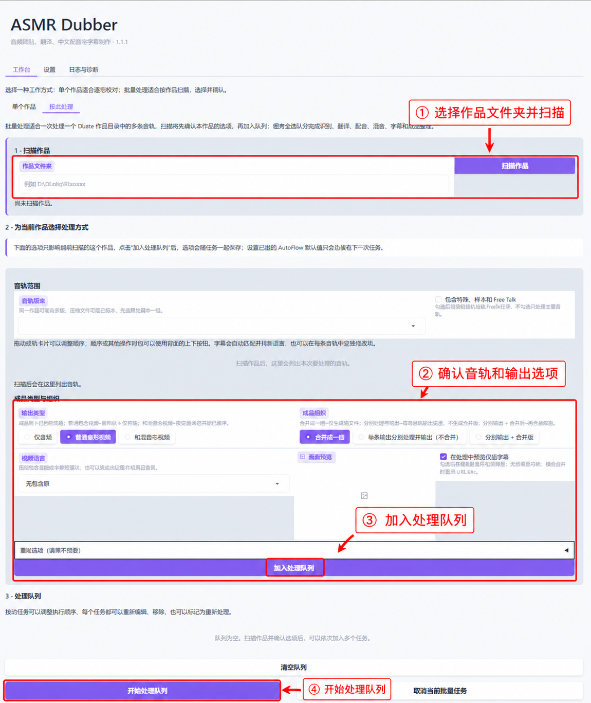
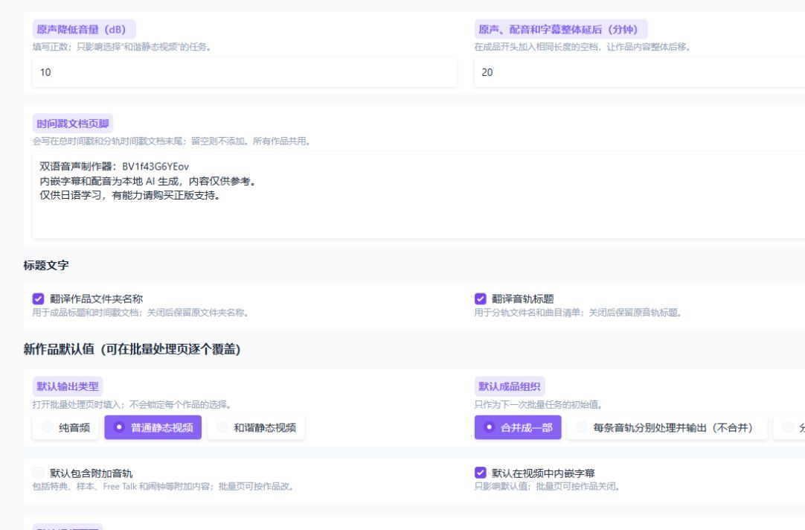

# ASMR Dubber

ASMR Dubber 用于把日语、英语音视频制作成中文配音和字幕。识别结果会整理成可编辑的句子表，可分步完成翻译、配音、混音和字幕导出。

## 能做什么

- 从音频或视频创建独立项目，并保留输入文件的原始副本；
- 使用 Parakeet、Kotoba-Whisper 或 Faster-Whisper 做 ASR（语音识别）；
- 可导入日语、英语或中文的 SRT、VTT、ASS/SSA、LRC 和纯文本台本；中文台本可跳过 ASR 与翻译，直接进入校对和配音；
- 可选日语 ASMR 专用 VAD（语音活动检测）和 Qwen3 ForcedAligner 时间戳对齐；
- 使用多个已安装的识别模型交叉校对源文；
- 通过 DeepSeek、阿里云百炼、豆包、OpenAI、Claude、Gemini、DeepL、Google 或 Microsoft 等服务翻译；
- 使用本地 IndexTTS2、无需 API Key 的 Edge TTS，或连接 MiMo、MiniMax、GPT-SoVITS、CosyVoice、Fish Speech/Fish Audio API 做 TTS（语音合成）；
- 逐句调整源文、中文、起止时间和是否配音；
- 输出混音后的 WAV、视频，以及双语/中文/源文 SRT 和 LRC 字幕；
- 可以只导出完整时间轴的中文克隆音轨，之后再把它加入原音轨，不必重新生成 TTS；
- 可在“批量处理”中扫描 DLsite 作品目录，按音轨或整部作品排队生成音频、静态视频和字幕；
- 中断后继续工作，只重做缺失或设置已经失效的部分；
- 长任务可在网页中取消；程序日志可直接查看和下载。

英语项目使用现有的 Faster-Whisper 模型；Parakeet、Kotoba-Whisper 和日语 ASMR 专用 VAD 仍只用于日语。翻译和配音目标语言为简体中文。

## 演示

### 素材 1

https://github.com/user-attachments/assets/70d1af0d-a165-410e-a28d-2a5dbaa203dd

### 素材 2

https://github.com/user-attachments/assets/ca7884c7-9272-4b07-a527-5e7c0351758b

### 素材 3

https://github.com/user-attachments/assets/d7106c36-8a5d-4aab-96b3-0f17d027d0d3

### 素材 4（18+）

https://github.com/user-attachments/assets/f938ef87-ebf4-4597-87ec-50313ff4a20c

[](https://www.bilibili.com/video/BV1f43G6YEov/)

[▶ 在 B 站观看完整演示](https://www.bilibili.com/video/BV1f43G6YEov/)

以上素材仅用于功能演示，如有侵权请联系删除。

## 下载与安装（Windows）

从[GitHub Releases](https://github.com/EveningStudy/asmr-dubber/releases/latest)下载 `ASMR-Dubber-windows-portable.zip`，完整解压到最终使用位置。不要直接在压缩软件里运行。

> **使用前请启用 Windows 长路径。** 进入“设置 → 系统 → 高级 → 文件资源管理器”，打开“启用长路径”，然后重新启动 ASMR Dubber。未启用时，IndexTTS2 等第三方运行环境中的深层文件可能超过 Windows 的传统路径限制，出现“文件明明存在但程序报告找不到”的错误。如果当前 Windows 没有这个开关，请把程序解压到 `D:\ASMR-Dubber` 这类短路径。



首次运行未签名的启动器时，Windows 可能显示 SmartScreen 提示。确认文件来自本项目的 GitHub Release 后，先点击“更多信息”，再点击“仍要运行”；来源不明的文件不要继续运行。



Windows 包要让进阶组件全部使用 GPU，需要 NVIDIA Turing 或更新架构。主环境使用 CUDA 13，不支持 Maxwell、Pascal 和 Volta；这些旧卡即使显存较大，也不属于完整本地 GPU 支持范围。

## 快速开始

### Windows

适用于 64 位 Windows 10/11。

1. 下载项目压缩包并完整解压。不要直接在压缩软件里运行。
2. 双击 `ASMR-Dubber-Setup.exe`，按提示选择安装方案。
3. 安装结束后双击 `ASMR-Dubber.exe`。
4. 浏览器打开后，先到“设置”确认识别、翻译和合成方式，再回到“单个作品”。
5. 保留启动终端。要停止程序，按 `Ctrl+C` 或关闭终端。

Edge TTS 已直接适配，无需 API Key。未安装或无法使用 IndexTTS2 时，新项目默认使用 Edge TTS。IndexTTS2 第一次生成语音时需要加载模型并初始化 CUDA，等待时间可能明显长于后续任务。

不需要预装 Python、uv、Git、FFmpeg 或 CUDA Toolkit。启动器优先使用 PowerShell 7；电脑上没有 PowerShell 7 时会使用 Windows 自带的 PowerShell 5.1。下载阶段需要系统中的 `curl.exe`。

建议把程序解压到短且可写的路径，例如 `D:\Apps\ASMR-Dubber`。不要放在 `C:\Program Files`，也不要让云盘同步程序运行时目录。

### Linux

> Linux 版本已较长时间未维护，当前发布不保证可用。以下命令仅供已有环境参考；新用户建议使用 Windows 版。

安装前确认系统有 `bash`、`curl`、`tar` 和 `getconf`：

```bash
bash scripts/linux/setup.sh 推荐
bash scripts/linux/run-ui.sh
```

本地 NVIDIA 模型还需要可用的显卡驱动。程序会准备自己的 Python 和依赖，不修改系统 Python。

更完整的系统要求、磁盘估算、下载策略和离线安装方法见[安装指南](docs/INSTALLATION.md)。

## 选择安装方案

| 方案 | 安装内容 | 安装后约占用 | 安装前建议可用空间 |
|---|---|---:|---:|
| 基础 | 程序、网页、音频工具、Edge TTS 和云端 API 客户端；不含本地识别模型 | 约 2 GB | 至少 5 GB |
| 推荐 | 基础 + 两个 Parakeet 日语模型；NVIDIA 电脑再装 IndexTTS2 | 约 24–28 GB | 至少 35 GB |
| 进阶 | 基础 + 下列固定分析模型；NVIDIA 电脑再装 IndexTTS2 | 约 33–39 GB | 至少 50 GB |

“进阶”会准备以下模型，不代表下载某个模型仓库中的所有内容：

1. Parakeet CTC 1.1B JA GAL；
2. Parakeet TDT/CTC 0.6B JA；
3. Kotoba-Whisper v2.2；
4. Faster-Whisper large-v2；
5. 日语 ASMR 专用 Whisper VAD ONNX；
6. Qwen3 ForcedAligner 0.6B；
7. IndexTTS2 checkpoints，仅在检测到 NVIDIA GPU 时安装。

没有 NVIDIA GPU 的电脑仍可使用 CPU 识别、Edge TTS 和云端 TTS。CPU 处理长音频会慢很多；IndexTTS2 也支持 CPU，但速度通常明显慢于 CUDA。硬件选择可参考[后端指南](docs/BACKENDS.md)。

## 单个作品：从音频到成品

### 1. 设置识别、翻译和配音

先到“设置 → 设备与模型”确认准备使用的后端显示为“可用”。随后在 ASR（语音识别）页选择项目源语言、识别模型、VAD（语音活动检测）和时间戳方式。



在“翻译”中选择服务、模型和接口地址，并保存当前服务的 API Key。日语和英语分别使用各自的翻译 Prompt。



在“TTS（语音合成）”中选择本地 IndexTTS2、Edge TTS 或云端服务。



设置页底部的“仅保存为以后新项目默认值”不会改变已打开项目；需要让当前项目立即采用新设置时，使用“保存并应用到当前项目”。

### 2. 创建项目并完成 1–5 步

回到“工作台 → 单个作品”，选择一个音频或视频并新建项目。项目会保存输入副本、设置快照、句子表和中间缓存，可以关闭程序后继续。



1. 点击“运行 ASR（语音识别）”，检查句子表里的文字和时间；
2. 点击“翻译为中文”，再直接校对中文；导入中文字幕或中文配音稿时可以跳过这一步；
3. 修改完成后保存校对表格。把一行的原文和中文都清空即可删除该句；
4. 展开“统一音色参考”，选择一条 5–15 秒、单人且背景干净的台词；
5. 点击“生成中文配音”，确认后再点“混音与输出”。混音参数不满意时只需重新混音。

已有字幕或台本时，可以展开“使用已有台本或字幕”。SRT、VTT、ASS/SSA、LRC 会使用文件中的时间轴；纯文本可以按长度估算，也可以先运行 ASR，再由大模型依据台本校正已有句子。

### 3. 调整中文配音和输出

“混音与字幕”集中控制中文落点、冲突处理、音量、声道路由和字幕可读性。默认让中文从原句开始时间后 500 ms 播放；句子冲突时可在最大倍速内自动加速，也可以选择等上一句播放完再开始下一句。



音频输出可以同时保留混音成品和完整时间轴的中文克隆音轨，也可以只保留其中一种。只调整时间、音量或声道路由不会使逐句 TTS 缓存失效。字幕可以独立生成，支持双语、仅中文和仅原文 SRT/LRC；视频项目还会生成带字幕视频。

详细参数和台本导入方式见[使用指南](docs/USER_GUIDE.md)，每项设置的默认值和作用见[配置参考](docs/CONFIGURATION.md)。

## 支持的后端

| 环节 | 可选后端 |
|---|---|
| ASR（语音识别）| Parakeet（日语）、Kotoba-Whisper（日语）、Faster-Whisper（日语/英语）|
| 时间戳 | 识别模型自带时间戳、Qwen3 ForcedAligner 0.6B |
| TTS（语音合成）| IndexTTS2、Edge TTS、MiMo TTS、MiniMax TTS、GPT-SoVITS API、CosyVoice API、Fish Speech/Fish Audio API |
| 翻译 | DeepSeek、阿里云百炼、豆包（火山方舟）、OpenAI、Anthropic Claude、Google Gemini、OpenAI-compatible、DeepL、Google Cloud Translation、Microsoft Azure Translator |

多模型交叉校对只列出本机完整可用的识别模型。

Faster-Whisper large-v3 不随安装方案下载，需要时可按[后端指南](docs/BACKENDS.md#使用-large-v3)放入程序目录。

## 数据放在哪里

默认情况下，所有可变数据都在程序根目录的 `.asmr-dubber`：

```text
<程序目录>/
├── .asmr-dubber/
│   ├── bootstrap/       # uv
│   ├── runtimes/        # Python、FFmpeg 和隔离模型运行时
│   ├── venv/            # 主程序环境
│   ├── models/          # 本地模型
│   ├── cache/           # 下载与计算缓存
│   ├── config/          # 设置、密钥和外部参考音频
│   ├── projects/        # 项目
│   ├── autoflow/        # 批量任务状态、日志和临时文件
│   ├── logs/            # Setup 与程序运行日志
│   └── temp/            # 可清理的临时文件
├── model-packs/         # 可选的离线模型包入口
├── ASMR-Dubber.exe
└── ASMR-Dubber-Setup.exe
```

API Key 按便携设计以**明文**保存在 `.asmr-dubber/config/secrets.json`。它不会写入项目文件、性能记录或字幕，但任何能读取程序目录的账户都能读取它。不要共享 `.asmr-dubber`，也不要把它提交到 Git 或公开网盘。

停止程序后，可以复制整个文件夹来备份或搬到另一块磁盘；移动后重新运行 Setup，让脚本修复运行环境里的绝对路径。要卸载，先关闭程序和相关模型服务，再删除整个程序文件夹。

## 批量处理 DLsite 作品

“工作台 → 批量处理”用于已经解压的作品目录。输入目录并扫描后，程序先选出推荐的音频版本，再列出本次任务中的每条音轨。



- 勾选“包含特典、样本和 Free Talk”后，附加音轨会立即加入列表；
- 拖动卡片或使用上下按钮可以改变音轨顺序；
- SRT、VTT、ASS/SSA 和 LRC 会按音轨自动匹配，并判断为中文、日语或英语；
- 每条音轨都可以更换字幕、修改语言或关闭字幕。没有字幕的音轨按正常 ASR 流程处理。

接着选择输出类型和成品组织。纯音频不需要画面；视频任务会直接显示推荐图片的相对路径和预览，也可以改用作品中的其它图片或黑色背景。“每条音轨分别处理并输出”不会生成合并版。

确认后加入队列，再继续扫描其它作品。队列支持拖动排序、编辑选项、移除和标记重新处理；修改任务不会影响队列中的其它作品。

带时间轴的中文字幕覆盖全部所选音轨时，程序直接建立中文时间轴，不再运行 ASR 或翻译；日语或英语字幕跳过 ASR，之后仍会翻译。任务状态、日志和中间文件保存在 `.asmr-dubber/autoflow`，中断后可以继续。

固定规则和新任务默认值位于“设置 → 自动处理”。这里可以决定是否翻译作品文件夹名称和音轨标题；已经加入队列的任务仍保留加入时的选择。



## 项目目录

每个项目都有自己的设置快照和中间结果：

```text
<项目>/
├── project.json         # 项目状态和设置
├── source.<扩展名>      # 输入媒体副本
├── analysis/            # 分析音频、识别候选和校对记录
├── references/          # 项目参考片段
├── chinese/             # 逐句中文音频缓存
├── mix/                 # 临时混音中间文件
├── output/              # 最终音频和视频
├── subtitles/           # SRT、LRC 和字幕视频
├── exports/             # JSON、CSV 时间轴
└── performance.json     # 不含密钥和 Prompt 的阶段指标
```

不要只复制 `project.json`。需要备份项目时，请复制整个项目目录。

## 命令行

大多数用户只需要网页。脚本、自动化和排障可以使用命令行：

```powershell
.\scripts\windows\run-cli.ps1 doctor --no-network
.\scripts\windows\run-cli.ps1 --help
```

```bash
bash scripts/linux/run-cli.sh doctor --no-network
bash scripts/linux/run-cli.sh --help
```

常用命令有 `create`、`analyze`、`translate`、`synthesize`、`mix`、`subtitles`、`set-timing`、`install-backend` 和 `verify-asr`。

## 文档

- [安装指南](docs/INSTALLATION.md)：系统要求、安装方案、网络、离线包和卸载
- [使用指南](docs/USER_GUIDE.md)：从建项目到配音、字幕和恢复任务
- [命令行参考](docs/CLI.md)：项目阶段、模型包、后端安装和自动化命令
- [配置参考](docs/CONFIGURATION.md)：设置作用域和各项参数
- [后端指南](docs/BACKENDS.md)：模型、API、硬件需求和组合方式
- [排障指南](docs/TROUBLESHOOTING.md)：安装、下载、模型、API 和输出问题
- [架构说明](docs/ARCHITECTURE.md)：项目结构、数据流和扩展边界
- [ModelScope 制品维护](docs/MODELSCOPE_UPLOADS.md)：镜像仓库与发布校验
- [第三方软件与模型说明](docs/THIRD_PARTY_NOTICES.md)
- [贡献指南](CONTRIBUTING.md)与[安全策略](SECURITY.md)

## 许可与责任

项目代码采用[MIT License](LICENSE)。模型、运行时和云服务适用各自的许可证或服务条款，其中 IndexTTS2 使用独立的 bilibili Model Use License。请确认你有权处理输入作品和参考声音，并按适用规则标记合成内容。详见[第三方软件与模型说明](docs/THIRD_PARTY_NOTICES.md)。
