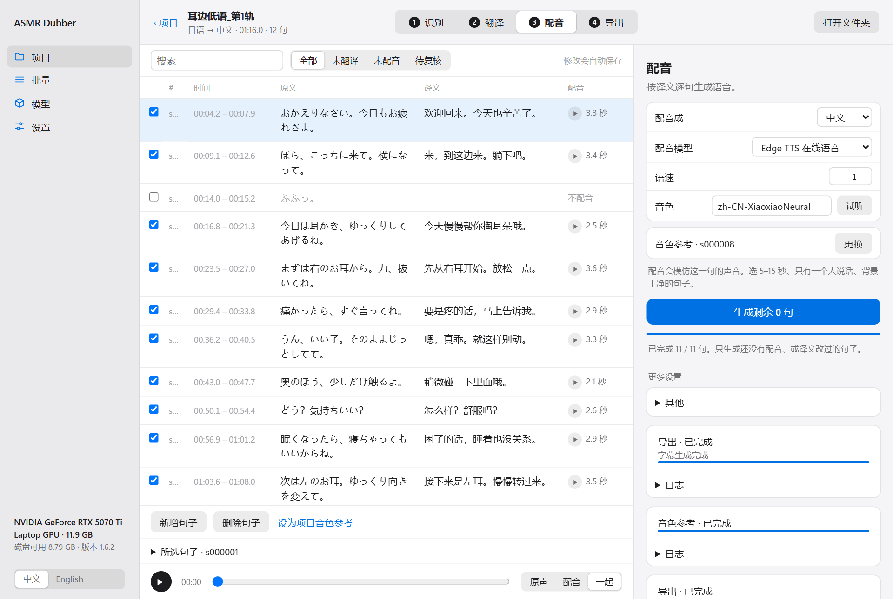
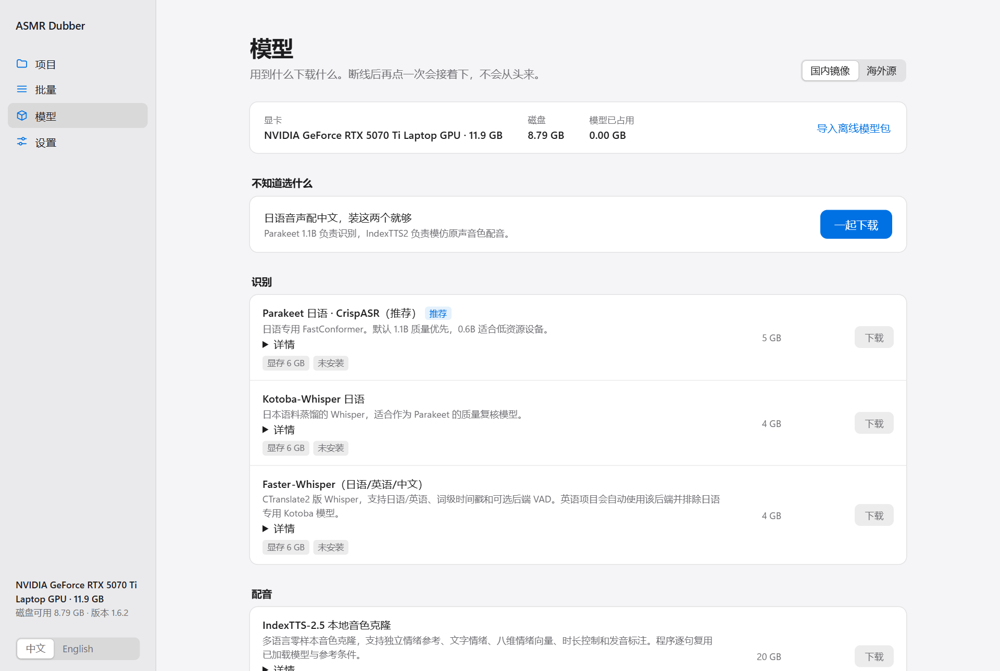
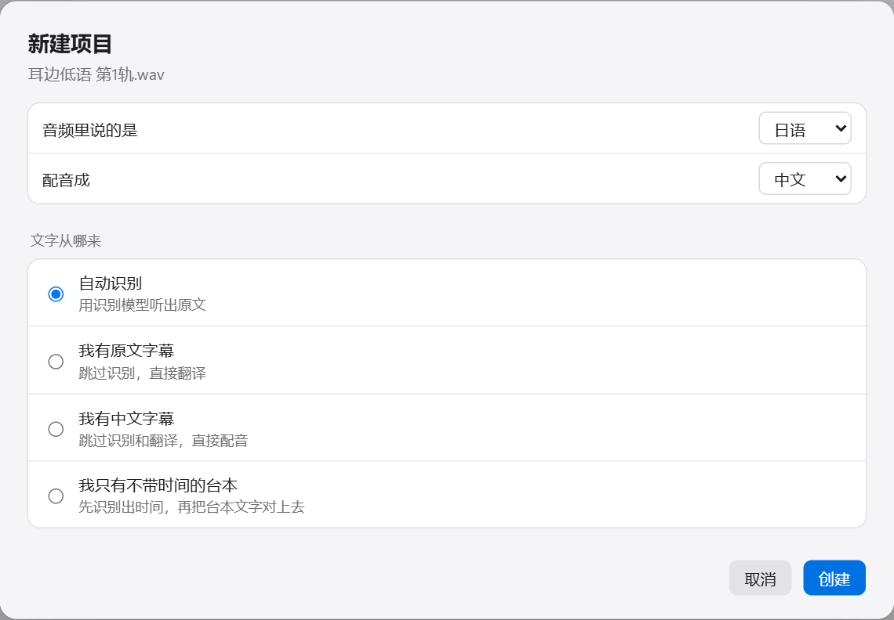

中文 | [English](README.en.md)

# ASMR Dubber

**给音声配上另一种语言。原声的位置在哪，配音就在哪。**

识别、翻译、音色克隆配音、混音、字幕，一个程序做完。

支持日语、英语、中文的音频和视频，可以配成中文或英文。

[下载](https://github.com/EveningStudy/asmr-dubber/releases/latest) · [三分钟上手](#三分钟上手) · [使用手册](docs/USER_GUIDE.md) · [全部文档](docs/INDEX.md)

## 先听效果

建议戴耳机。

### 素材 1 · RTF

双语音声：保留日语原声，叠加经过 RTF（原声空间线索迁移）处理的中文配音。

https://github.com/user-attachments/assets/2eddb029-1a6d-4daf-8f53-741b46141f4d

### 素材 2 · RTF

双语音声：保留日语原声，中文配音经 RTF 处理后与原声混合。

https://github.com/user-attachments/assets/8068b982-95c0-4561-8d18-f82cb8cebb6e

### 素材 3 · RTF

双语音声：保留日语原声，叠加经过 RTF 处理的中文配音，可与下方的人声分离版本对比试听。

https://github.com/user-attachments/assets/4e7618af-ad3d-4931-9749-4b39816d01d8

### 素材 3 · RTF + 人声分离

中文替换音声：先分离日语人声与背景，再识别、翻译并生成中文配音；中文配音经 RTF 迁移原声的空间线索后，与分离背景混合。分离可能残留日语或影响音效，不保证完全消除原人声。

https://github.com/user-attachments/assets/a8841fb0-e4f1-4383-92bb-942805ff1adc

[在 B 站观看旧版本的介绍与演示](https://www.bilibili.com/video/BV1f43G6YEov/)。目前版本的使用请以文档为准。

[更多音声示例](https://space.bilibili.com/3747523753675973)。一些使用本程序制作的音声实例，效果仅供参考，实际表现因素材、模型与参数设置而异。

素材仅用于功能展示，如有侵权请联系删除。

## 它能做什么

| | |
|---|---|
| 🎧 **想要哪种成品都行** | 原声加配音的双语版、去掉原人声的替换版、单独的配音轨、只有翻译字幕，或者配上封面做成视频。 |
| 🧭 **空间跟随** | 音声里的声音会从左耳移到右耳、由远到近。程序逐句分析原声的位置和远近，让配音出现在同一个地方，而不是一直待在正中间。 |
| 🎼 **人声分离** | 把原声拆成人声和背景，去掉原来的语言，只留下背景音效和配音，做成“替换版”。笑声、喘息这些没有配音的地方可以选择保留原声。 |
| 🗣️ **音色克隆** | 从原声里选一句当参考，配音就用这个声音说另一种语言。用的是 IndexTTS2，在你自己的显卡上跑。 |
| ✍️ **每一句都能改** | 识别错了改原文，翻译不好改译文，改哪句就只重新配哪句。 |
| 📦 **整个作品一次做完** | 把作品文件夹交给批量页，多条音轨自动走完全部流程，可以合并成一个文件，也可以做成视频。 |
| 📝 **有字幕就不用识别** | 已有原文字幕可以跳过识别；已有译文字幕可以连翻译一起跳过。也可以只导出字幕，不配音。 |
| 🎚️ **参数全部开放** | 两百多个参数，平时折叠着，需要时展开。项目里改的只影响这个项目。 |

## 三分钟上手

下面以最常见的日语配中文为例。

**1. 下载并启动。** 从 [Releases](https://github.com/EveningStudy/asmr-dubber/releases/latest) 下载压缩包，解压到一个路径短的文件夹（比如 `D:\ASMR-Dubber`），双击 `ASMR-Dubber.exe`。浏览器会自动打开界面。不需要预先安装 Python 或其他东西。

**2. 下载模型。** 打开“模型”页，点“一起下载”。这会装上日语识别模型 Parakeet 和音色克隆模型 IndexTTS2。原声是英语或中文的话，识别模型改下 Faster-Whisper。

**3. 填翻译 Key。** 打开“设置 → 云端服务”，给 DeepSeek（或你有账号的任何一家）填上 API Key。

**4. 开始做。** 回到“项目”页，把音频拖进去，选好原声和配音的语言，然后按顶部的四步走：**识别 → 翻译 → 配音 → 导出**。

没有显卡也能用：配音选内置的 Edge TTS（联网即可，音色固定），识别用处理器跑，会慢一些。

完整的图文步骤在[使用手册](docs/USER_GUIDE.md)。Linux 的启动方式见[安装与模型](docs/INSTALLATION.md#linux-和-wsl2)。

## 文档

| 我想…… | 看这篇 |
|---|---|
| 装好程序、下载模型 | [安装与模型](docs/INSTALLATION.md) |
| 从头做一个音频 | [使用手册](docs/USER_GUIDE.md) |
| 一次处理整个作品文件夹 | [批量处理](docs/BATCH.md) |
| 用现成的字幕或台本 | [字幕与台本](docs/SUBTITLE_WORKFLOW.md) |
| 调空间跟随、音量，做替换版 | [混音与空间跟随](docs/EXPERIMENTAL_AUDIO.md) |
| 让多个模型互相校对识别结果 | [多模型复核](docs/AUDIO_REVIEW_TUTORIAL.md) |
| 换别的识别模型、配音服务、翻译服务 | [模型与服务](docs/BACKENDS.md) |
| 弄清设置存在哪、清理磁盘、备份 | [设置与存储](docs/CONFIGURATION.md) |
| 查某个参数是什么意思 | [参数表](docs/PARAMETERS.md) |
| 解决报错 | [常见问题](docs/TROUBLESHOOTING.md) |

开发相关：[架构](docs/ARCHITECTURE.md) · [命令行](docs/CLI.md) · [贡献](CONTRIBUTING.md) · [全部文档](docs/INDEX.md)

## 需要知道的几件事

- **数据都在程序文件夹里。** 项目、模型、设置都在 `.asmr-dubber` 目录下。备份或搬家时复制整个文件夹。
- **API Key 是明文保存的。** 位置在 `.asmr-dubber/config/secrets.json`，不要把这个文件夹发给别人。
- **用云端服务时，内容会发给服务商。** 翻译会发送台词文本，云端配音会发送译文和参考音频。全部用本地模型时不会上传任何东西。
- **人声分离和替换版是实验性功能。** 可能残留原声，也可能损伤音效。

## 许可

项目代码采用 [MIT](LICENSE) 许可。模型、运行时、云服务、输入作品与生成内容适用各自的规则，不因代码开源而自动获得使用授权。见[第三方声明](docs/THIRD_PARTY_NOTICES.md)。

## 友链

- [LINUX DO](https://linux.do/)：新的理想型社区
