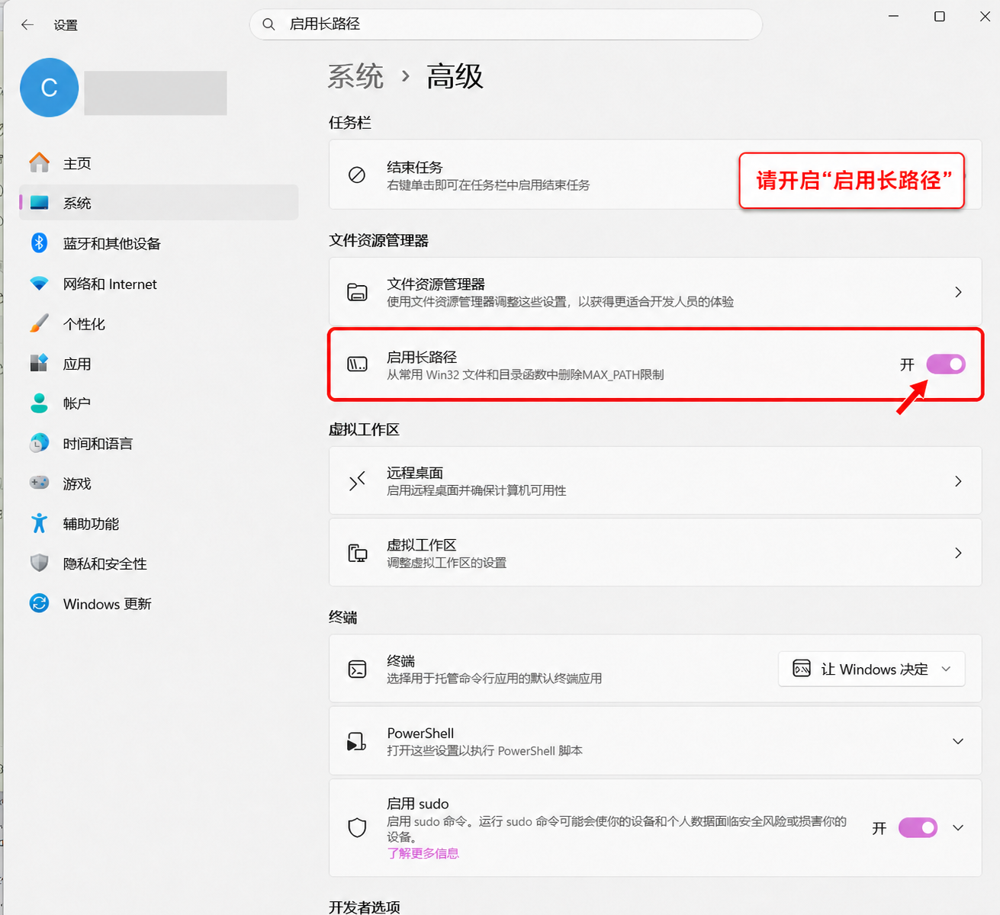

中文 | [English](README.en.md)

# ASMR Dubber

[](https://github.com/EveningStudy/asmr-dubber/releases/latest)


[](LICENSE)

把日语或英语音频、视频制作成中文配音、双语音频和字幕。保留原声，识别、翻译、配音、混音可以分步执行，文字和时间可人工校对。

## 演示

建议戴耳机试听。

### 素材 1 · RTF

https://github.com/user-attachments/assets/2eddb029-1a6d-4daf-8f53-741b46141f4d

### 素材 2 · RTF

https://github.com/user-attachments/assets/8068b982-95c0-4561-8d18-f82cb8cebb6e

### 素材 3 · RTF

https://github.com/user-attachments/assets/4e7618af-ad3d-4931-9749-4b39816d01d8

### 素材 3 · RTF + 人声分离

https://github.com/user-attachments/assets/a8841fb0-e4f1-4383-92bb-942805ff1adc

[在 B 站观看完整演示](https://www.bilibili.com/video/BV1f43G6YEov/)。素材仅用于功能展示，如有侵权请联系删除。

## 下载与启动

Windows 从 [GitHub Releases](https://github.com/EveningStudy/asmr-dubber/releases/latest) 下载便携 ZIP，完整解压到短且可写的路径，例如 `D:\Apps\ASMR-Dubber`：

> **使用前请启用 Windows 长路径。** 如果你的 Windows 设置中提供此开关，进入“设置 → 系统 → 高级 → 文件资源管理器”，打开“启用长路径”，然后重新启动 ASMR Dubber。未启用时，IndexTTS2 等第三方运行环境中的深层文件可能超过 Windows 的传统路径限制，出现“文件明明存在但程序报告找不到”的错误。如果当前 Windows 没有这个开关，请优先把程序解压到 `D:\ASMR-Dubber` 这类短路径，以降低路径过长的风险。



1. 首次运行 `ASMR-Dubber-Setup.exe`，选择安装方案。
2. 安装完成后运行 `ASMR-Dubber.exe`，保留启动终端。
3. 在“设置 → 设备与模型”检查后端，再配置识别、翻译和配音。

不要求预装 Python、uv、Git、FFmpeg 或 CUDA Toolkit。下载需要系统 `curl.exe`；本地 GPU 推理需要兼容的 NVIDIA 驱动。SmartScreen、显存要求及安装失败处理见[安装指南](docs/INSTALLATION.md)。

Linux x86_64（含 WSL2）在源码根目录执行：

```bash
bash scripts/linux/setup.sh 推荐
bash scripts/linux/run-ui.sh
```

需要 `bash`、`curl`、`tar`、`getconf`；ARM64、macOS 不在支持范围内。CPU 也可运行部分本地后端，但长音频通常明显慢于 GPU。安装方案与硬件要求以[安装指南](docs/INSTALLATION.md)为准。

| 安装方案 | 主要用途 |
|---|---|
| 基础 | 网页、媒体工具、Edge TTS 和 API 客户端，不含大型本地模型 |
| 推荐 | 基础 + 两个 Parakeet 日语模型；NVIDIA 机器再安装 IndexTTS2 |
| 进阶 | 推荐所需组件及 Kotoba、Faster-Whisper、ASMR VAD、Qwen3 对齐 |

IndexTTS-2.5 为按需安装项，不属于以上方案。英语本地识别需要 Faster-Whisper，不要把日语推荐方案当作英语模型包。

## 按你的素材选择流程

网页顶部 **中文 / English** 可直接切换界面，默认中文；Setup 也可选择语言。[English documentation](docs/en/INDEX.md)。

仅字幕文件支持双语、仅原文和仅译文，并可沿用音频原名。

| 手上有什么 | 最短制作路线 |
|---|---|
| 只有日语／英语音频或视频 | 新建项目 → ASR → 校对原文 → 翻译 → 配音 → 混音 |
| 已有原文时间轴字幕 | 新建项目 → 导入原文字幕 → 翻译 → 配音 → 混音 |
| 已有中文字幕 | 新建项目 → 导入中文配音稿 → 配音 → 混音；不需要 ASR 或正文翻译 |
| 只有 TXT 台本 | 导入并选择估算时间或 ASR 台本重新定时，之后人工检查 |
| 多条音轨／多个作品 | 批量扫描 → 逐轨检查字幕、语言和顺序 → 加入队列 → 执行 |

详见[使用指南](docs/USER_GUIDE.md)和[完全依据已有字幕制作](docs/SUBTITLE_WORKFLOW.md)。字幕齐全是指每条所选音轨都有对应文件，不要求字幕覆盖音乐、停顿等每一秒。

### 混音

混音时可选 **RTF（原声空间线索迁移）**，将原录音的立体声空间线索迁移到中文配音。操作和参数见[音频处理](docs/EXPERIMENTAL_AUDIO.md)。

### 设置保存到哪里

“设置保存范围”有三个选项：**仅新项目默认值／仅当前项目／两者**。默认只保存新项目默认值；要改变已打开的项目，必须选择“仅当前项目”或“两者”。API Key 使用各服务自己的保存按钮。

切换页签保留未保存草稿；刷新浏览器会丢弃草稿并开启新的页面会话，已有项目需重新打开。程序重启会重新加载运行环境，不等同于刷新网页。详见[配置作用范围](docs/CONFIGURATION.md#默认设置和项目设置)。

## 能用哪些后端

| 环节 | 支持范围 |
|---|---|
| ASR | Parakeet（日语）、Kotoba-Whisper（日语）、Faster-Whisper（日语／英语）、通用 ASR API |
| 时间对齐 | 后端自带时间戳、Qwen3 ForcedAligner |
| 本地配音 | IndexTTS2、按需安装的 IndexTTS-2.5 |
| 在线配音 | Edge TTS、MiMo、MiniMax、IndexTTS2 API、GPT-SoVITS、CosyVoice、Fish、通用 TTS API |
| 翻译 | DeepSeek、百炼、豆包、SenseNova、OpenAI、Claude、Gemini、OpenAI-compatible、DeepL、Google、Microsoft |

Edge TTS 不需要密钥，但需要联网且不克隆音色。其它云服务需要用户自己的账户或服务端；程序不代为部署第三方服务。详见[后端指南](docs/BACKENDS.md)。

## 数据、恢复与隐私

默认数据在 `.asmr-dubber`：项目在 `projects`，设置与密钥在 `config`，模型与环境在 `models`／`runtimes`，批量状态在 `autoflow`。配置了外部项目目录时，需要另外备份那个目录。

- 备份项目要复制整个项目目录，不是只有 `project.json`。
- 重试会复用满足条件的缓存；不要为排障直接删除整个 `.asmr-dubber`。
- 重做批量结果可能替换旧成品，先备份再明确选择重做。
- Key 明文保存在 `.asmr-dubber/config/secrets.json`。不要共享配置目录或未经脱敏的日志。
- 原文字幕、中文台本、音色参考会按所选服务发送。

详见[排障指南](docs/TROUBLESHOOTING.md)、[安全策略](SECURITY.md)和[支持入口](SUPPORT.md)。

## 文档导航

[完整文档索引](docs/INDEX.md)

| 分类 | 入口 |
|---|---|
| 开始使用 | [安装](docs/INSTALLATION.md) · [使用指南与批量处理](docs/USER_GUIDE.md) |
| 字幕与音频 | [已有字幕制作](docs/SUBTITLE_WORKFLOW.md) · [音频处理：RTF、分离与逐句混音](docs/EXPERIMENTAL_AUDIO.md) |
| 配置与排障 | [配置参考](docs/CONFIGURATION.md) · [后端](docs/BACKENDS.md) · [CLI](docs/CLI.md) · [排障](docs/TROUBLESHOOTING.md) · [支持](SUPPORT.md) |
| 开发与维护 | [贡献](CONTRIBUTING.md) · [架构](docs/ARCHITECTURE.md) · [Prompt](docs/PROMPTS.md) · [制品维护](docs/MODELSCOPE_UPLOADS.md) · [发布记录](docs/RELEASE.md) |
| 安全与许可 | [安全策略](SECURITY.md) · [第三方声明](docs/THIRD_PARTY_NOTICES.md) · [行为准则](CODE_OF_CONDUCT.md) |

## 许可

项目代码采用 [MIT](LICENSE)。模型、运行时、云服务、输入作品与生成内容适用各自规则，不因代码开源而自动获得使用授权。见[第三方声明](docs/THIRD_PARTY_NOTICES.md)。

## 友链

- [LINUX DO](https://linux.do/)：新的理想型社区
