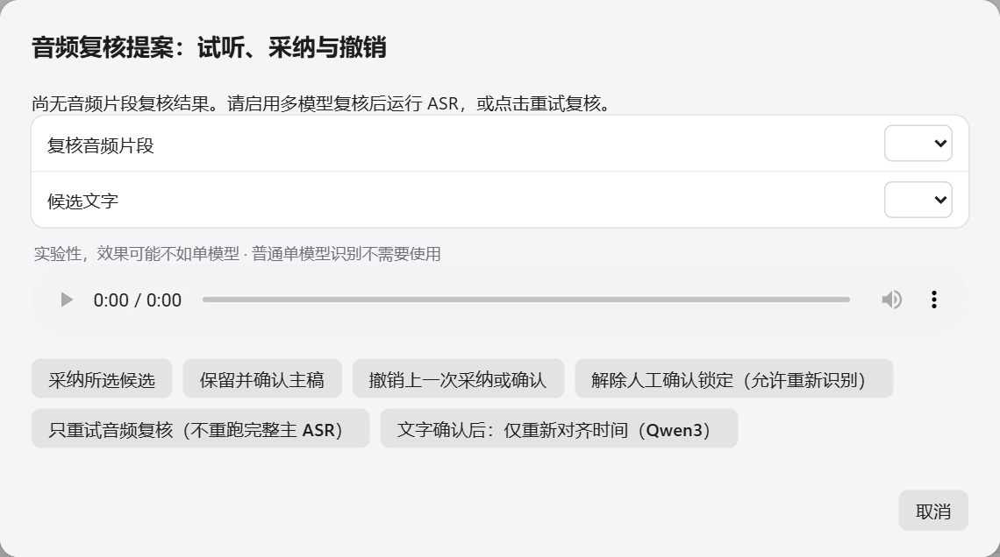

中文 | [English](en/AUDIO_REVIEW_TUTORIAL.md)

[← 全部文档](INDEX.md)

# 多模型复核

> 这是实验性功能，效果不一定比只用一个模型好。普通使用不需要它。

识别模型会听错。多模型复核的思路是：让另外一两个模型也听同一段音频，把几个模型写得不一样的地方挑出来，由你来决定听谁的。

它适合对识别准确度要求很高、并且愿意花时间逐处确认的情况。它不会自动让结果变得更准，只是帮你更快找到可能有问题的地方。

## 准备

需要至少装两个识别模型。比如主模型用 Parakeet，再装一个 Kotoba-Whisper 或 Faster-Whisper 来复核。在“模型”页下载。

## 打开复核

在项目的“识别”步骤，展开“更多设置”里的“多模型复核”：

1. 打开“多模型复核”开关。
2. 在“复核模型”里选用哪些模型来复核。
3. “复核方式”保持“仅提出建议”。

然后点“重新识别”。程序会先用主模型正常识别，再让复核模型把同样的音频听一遍。

如果项目已经识别过了，不需要重新识别，在下面说的复核窗口里点“只重试音频复核”就行。

## 查看和处理分歧

在“识别”步骤点蓝色的“音频复核提案：试听、采纳与撤销”。

（截图里的项目没有运行过复核，所以显示“尚无复核结果”。运行过之后，两个下拉框里会有内容。）

处理一处分歧的过程：

1. 在“复核音频片段”里选一段。
2. 在“候选文字”里选一个候选。下面会显示它和主模型写的有什么不同。
3. 点播放，听这一段原声。
4. 做决定：
   - 候选是对的：点“采纳所选候选”。
   - 主模型是对的：点“保留并确认主稿”。
   - 都不对：关掉窗口，回表格里自己改。

点错了可以点“撤销上一次采纳或确认”。

几种状态的意思：

| 状态 | 意思 |
|---|---|
| 文字一致 | 几个模型写的一样。但也可能是一起听错了 |
| 存在文字差异 | 写的不一样，需要你听一下 |
| 证据不足 | 复核模型没给出可靠的结果，保留主模型的 |
| 边界需人工确认 | 这段话的切分位置有问题，不能一键替换，要回表格里改 |

数字和“是 / 不是”这类否定词，值得多听一遍，模型最容易在这些地方出错。

## 其他几个按钮

- **解除人工确认锁定**：你确认或采纳过的句子会被锁住，重新识别时不会被覆盖。想让它们重新参与识别，先点这个。
- **只重试音频复核**：只让复核模型重新跑一遍，不动主模型的结果。
- **文字确认后：仅重新对齐时间（Qwen3）**：文字改好之后，重新计算每句的起止时间。需要先下载 Qwen3 时间对齐模型。

## 自动采纳

“复核方式”里的“保守自动采纳”会让程序在把握很大的时候自动替换，不用你逐个确认。它的条件很严格：必须有不同类型的模型给出完全相同的文字，而且不涉及数字和否定词。

即使这样，自动替换的结果也可能是错的。它同样可以撤销。

## 采纳之后

原文改了，这一句的译文和配音可能就对不上了。到翻译步骤检查这一句的译文，需要的话改掉，再到配音步骤点“生成剩余”。
