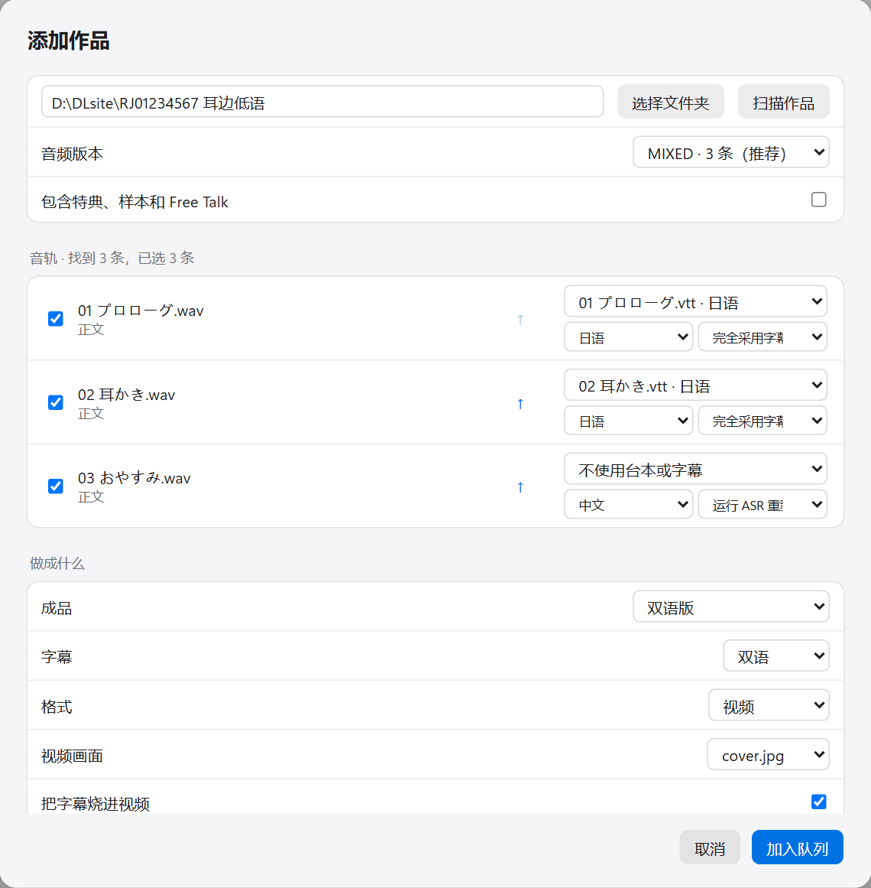
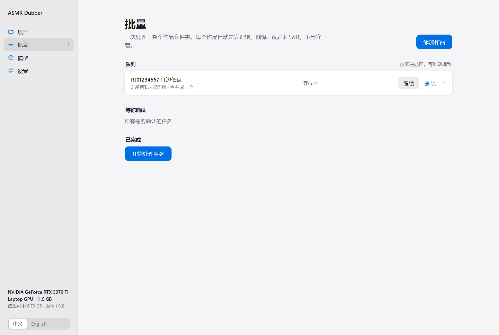
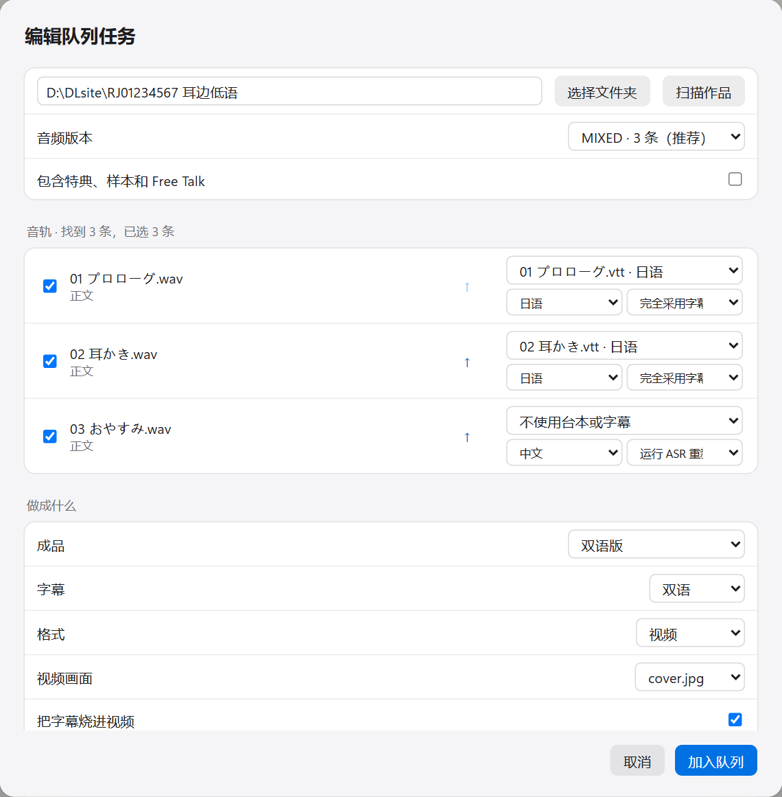
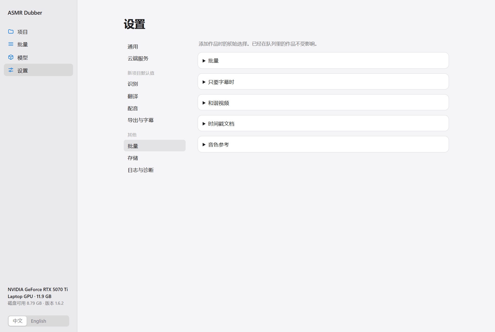

中文 | [English](en/BATCH.md)

[← 全部文档](INDEX.md)

# 批量处理

一个作品通常有好几条音轨。批量页可以把整个作品文件夹一次交给程序，它会一条一条自动做完识别、翻译、配音和导出，中途不用守着。最后可以把所有音轨合并成一个文件，也可以做成带封面的视频。

建议先用[使用手册](USER_GUIDE.md)里的方法手动做一条音轨，确认模型、翻译服务和音色都没问题，再用批量。

## 1. 添加作品

点左侧的“批量”，再点右上角的“添加作品”。

### 选文件夹

在最上面填入作品文件夹的路径（或点“选择文件夹”），然后点“扫描作品”。文件夹需要是已经解压好的。

程序会找出里面的音频、字幕和封面图。如果作品同时提供了 WAV 和 MP3 这样的多种格式，在“音频版本”里选一种。

特典、样本和 Free Talk 默认不处理，要的话勾上“包含特典、样本和 Free Talk”。

### 检查每条音轨

“音轨”列表里是这次要处理的全部音轨。每一条可以单独设置：

- **左边的勾**：不想处理的音轨去掉勾。
- **箭头**：调整顺序。合并时会按这个顺序拼接。
- **第一个下拉框**：这条音轨用哪个字幕文件。程序会按文件名自动匹配，匹配错了可以改。没有字幕就选“不使用台本或字幕”。
- **语言**：字幕（或音频）的语言。
- **最后一个下拉框**：怎么用这个字幕。
  - “完全采用字幕文字和时间轴”：不做识别，直接用字幕。字幕带时间时选这个。
  - “运行 ASR 重新定时”：做识别得到时间，文字用台本的。字幕不带时间或时间不准时选这个。

每条音轨都花几秒看一眼。字幕配错了音轨，后面全是错的。

### 选做成什么

| 选项 | 说明 |
|---|---|
| **成品** | 见下表 |
| **字幕** | 双语、仅译文、仅原文 |
| **格式** | “音频”只出音频；“视频”会配上一张静态图做成视频；“和谐视频”见下面的说明 |
| **视频画面** | 用作品里的哪张图。没有合适的图就选黑色背景 |
| **把字幕烧进视频** | 字幕直接画在画面上 |
| **多条音轨** | “合并成一个”把所有音轨拼成一个文件；“每轨单独”各出各的；“都要”两种都出 |

成品有五种：

| 成品 | 出来的是什么 |
|---|---|
| 双语版 | 原声加配音 |
| 替换版（实验性） | 去掉原人声，只留背景和配音。需要先下载人声分离模型 |
| 双语版 + 替换版 | 两种都出。识别、翻译、配音只做一次 |
| 原声 + 字幕，不配音 | 不配音，只给原声配上字幕 |
| 只要字幕文件 | 只出 SRT 和 LRC 字幕，不出音频 |

“和谐视频”会把原声音量压低，并把原声、配音和字幕整体往后推一段时间。具体压多少、推多久在“设置 → 批量 → 和谐视频”里改。

都选好后点“加入队列”。可以接着添加别的作品，最后一起开始。

## 2. 开始处理

队列里的作品会按从上到下的顺序处理。开始之前可以：

- 点“编辑”改这个作品的任何选项。
- 点“删除”把它移出队列。这不会删除作品文件夹里的任何东西。
- 拖动或点箭头调整顺序。

点“开始处理队列”就开始了。

需要注意：**加入队列的那一刻，当时的识别、翻译、配音设置就被记下来了**。之后再去“设置”里改默认值，不会影响已经在队列里的作品。想让它用新设置，点“编辑”再保存一次。

## 3. 确认音色参考

用克隆模型配音时，程序会为每个作品自动挑一句话当音色参考。做到这一步时，它会停下来等你确认，“等你确认”下面会出现“试听并选择”按钮。

听一下它挑的这句。满意就直接点“采用”，不满意就换一句。怎么挑见[使用手册的配音一节](USER_GUIDE.md#选音色参考)。

如果你没来确认，等待时间到了之后（默认 60 秒）它会用自己挑的那句继续。等待多久、要不要等，在“设置 → 批量 → 音色参考”里改。打算睡觉前挂机跑的话，可以把等待关掉。

## 4. 拿成品

做完的作品会出现在“已完成”里，点“打开文件夹”查看。

成品放在作品文件夹下的一个新文件夹里（默认叫“AutoFlow输出”，名字可以在设置里改）。原来的文件不会被改动。

如果某个作品失败了，先看它的日志里写了什么。修好问题后点“继续”，已经做完的音轨和句子不会重做。

想把一个已完成的作品从头再做一遍，编辑它，勾上“重新处理”。这会覆盖之前的成品，想保留的话先复制到别处。

## 5. 批量的默认设置

“设置 → 批量”里是添加作品时的初始选项。改了以后只影响之后添加的作品。

| 分组 | 里面是什么 |
|---|---|
| 批量 | 成品文件夹的名字、默认格式、默认合并方式、默认视频画面、是否包含特典、是否翻译文件夹名和音轨标题 |
| 只要字幕时 | 字幕默认内容、字幕文件怎么命名 |
| 和谐视频 | 原声压低多少、整体延后多久、原声视频要不要也烧字幕 |
| 时间戳文档 | 合并成品附带的时间戳文档里要不要加一段文字 |
| 音色参考 | 要不要等你确认、最多等多久 |

识别、翻译、配音用的是“设置 → 新项目默认值”里的设置，见[设置与存储](CONFIGURATION.md)。
