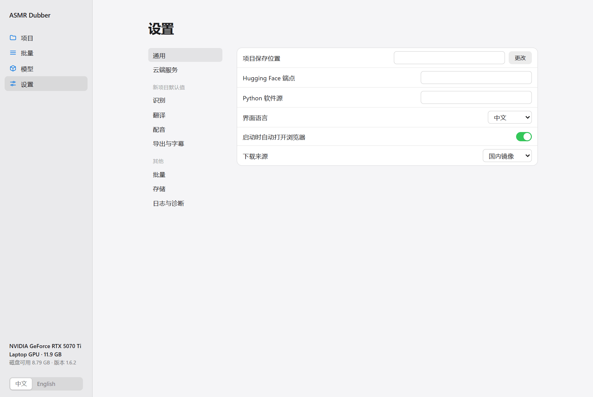
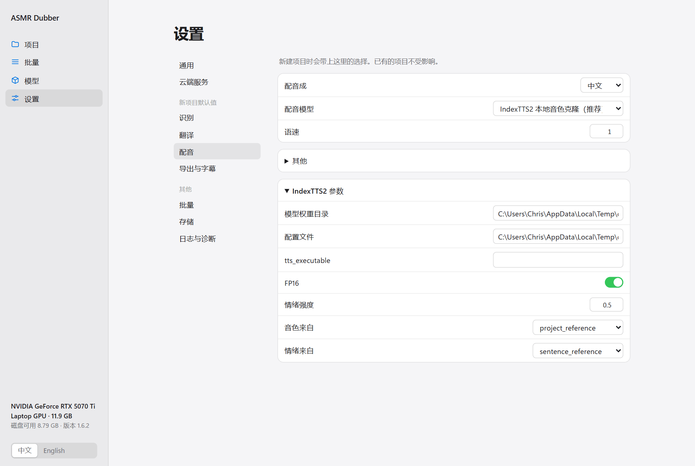
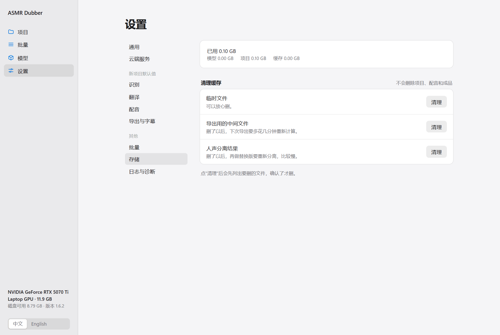

中文 | [English](en/CONFIGURATION.md)

[← 全部文档](INDEX.md)

# 设置与存储

## 设置在哪里改

程序里有两个地方可以改设置，它们管的范围不一样：

| 在哪改 | 影响什么 |
|---|---|
| 项目里，右侧的面板 | **只影响这一个项目** |
| “设置 → 新项目默认值” | **只影响以后新建的项目**。已有的项目不会变 |

新建项目时，程序会把当时的默认值复制一份给它。之后这个项目就有了自己的一套设置，和默认值不再有关系。

所以：

- 想改正在做的这个项目，就在项目里改。
- 想让以后的项目都用某个设置，去“新项目默认值”改。
- 两边都想改，就两边各改一次。

所有设置改了就自动保存，没有“保存”按钮。数字和文字输入框是在你点到别处时保存的。

## 通用设置



| 设置 | 说明 |
|---|---|
| 项目保存位置 | 新项目存在哪。留空就存在程序目录的 `.asmr-dubber/projects` 下。C 盘空间紧张时可以改到别的盘 |
| 界面语言 | 中文或 English。左下角也能切换。这只改界面，不影响识别和配音的语言 |
| 启动时自动打开浏览器 | 不想每次启动都弹浏览器就关掉 |
| 下载来源 | 国内镜像或海外源，和模型页右上角的是同一个设置 |
| Hugging Face 端点、Python 软件源 | 下载模型和依赖用的镜像地址。一般留空 |

## 新项目默认值

分成四页：识别、翻译、配音、导出与字幕。每一页的内容和项目里对应步骤的面板完全一样。



常用的选项直接显示，其余的按用途收在折叠的分组里，点一下展开。显示哪些分组取决于你选的模型：选了 IndexTTS2 才会出现“IndexTTS2 参数”，选了 Edge TTS 就看不到它。

每个参数的含义、默认值和取值范围，见[参数表](PARAMETERS.md)。

## 云端服务的 Key

在“设置 → 云端服务”里填。Key 是全局的，所有项目共用。


- 点“填写”输入 Key，点“清除”删掉它。
- 填过之后，界面不会再显示完整的 Key。
- Key 以明文保存在 `.asmr-dubber/config/secrets.json`。把程序文件夹发给别人之前，先删掉这个文件。

各家服务怎么申请、模型名填什么，见[模型与服务](BACKENDS.md)。

## 清理磁盘

做过几个项目之后，中间文件会占不少空间。“设置 → 存储”可以清理。



顶部是模型、项目、缓存各占了多少。下面三类可以清理：

| 类别 | 是什么 | 清了以后 |
|---|---|---|
| 临时文件 | 处理过程中留下的副本 | 没有影响，可以放心清 |
| 导出用的中间文件 | 混音和空间跟随算出来的中间结果 | 下次导出要多花几分钟重新算 |
| 人声分离结果 | 分离出来的人声和背景 | 下次做替换版要重新分离，比较慢 |

点“清理”不会马上删。程序会先扫描，列出要删的项目和文件让你看，点“确认清理”才真的删除。

**不会被清理的**：原始音频、句子和译文、每一句的配音、导出的成品、模型。

模型要在“模型”页单独删除。想删掉整个项目，直接到项目保存位置删除那个项目的文件夹。

有任务在跑的时候不能清理。

## 数据都放在哪

默认全部在程序目录的 `.asmr-dubber` 文件夹里：

```text
.asmr-dubber/
  projects/   你的项目，每个项目一个文件夹
  config/     设置和 API Key
  models/     模型
  runtimes/   各个模型的运行环境
  cache/      下载缓存
  logs/       日志
  temp/       临时文件
```

一个项目文件夹里有：原始音频的副本、句子和译文（`project.json`）、每一句的配音、导出的成品和字幕。

**备份项目**要复制整个项目文件夹，只复制 `project.json` 是不够的。

**备份全部**就复制整个 `.asmr-dubber`。如果你改过项目保存位置，那个位置要另外备份。

## 从别的电脑访问

程序默认只允许本机访问。想从局域网里别的设备打开界面（比如程序跑在一台有显卡的电脑上，用笔记本操作），启动时指定监听地址：

```bash
# Linux
bash scripts/linux/run-ui.sh --host 0.0.0.0
```

```powershell
# Windows
.\scripts\windows
un-cli.ps1 ui --host 0.0.0.0 --port 7860
```

这种情况下程序会强制要求用户名和密码。用户名默认是 `asmr`，密码在启动时随机生成，打印在启动窗口里。想用固定的密码，启动前设置环境变量 `ASMR_DUBBER_UI_USERNAME` 和 `ASMR_DUBBER_UI_PASSWORD`。

不要把它直接暴露在公网上。

## 环境变量

给需要自定义部署的人参考，一般用不到：

| 变量 | 作用 |
|---|---|
| `ASMR_DUBBER_HOME` | 把整个数据目录放到别的位置 |
| `ASMR_DUBBER_PROJECTS` | 只改项目保存位置 |
| `ASMR_DUBBER_FFMPEG` | 指定用哪个 FFmpeg |
| `ASMR_DUBBER_ALLOW_EXTERNAL_DOWNLOADS=1` | 这次运行允许从海外源下载 |
| `ASMR_DUBBER_UI_USERNAME`、`ASMR_DUBBER_UI_PASSWORD` | 远程访问的用户名和密码 |
| `ASMR_DUBBER_MAX_UPLOAD_SIZE` | 上传文件的大小上限，默认 20gb |
| `MODELSCOPE_API_TOKEN` | 访问私有模型仓库的令牌 |
