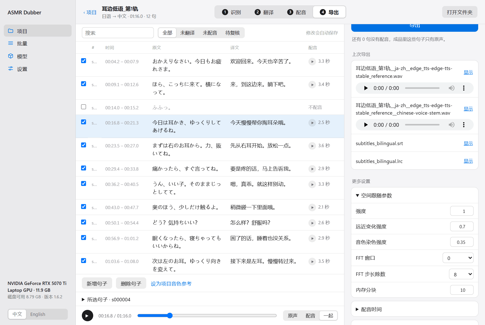
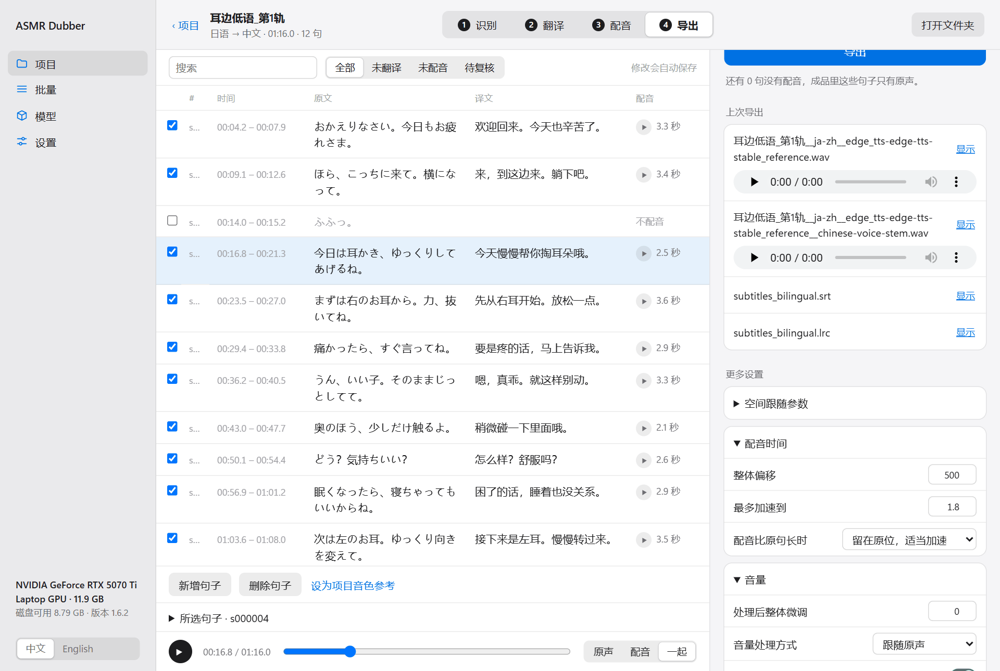
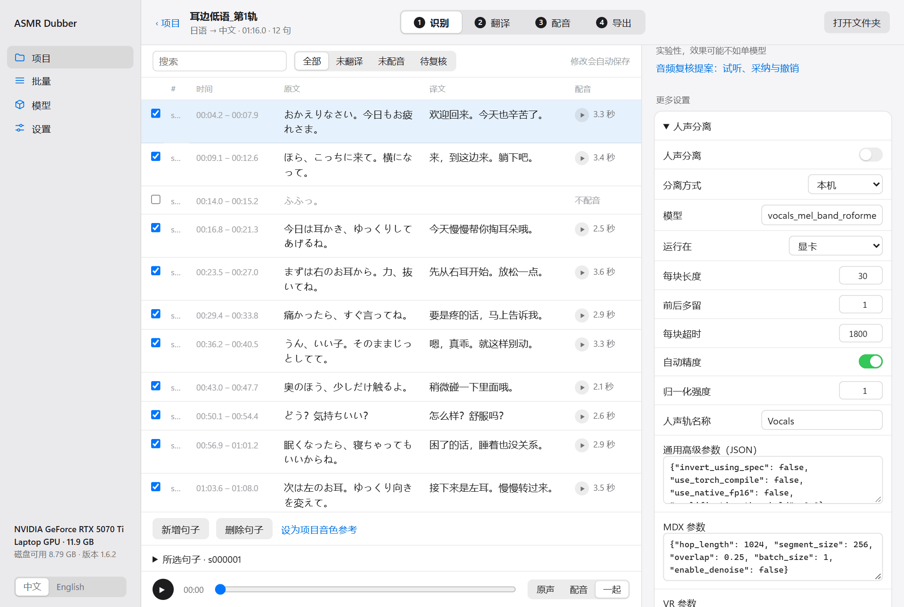

中文 | [English](en/EXPERIMENTAL_AUDIO.md)

[← 全部文档](INDEX.md)

# 混音与空间跟随

配音生成好之后，怎么把它和原声合到一起，都在“导出”这一步里调。这里的设置改了以后只需要重新导出，不用重新配音，所以可以放心反复试。

## 四种成品

| 成品 | 里面有什么 | 适合 |
|---|---|---|
| 双语版 | 完整的原声 + 配音 | 大多数情况。原声一点不少，中文叠在上面 |
| 替换版（实验性） | 去掉人声后的背景 + 配音 | 不想听到原来的语言 |
| 只有配音轨 | 只有配音，没有原声和背景 | 想在别的软件里自己混音 |
| 只要字幕 | 没有音频 | 只想要翻译字幕 |

前两种在“成品”里选。配音轨通过“保存哪些音频”一并保存。只要字幕在“导出内容”里选。

## 空间跟随

音声里的声音经常是会动的：从左耳到右耳，从远到近。普通的配音只会待在正中间，听起来和原声是脱节的。

打开“空间跟随”后，程序会分析每句原声的左右位置和远近，让对应的中文配音出现在同样的位置。这个功能在界面和旧文档里也叫 RTF（原声空间线索迁移）。

一般只要打开开关就行。觉得效果不对时，展开“空间跟随参数”：

| 参数 | 作用 | 怎么调 |
|---|---|---|
| 强度 | 整体效果的强弱。0 是不处理，1 是完全跟随 | 觉得位置变化太夸张就调低 |
| 远近变化强度 | 配音跟着原声变近变远的程度 | 配音忽大忽小时调低 |
| 音色染色强度 | 配音带上多少原声的音色特征 | 配音听起来发闷或变味时调低 |
| FFT 窗口、FFT 步长除数 | 分析的精细程度 | 一般不用动 |
| 内存分块 | 一次处理多长的音频 | 内存不够时调小 |

有两个限制：

- **原声必须是双声道的。** 单声道的音频没有位置信息，开了也没用。
- 某一句原声太短或太安静，分析不出位置时，这一句会放在比较居中的位置。日志里会写“RTF 降级”，这不是出错。

## 配音的时间

展开“配音时间”：

**整体偏移**：配音比原句晚多久开始，单位是毫秒。默认 500，也就是原声说了半秒之后中文才进来，这样两个声音不会完全叠在一起。正数是往后推，负数是往前提。

**配音比原句长时**：中文经常比日语长，一句还没说完下一句就该开始了。有两种处理方式：

- **留在原位，适当加速**：每句都在原来的时间点开始，说不完就加快语速。加速有上限（“最多加速到”，默认 1.8 倍），到了上限还说不完，就会和下一句重叠一点。
- **上一句结束后再放下一句**：不加速，也不重叠，后面的句子往后顺延。配音会越来越晚于原声，成品也可能比原音频长。

大多数情况用第一种。如果发现很多句子被加速得太明显，更好的办法是回到翻译步骤把译文改短。

## 音量

展开“音量”。

**音量处理方式**有三种：

- **跟随原声**（默认）：原声这句轻，配音也轻；原声响，配音也响。最自然。
- **统一音量**：每句配音都调到一样响。原声的音量忽大忽小、导致配音跟着乱跳时用。
- **保留原始音量**：配音模型生成出来多响就多响。

觉得配音整体太响或太轻，改“相对原声”或“处理后整体微调”，单位是分贝，正数变响，负数变轻。

只想调某一句的音量，见[使用手册的“改某一句”](USER_GUIDE.md#8-改某一句)。

“输出保护”分组里是峰值限制，防止成品爆音，一般不用动。

## 替换版：去掉原来的人声

替换版会先用人声分离模型把原声拆成“人声”和“背景”两部分，然后只保留背景，放上配音。

这是实验性功能。先说清楚它的问题：

- 分离不可能完全干净，成品里常常能听到一点残留的原声。
- 耳语、呼吸声、贴近麦克风的音效可能被当成人声一起去掉。
- 分离比较慢。

所以如果只是想听懂内容，双语版通常是更好的选择。

想做替换版的话：

**1. 下载人声分离模型。** 在“模型”页的“可选”分组里。

**2. 在项目里打开人声分离。** 到“识别”步骤，展开“更多设置”里的“人声分离”，打开开关。

**3. 导出时选替换版。** 到“导出”步骤，“成品”选“替换版”，点“导出”。第一次会先做分离，需要等一阵。

### 把某些原声放回来

替换版去掉了全部人声，但有些声音你可能想留着，比如笑声和喘息。这些句子没有配音，去掉以后就成了一段空白。

选了替换版之后，“更多设置”里会多出“原声回填”：

- **没有配音的句子**：自动把所有没配音的句子的原人声放回来。
- **手动指定**：自己填要放回来的句子编号。
- **不回填**：全部去掉。

也可以逐句控制：在表格里选中一句，展开“所选句子”，改“原声开关（仅分离时）”。

### 用云端做分离

没有显卡的话，分离可以交给云端服务（Replicate 或自己搭的接口）。在“人声分离”里把“分离方式”改成 Replicate 或自建接口，并在“设置 → 云端服务”填好 Key。这会把音频上传到那个服务，并且可能产生费用。

## 要不要重新配音

| 改了什么 | 需要重做 |
|---|---|
| 空间跟随、配音时间、音量、输出保护 | 只需要重新导出 |
| 双语版换成替换版 | 重新导出（第一次要等分离） |
| 打开或关闭人声分离 | 建议重新识别，因为识别用的音频变了 |
