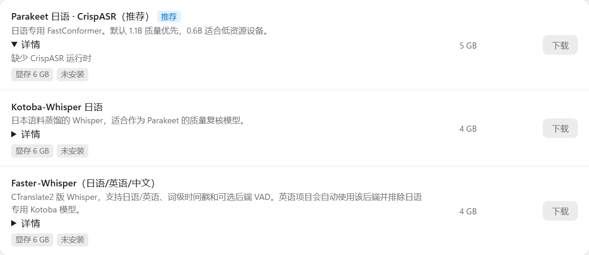
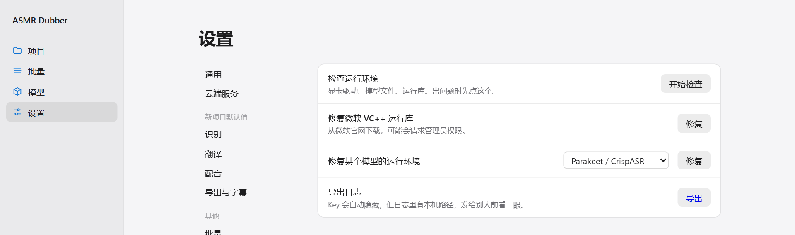

中文 | [English](en/INSTALLATION.md)

[← 全部文档](INDEX.md)

# 安装与模型

程序是免安装的：解压，双击，就能用。模型不在压缩包里，启动后在界面里按需下载。

## 需要什么样的电脑

| | 最低 | 推荐 |
|---|---|---|
| 系统 | Windows 10 / 11（64 位），或 x86_64 Linux | |
| 显卡 | 没有也能用 | NVIDIA 显卡，显存 8 GB 以上 |
| 磁盘 | 5 GB（只用在线配音） | 40 GB 以上（识别加音色克隆） |

没有 NVIDIA 显卡的话：识别可以用处理器跑，只是慢；配音用内置的 Edge TTS，不能克隆音色。AMD 和 Intel 显卡不能用来加速。

## Windows

### 1. 下载并解压

从 [Releases](https://github.com/EveningStudy/asmr-dubber/releases/latest) 下载压缩包，**完整解压**到一个路径短、可以写入的文件夹，比如 `D:\ASMR-Dubber`。

几个容易踩的坑：

- 不要在压缩包里直接双击运行，一定要先解压。
- 不要放在 `C:\Program Files`、桌面的深层文件夹，或 OneDrive 之类的同步盘里。
- 路径尽量短。路径太长会导致“文件明明在却说找不到”的错误。

如果你的 Windows 设置里有“启用长路径”的开关，建议打开它（设置 → 系统 → 高级 → 文件资源管理器）：


### 2. 启动

双击 `ASMR-Dubber.exe`。

第一次启动时，如果 Windows 弹出“已保护你的电脑”，点“更多信息”，再点“仍要运行”。


会出现一个黑色的窗口，里面滚动着日志。**这个窗口不要关**，关掉它程序就停了。第一次启动需要几分钟准备运行环境，之后会快很多。

准备好之后浏览器会自动打开界面。如果没有自动打开，手动访问 `http://127.0.0.1:7860`。


首页的“开始之前”列出了三样要准备的东西。配音已经可以用了（内置的 Edge TTS），另外两样接下来处理。

### 3. 下载模型

点左侧的“模型”。


页面顶部显示你的显卡、剩余磁盘空间，和模型已经占了多少。

**不知道选什么，就点“一起下载”。** 它会装上：

- **Parakeet**：日语识别，约 5 GB。
- **IndexTTS2**：音色克隆配音，约 20 GB，需要 NVIDIA 显卡。

下载时间取决于网速，IndexTTS2 比较大，可能要等一阵。下载中可以点“暂停”，之后再点“继续”会接着下，不会从头来。网络断了也一样。

每个模型下面的“详情”可以展开，里面是这个模型的安装状态。



#### 我该下载哪些

| 你要做的事 | 下载 |
|---|---|
| 日语音声配中文，要像原声 | Parakeet + IndexTTS2（就是“一起下载”） |
| 日语音声配中文，没有显卡 | Parakeet。配音用内置的 Edge TTS |
| 英语或中文的音频 | Faster-Whisper。Parakeet 只认日语 |
| 手上有字幕，只想配音 | 只下 IndexTTS2，或者什么都不下用 Edge TTS |
| 想做“替换版”（去掉原人声） | 再加一个人声分离模型 |

下面这几个平时不需要，用到的时候再下：

- **ASMR 语音检测**：识别前先找出哪些片段有人说话，适合有很长静音的音声。
- **Qwen3 时间对齐**：重新计算每句话的起止时间，让字幕和配音对得更准。
- **人声分离**：做替换版才需要。
- **Kotoba-Whisper**：另一个日语识别模型，可以和 Parakeet 对比着用。
- **IndexTTS-2.5**：新一代克隆模型，支持更多语言，要求 10 GB 以上显存。

#### 下载很慢或失败

右上角可以切换“国内镜像”和“海外源”。国内镜像走 ModelScope，在国内一般更快。海外源走 Hugging Face 和 GitHub，可能需要代理。

失败了直接再点一次“下载”，已经下好的部分会保留。

#### 删除模型

装好的模型右边有“删除”。删除只会删模型文件，不会动你的项目和成品。有任务在跑的时候不能删。

#### 离线安装

没法联网的电脑，可以把 ASMR Dubber 格式的模型包（ZIP 文件）原样放进程序目录下的 `model-packs` 文件夹，然后点模型页右上角的“导入离线模型包”。不要解压，也不要改名。

### 4. 填翻译 Key

见[使用手册的第一节](USER_GUIDE.md#1-准备填翻译-key)。填好后就可以开始做了。

## Linux 和 WSL2

支持 64 位 x86_64 的 Linux，在 Ubuntu 24.04 和 WSL2 上验证过。不支持 macOS 和 ARM。

需要系统里有 `bash`、`curl`、`tar`、`getconf`。在源码目录下运行：

```bash
bash scripts/linux/setup.sh 基础
bash scripts/linux/run-ui.sh
```

第一行准备运行环境，只需要跑一次。第二行启动界面，之后每次用都运行它。模型同样在界面的“模型”页下载。

用显卡需要先装好 NVIDIA 驱动，并确认 `nvidia-smi` 能正常输出。

想从别的电脑访问（比如程序跑在服务器上），见[设置与存储](CONFIGURATION.md#从别的电脑访问)。

## 更新、搬家和卸载

**自动更新**：界面左下角会显示有没有新版本。有的话点一下，程序会自己下载并安装，装完按提示重新启动。你的项目、模型和设置都不会动。连不上 GitHub 时，那里会给出手动下载的链接。

**手动更新**：先关掉程序，把新版本解压到一个新文件夹，再把旧文件夹里的 `.asmr-dubber` 整个复制过去。这个目录里是你的项目、模型和设置。新版本第一次启动时会重新检查运行环境，比平时慢一些。

**换个位置**：先关掉程序，把整个文件夹移过去，再启动。第一次启动同样会重新检查运行环境。

**备份**：复制整个 `.asmr-dubber` 文件夹。注意里面的 `config/secrets.json` 是明文保存的 API Key。

**卸载**：直接删除整个程序文件夹。程序没有往系统里写任何东西。

## 遇到问题

“设置 → 日志与诊断”里可以检查运行环境，也可以导出日志。



具体的报错见[常见问题](TROUBLESHOOTING.md)。
