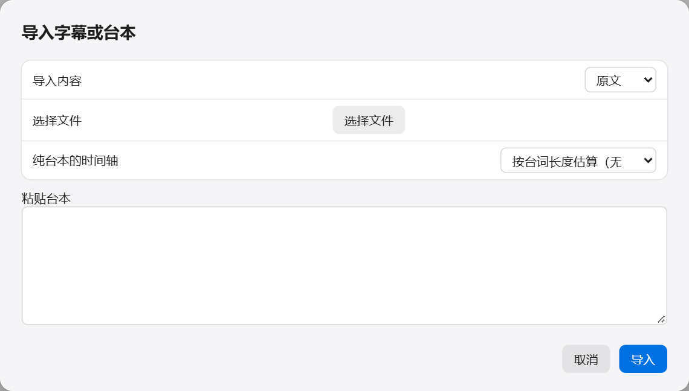

中文 | [English](en/SUBTITLE_WORKFLOW.md)

[← 全部文档](INDEX.md)

# 字幕与台本

如果作品自带字幕或台本，就不必让模型去“听”了。用现成的文字更准，也更快。

## 我手上的东西该怎么用

| 你有什么 | 新建项目时选 | 之后要做的 |
|---|---|---|
| 带时间的原文字幕（SRT、VTT、ASS、LRC） | 我有原文字幕 | 翻译 → 配音 → 导出 |
| 带时间的译文字幕 | 我有译文字幕 | 配音 → 导出 |
| 不带时间的原文台本（TXT） | 我只有不带时间的台本 | 识别 → 翻译 → 配音 → 导出 |
| 什么都没有 | 自动识别 | 识别 → 翻译 → 配音 → 导出 |

选了后三种之一，项目建好后会自动弹出导入窗口。

## 导入字幕

已经建好的项目也可以随时导入：在“识别”步骤里，点“导入字幕或台本”旁边的“选择文件”。

- **导入内容**：这份文字是“原文”还是“译文”。译文会直接填进译文那一列，跳过翻译。
- **选择文件**：选字幕文件。也可以不选文件，直接把文字粘贴到下面的框里。
- **纯台本的时间轴**：只在文字不带时间时有用，见下一节。

点“导入”。

> **注意**：导入会替换掉项目里现有的全部句子。如果已经校对过，先想清楚。

导入后在表格里抽查几句，点一下某一行，播放条会跳到那个时间，听一听文字和声音对不对得上。

关于几种格式：

- SRT、VTT、ASS 每句都有开始和结束时间，最可靠。
- LRC 只有开始时间，结束时间是程序根据下一句推算的。
- 字幕不需要覆盖每一秒。音乐、停顿、呼吸的地方没有字幕是正常的。

## 台本没有时间怎么办

很多作品附带的是 TXT 台本，只有文字，没有每句话的时间。有三种办法给它配上时间：

| 办法 | 需要什么 | 效果 |
|---|---|---|
| **先识别，再用大模型校对台本**（推荐） | 识别模型 + 翻译服务的 Key | 先用识别得到每句话的时间，再把台本的文字对到这些时间上。时间来自识别，文字来自台本，两头的优点都占了 |
| **Qwen3 时间对齐** | Qwen3 时间对齐模型 | 直接拿台本文字去音频里找位置。只支持日语和英语原文 |
| **按台词长度估算** | 什么都不需要 | 按每句话的字数平均分配时间。只是一个起点，必须自己逐句调 |

不管用哪种，做完都要抽查。重点看有没有漏句，和每句的开头结尾对不对。

对不上的句子会保留识别的结果，并被标记为“待复核”。在表格上方点“待复核”可以只看这些句子。

## 只要字幕，不要配音

不想配音，只想要一份翻译好的字幕：

1. 正常做完识别和翻译。
2. 跳过配音，直接到“导出”步骤。
3. “导出内容”选“只要字幕”，“字幕”选想要的内容。
4. 点“导出”。

会得到 SRT 和 LRC 两种格式的字幕文件。

字幕每行多少字、每条最少显示多久，在导出步骤“更多设置”的“字幕排版”里调。

## 批量时每条音轨用哪个字幕

批量处理时，程序会按文件名给每条音轨自动匹配字幕。在添加作品的窗口里可以逐条检查和修改，见[批量处理](BATCH.md#检查每条音轨)。

- 每条音轨都有带时间的字幕时，选“完全采用字幕文字和时间轴”，可以完全不用识别模型。
- 全部是译文字幕时，连翻译也不需要。
- 同一个作品里不要混用日语和英语的原文字幕。
