中文 | [English](en/USER_GUIDE.md)

[← 全部文档](INDEX.md)

# 使用手册

这篇带你把一个音频从头做成配音成品，以最常见的日语配中文为例。原声是英语或中文、或者想配成英文，步骤完全一样，只是新建项目时选的语言和用的识别模型不同。

照着做一遍大约需要二十分钟，其中大部分时间是等模型跑。

开始之前，请先按[安装与模型](INSTALLATION.md)把程序跑起来，并下载好识别模型和配音模型。

**目录**

1. [准备：填翻译 Key](#1-准备填翻译-key)
2. [新建项目](#2-新建项目)
3. [认识工作区](#3-认识工作区)
4. [第一步：识别](#4-第一步识别)
5. [第二步：翻译](#5-第二步翻译)
6. [第三步：配音](#6-第三步配音)
7. [第四步：导出](#7-第四步导出)
8. [改某一句](#8-改某一句)
9. [中途停下和接着做](#9-中途停下和接着做)
10. [接下来看什么](#10-接下来看什么)

## 1. 准备：填翻译 Key

翻译要用到大模型服务，你需要有其中一家的账号和 API Key。默认用 DeepSeek，便宜，效果也够用。

打开“设置 → 云端服务”，在要用的那一行点“填写”。

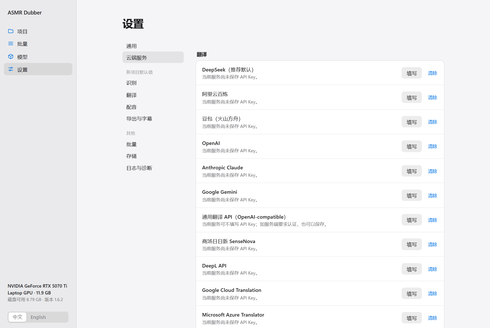

把 Key 粘贴进去，点“保存”。

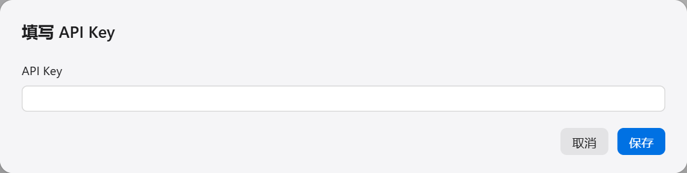

有两种情况可以跳过这一步：

- 你手上已经有译文字幕，不需要翻译。
- 原声和配音是同一种语言，只想换个声音重新配。

## 2. 新建项目

回到“项目”页，把音频或视频文件拖到“新建”区域，或者点一下选择文件。

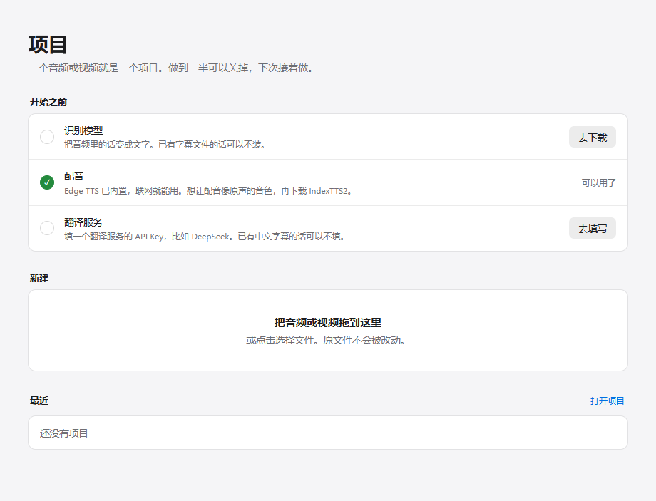

文件上传后会弹出这个窗口：

- **音频里说的是**：原声的语言。
- **配音成**：想要的配音语言，中文或英文。
- **文字从哪来**：没有字幕就选“自动识别”。有字幕或台本的话，见[字幕与台本](SUBTITLE_WORKFLOW.md)。

点“创建”。程序会把原文件复制一份到项目文件夹里，你的原文件不会被改动。

## 3. 认识工作区

项目打开后是这个样子：

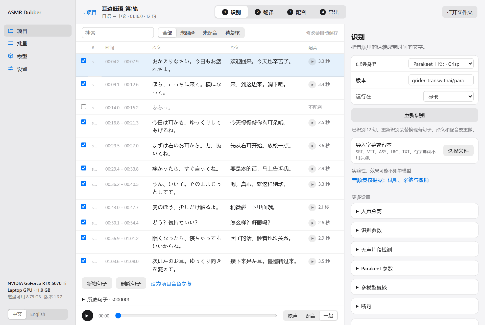

- **顶部**是四个步骤：识别、翻译、配音、导出。做完的步骤数字会变成实心。可以随时点任何一步回去改。
- **左边**是句子表格。每一行是一句话，有时间、原文、译文和配音状态。原文和译文可以直接点进去改。
- **右边**是当前步骤的设置和操作按钮。常用的在上面，其余的收在“更多设置”里。
- **底部**是播放条，可以切换听原声、配音，或者两个一起。

右边面板里改的设置只属于这个项目，改完自动保存，没有“保存”按钮。

## 4. 第一步：识别

识别是把音频里说的话转成带时间的文字。

1. 确认“识别模型”。日语音频用 Parakeet，英语和中文用 Faster-Whisper。
2. 点“重新识别”。第一次识别也是点这个按钮。
3. 等它跑完。一小时的音频用显卡大约需要几分钟。

跑完后表格里会出现句子。花几分钟过一遍原文，把明显识别错的地方改掉，因为翻译是照着原文翻的。错在这里，后面每一步都会跟着错。

如果句子的切分不理想（一句话被切成两半，或者两句话粘在一起），可以展开“更多设置”里的“断句”和“无声片段检测”调整后重新识别。

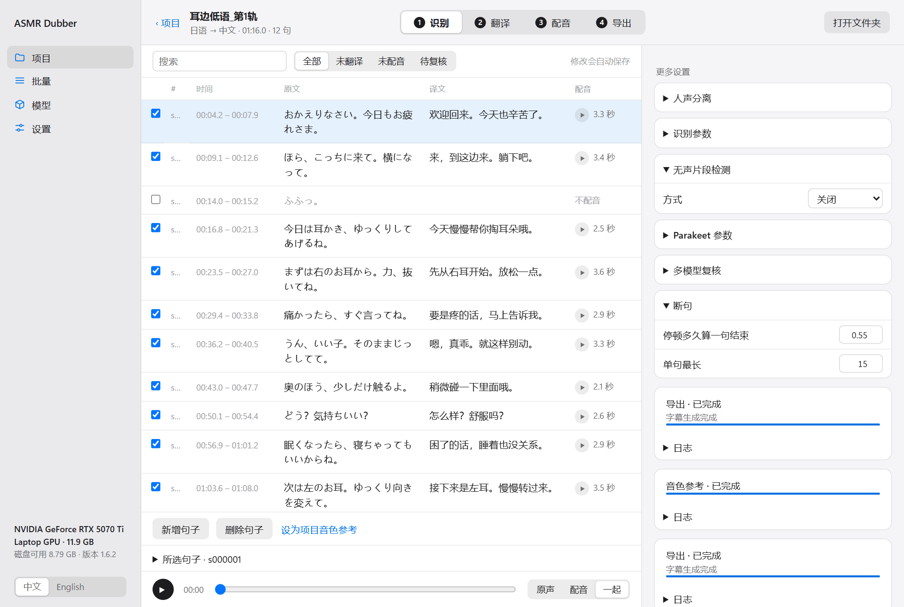

> **注意**：重新识别会替换掉现有的全部句子，已经做好的译文和配音都要重做。确认原文没问题后再往下走。

## 5. 第二步：翻译

点顶部的“翻译”。

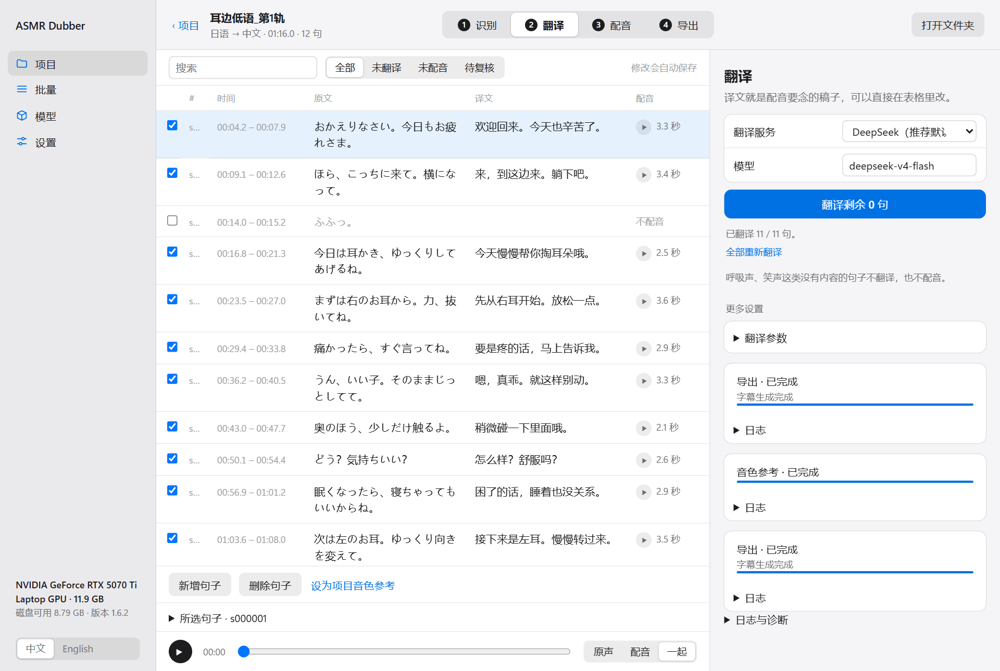

1. 确认“翻译服务”是你填了 Key 的那一家。
2. 点“翻译剩余 N 句”。

翻译完成后，译文会填进表格。**译文就是配音要念的稿子**，所以这一步值得认真看一遍：

- 觉得哪句翻得不好，直接点进译文格子里改。
- 译文太长的话，配音会比原句长，后面可能要加速才能塞进去。尽量让译文和原句差不多长。
- 笑声、呼吸声这类没有实际内容的句子不会被翻译，译文是空的，这是正常的。

“翻译剩余”只翻还没有译文的句子，不会动你改过的。“全部重新翻译”会把所有译文重翻一遍，包括你手动改过的，点之前会让你确认。

想让翻译更贴合作品，可以展开“翻译参数”，在“翻译 Prompt”里写上人物关系、称呼和语气。这里还能调上下文句数等参数。改乱了可以点“恢复内置 Prompt”。

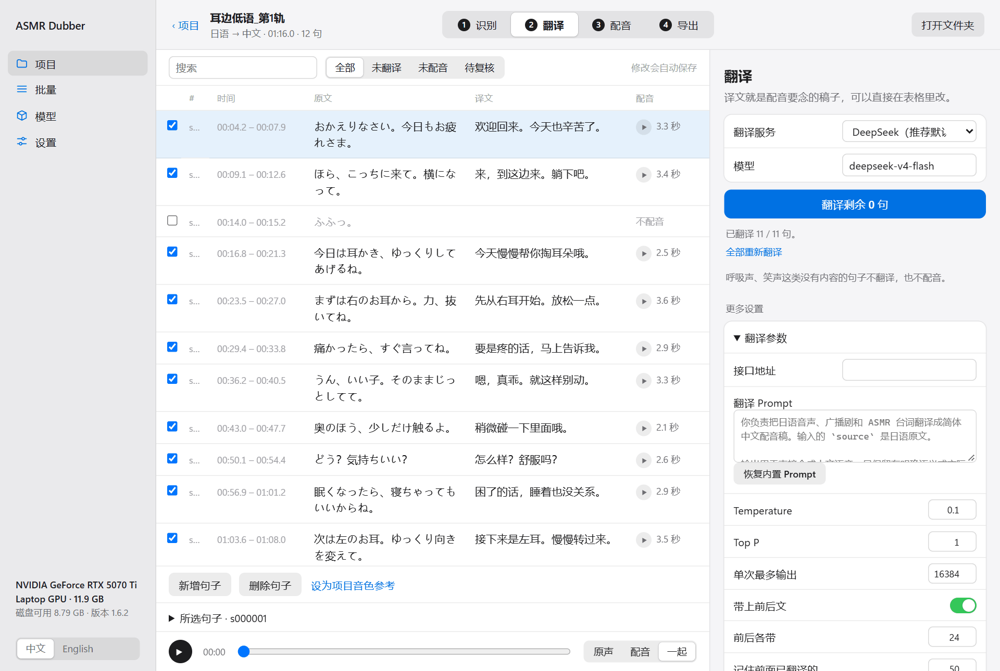

## 6. 第三步：配音

点顶部的“配音”。

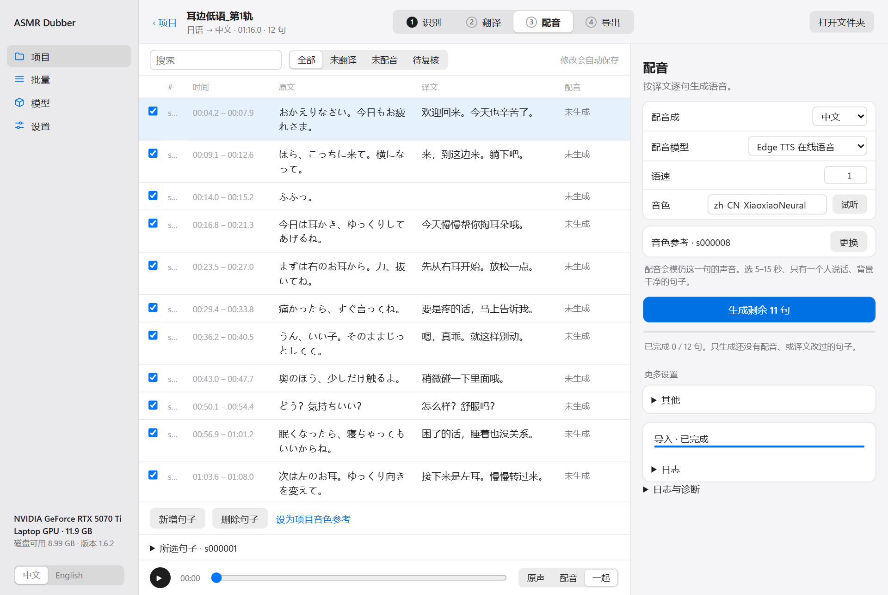

### 选配音模型

- **IndexTTS2**：模仿原声的音色，需要 NVIDIA 显卡。想要“听起来像原来那个人在说中文”就用这个。
- **Edge TTS**：微软的在线语音，免费，不需要显卡，但声音是固定的那几个，不能模仿原声。
- 其他云端服务见[模型与服务](BACKENDS.md)。

### 选音色参考

用 IndexTTS2 这类克隆模型时，需要告诉它模仿哪个声音。程序会自动推荐一句，你也可以点“更换”自己选。

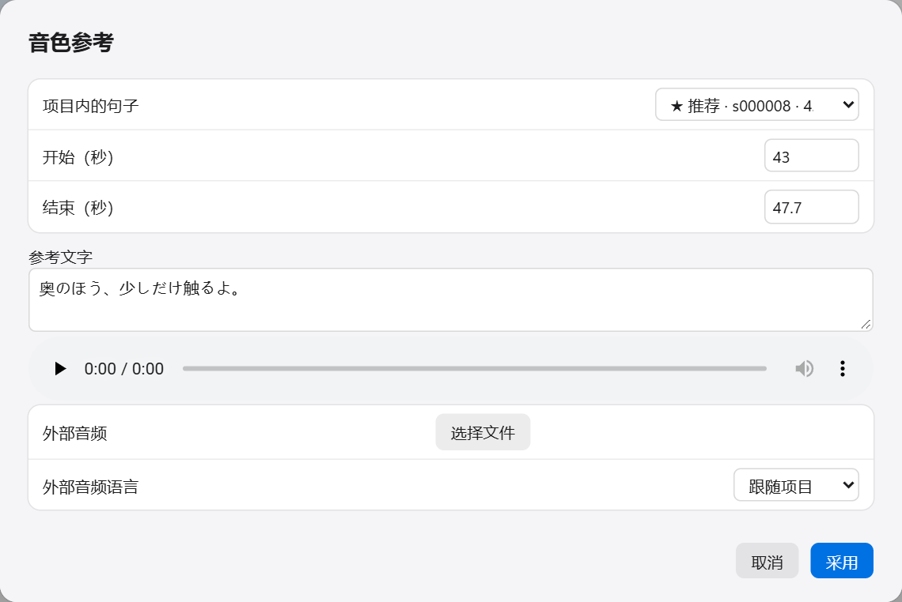

在“项目内的句子”里挑一句，点播放听一下。好的参考是这样的：

- 5 到 15 秒长
- 只有一个人在说话
- 是正常说话的声音，不是纯气声或笑声
- 背景音乐和音效比较弱

列表里带“★ 推荐”的是程序认为合适的，带“⚠ 过短”的不建议用。也可以点“选择文件”用项目外的音频当参考。选好后点“采用”。

### 开始生成

点“生成剩余 N 句”。程序会一句一句地生成，右侧能看到进度。

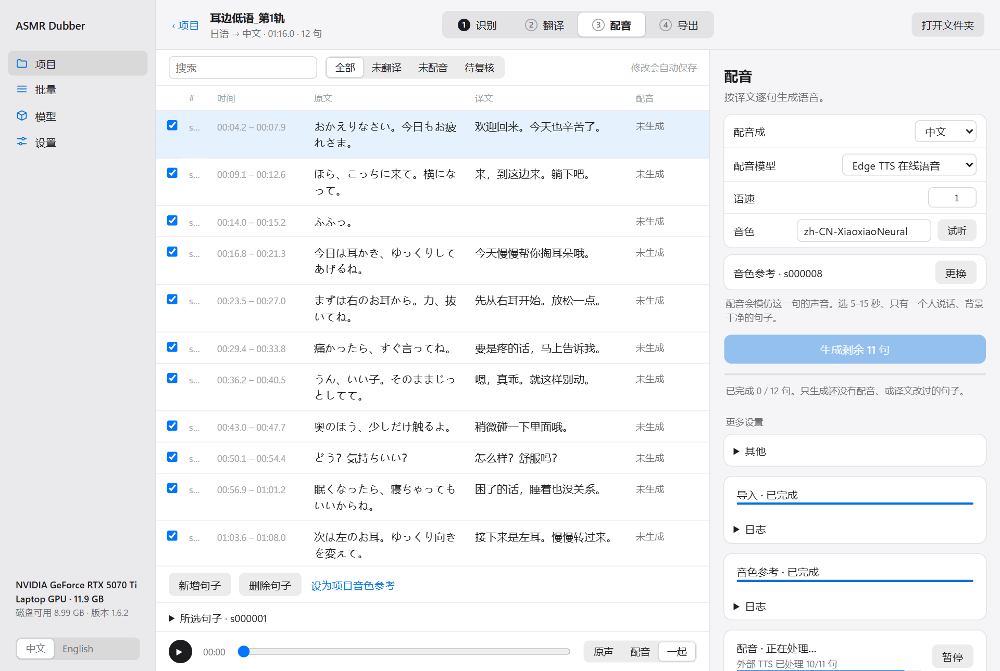

生成完的句子，表格最右边会出现播放按钮和时长，点一下就能听这一句。

“生成剩余”只会生成还没有配音的句子，和译文被改过的句子。所以听到哪句不满意，改一下译文再点一次就行，不用全部重来。

## 7. 第四步：导出

点顶部的“导出”。

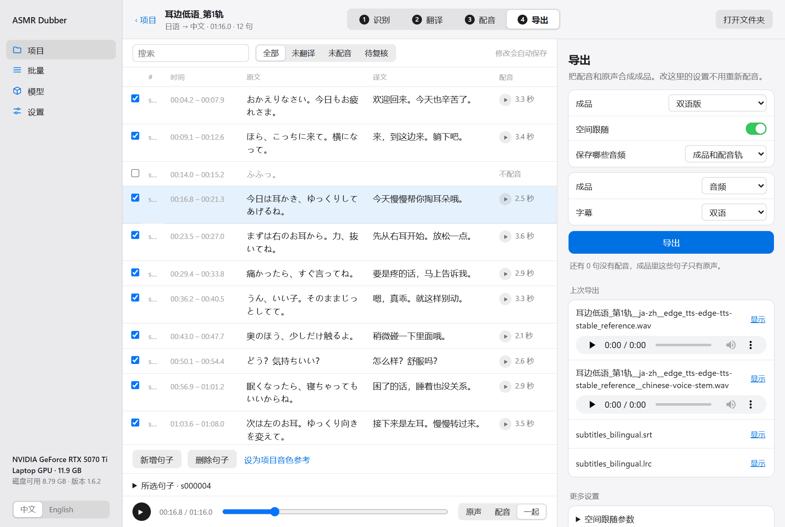

从上到下几个选项：

- **成品**：选“双语版”就是原声加配音。“替换版”是去掉原来的人声只留配音，属于实验性功能，见[混音与空间跟随](EXPERIMENTAL_AUDIO.md)。
- **空间跟随**：打开后，配音会跟着原声的左右位置和远近变化。原声是双声道的音声建议打开。
- **保存哪些音频**：除了成品，还可以单独保存一条只有配音的音轨，方便你在别的软件里继续处理。
- **导出内容**：选“音频”正常导出。选“只要字幕”就不生成音频。
- **字幕**：双语、仅译文、仅原文，或者不要字幕。

点“导出”。完成后，文件会出现在“上次导出”里，可以直接试听，也可以点“下载”保存到别处。

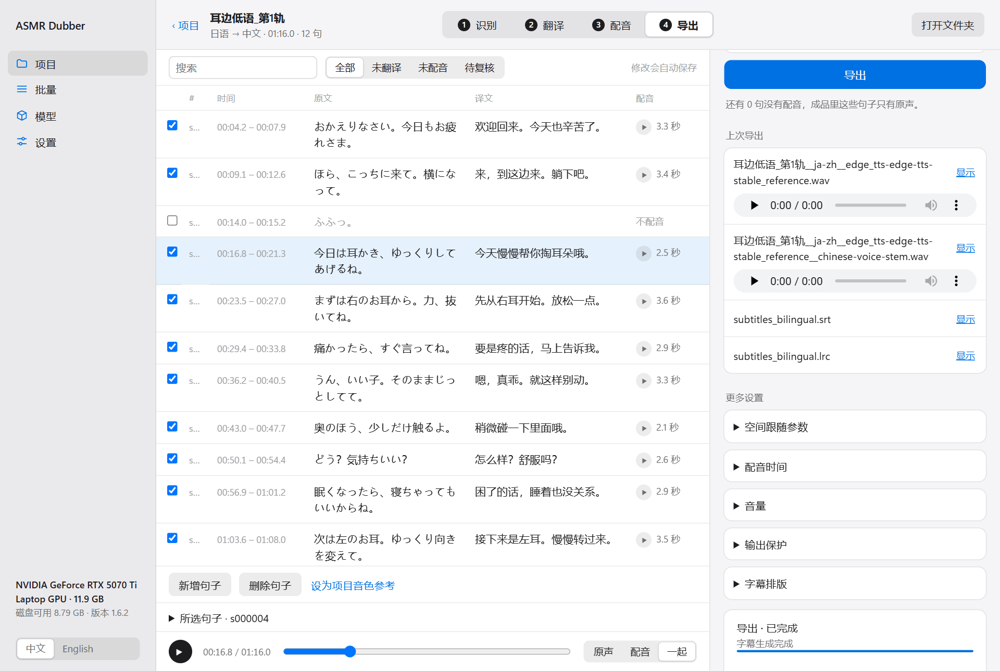

点右上角的“打开文件夹”能看到所有成品文件。

导出这一步的设置（音量、配音时间、空间跟随的强度）改了以后，只需要重新点“导出”，不用重新配音。想调这些的话见[混音与空间跟随](EXPERIMENTAL_AUDIO.md)。

如果导出时提示某一句“没有中文”，说明这句有原文但没有译文。补上译文，或者把这句左边的勾去掉，再导出。

## 8. 改某一句

在表格里点一下某一行选中它，表格下方会出现几个按钮。展开“所选句子”可以看到这一句的详细控制：

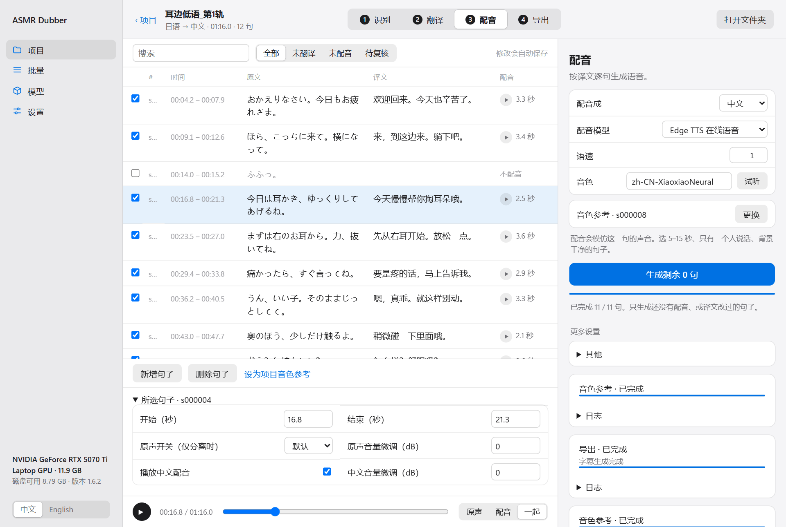

| 想做什么 | 怎么做 |
|---|---|
| 改原文或译文 | 直接点进格子里改，点别处就保存了 |
| 这句不要配音 | 去掉这一行最左边的勾 |
| 调整这句的起止时间 | 改“开始（秒）”和“结束（秒）” |
| 这句配音太响或太轻 | 改“配音音量微调（dB）”，正数变响，负数变轻 |
| 导出时这句不放配音，但保留已生成的 | 去掉“播放配音”的勾 |
| 在后面加一句漏掉的话 | 点“新增句子” |
| 删掉这句 | 点“删除句子” |
| 用这句当音色参考 | 点“设为项目音色参考” |

表格上方可以搜索，也可以只看“未翻译”“未配音”的句子，方便检查还有哪些没做完。句子多的时候每页显示 50 句，在表格下方翻页。

改完之后要重做哪些步骤：

| 改了什么 | 接下来 |
|---|---|
| 某句的译文 | 配音步骤点“生成剩余”，再导出 |
| 配音模型、音色参考 | 全部重新配音，再导出 |
| 音量、配音时间、空间跟随、字幕排版 | 只需要重新导出 |
| 重新识别 | 翻译和配音都要重做 |

## 9. 中途停下和接着做

- **想停下正在跑的任务**：点右侧任务旁边的“暂停”。已经做完的部分会保留。
- **想接着跑**：点“继续”，或者再点一次那一步的按钮。它只会做剩下的。
- **关掉程序再打开**：项目会出现在首页的“最近”里，点一下就回到上次的地方。

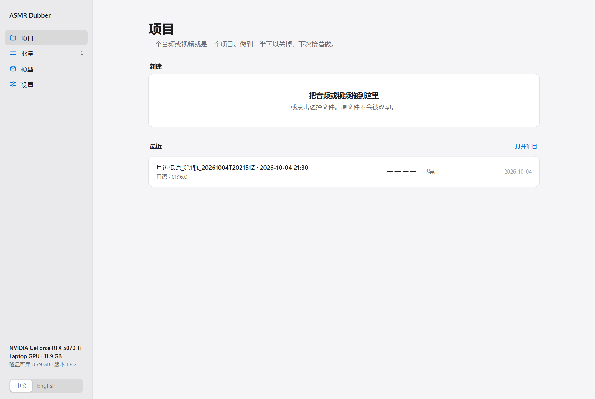

关掉启动程序时出现的那个黑色窗口，程序就停了。只关浏览器页面不会停，重新打开 `http://127.0.0.1:7860` 就能回来。

## 10. 接下来看什么

- 有一整个作品文件夹要做：[批量处理](BATCH.md)
- 手上有字幕或台本：[字幕与台本](SUBTITLE_WORKFLOW.md)
- 配音和原声的音量、时间对不上：[混音与空间跟随](EXPERIMENTAL_AUDIO.md)
- 想换别的模型或服务：[模型与服务](BACKENDS.md)
- 出错了：[常见问题](TROUBLESHOOTING.md)
