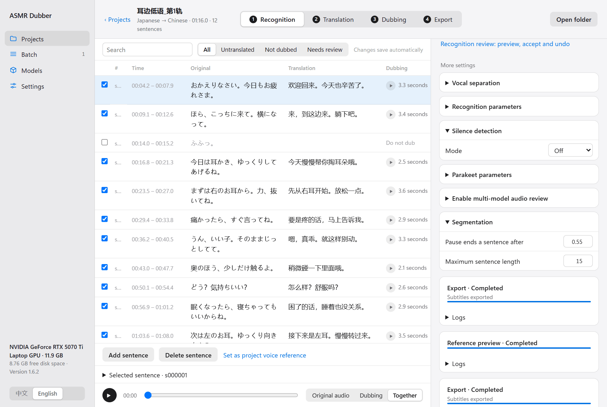
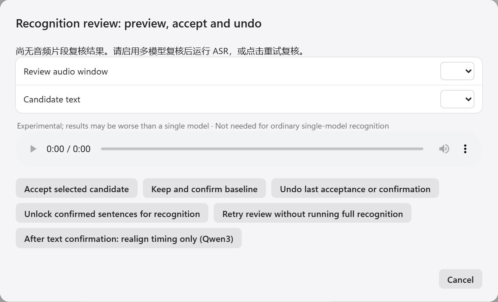

English | [中文](../AUDIO_REVIEW_TUTORIAL.md)

[← All docs](INDEX.md)

# Multi-model review

> This is experimental and not necessarily better than using one model. You do not need it for ordinary use.

Recognition models mishear things. The idea of multi-model review is to have one or two more models listen to the same audio, pick out the places where they wrote something different, and let you decide who is right.

It suits people who need very accurate recognition and are willing to confirm each spot. It does not make the result more accurate by itself. It only helps you find the likely problems faster.

## What you need

At least two recognition models installed. For example, Parakeet as the main model, plus Kotoba-Whisper or Faster-Whisper to review. Download them from the Models page.

## Turning it on

On the project's **Recognition** step, expand **Multi-model review** under **More settings**:

1. Turn the switch on.
2. Choose which models review under **Review models**.
3. Leave **Review handling** on **Suggest changes**.

Then click **Run recognition again**. The main model recognises as usual, and the review models then listen to the same audio.

If the project is already recognised, you do not need to run recognition again. Click **Retry review without running full recognition** in the review dialog described below.

## Looking at the differences

On the **Recognition** step, click the blue **Recognition review: preview, accept and undo** link.

(The project in the screenshot has not run a review, so the dialog reports no results. After a review, the two dropdowns are filled.)

To handle one difference:

1. Pick a window under **Review audio window**.
2. Pick a candidate under **Candidate text**. Its difference from the main model's text is shown below.
3. Play the original audio for that window.
4. Decide:
   - The candidate is right: click **Accept selected candidate**.
   - The main model is right: click **Keep and confirm baseline**.
   - Neither is right: close the dialog and fix it in the table.

If you clicked the wrong one, click **Undo last acceptance or confirmation**.

What the statuses mean:

| Status | Meaning |
|---|---|
| Text agrees | The models wrote the same thing. They may still all be wrong |
| Text differs | They wrote different things. Listen to it |
| Insufficient evidence | The review models gave nothing reliable. The main model's text is kept |
| Boundary needs manual confirmation | The sentence split is in doubt. It cannot be replaced in one click; fix it in the table |

Numbers and negations ("is" versus "is not") deserve a second listen. Models get these wrong most often.

## The other buttons

- **Unlock confirmed sentences for recognition**: sentences you confirmed or accepted are locked so that running recognition again does not overwrite them. Click this to let them be recognised again.
- **Retry review without running full recognition**: runs only the review models again and leaves the main result alone.
- **After text confirmation: realign timing only (Qwen3)**: recalculates each sentence's start and end once the text is settled. Needs the Qwen3 alignment model.

## Automatic acceptance

Setting **Review handling** to **Apply conservative changes** lets the program replace text by itself when it is very confident, without asking you each time. The conditions are strict: models of different types must produce exactly the same text, and no numbers or negations may be involved.

Even so, an automatic replacement can be wrong. It can be undone like any other.

## After accepting

Once the original text changes, the translation and the dub for that sentence may no longer match. Check that sentence's translation on the translation step, change it if needed, then click **Generate remaining** on the dubbing step.
