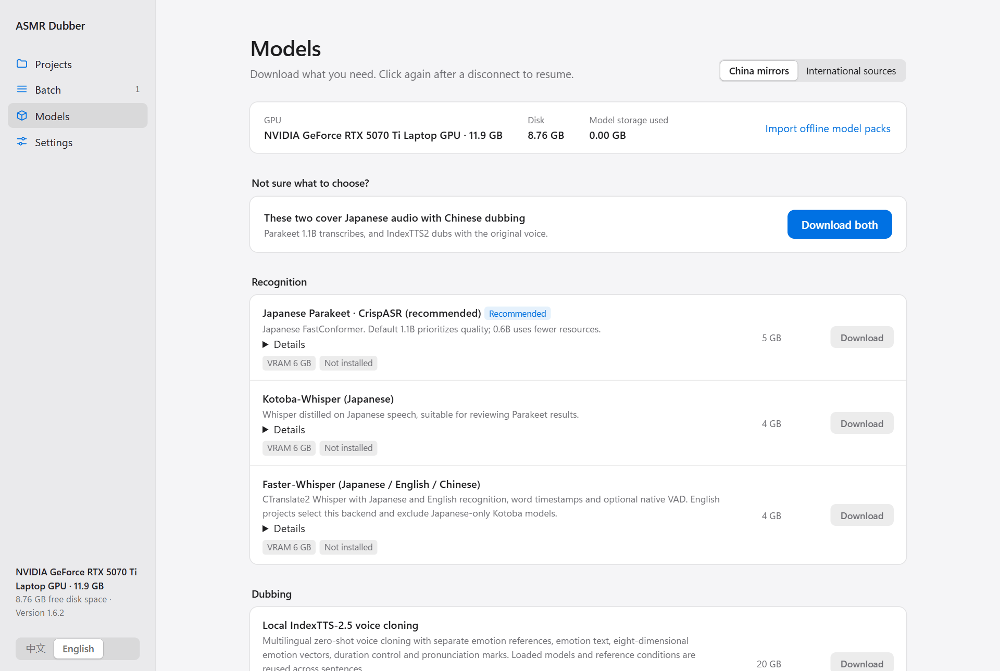
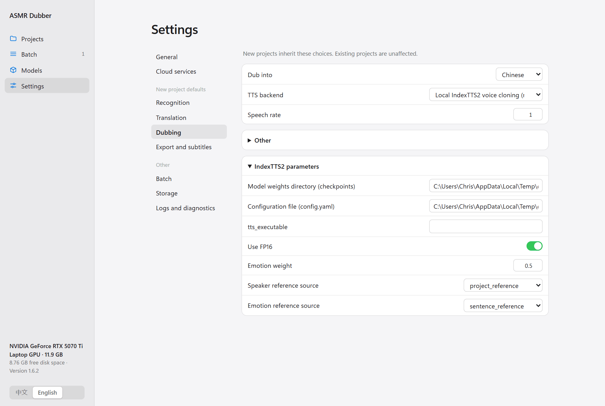

[中文](../BACKENDS.md) | English

[Documentation index](INDEX.md) · [README](../../README.en.md)

# Backends

The registry is the capability source of truth. A listed interface is not a promise that every remote model or local device was tested. Install only the models needed for the selected workflow.

## ASR, VAD and alignment

| Backend | Language / notes |
|---|---|
| Parakeet via CrispASR | Japanese; CTC 1.1B GAL quality baseline, 0.6B TDT/CTC lower-resource alternative |
| Kotoba-Whisper | Japanese; Model download prepares v2.2 only |
| Faster-Whisper | Japanese/English/Chinese with a suitable multilingual model; Model download prepares large-v2 |
| Generic ASR API | OpenAI-compatible `/v1/audio/transcriptions`; uploads audio |

Parakeet uses its own executable/models, not the main Torch runtime. Its chunk size defaults to 120 s and idle timeout to 600 s. Punctuation restoration is disabled by default. Kotoba defaults to 30 s chunks. Faster-Whisper generally uses float16/int8_float16 on GPU or int8 on CPU; device support depends on the installed runtime.

Other registered Whisper weights such as large-v3 are not included automatically. Use the model's expected local snapshot layout and verify completeness before selecting it; a model ID alone is not an installation.

VAD and alignment are independent. Default VAD is off. Backend VAD is available only for compatible recognizers. The Japanese ASMR ONNX VAD needs its own model/runtime and does not modify the original recording. Qwen3 ForcedAligner locates recognized text and cannot establish text correctness.

Multi-model review operates on common audio clips and is **experimental, potentially worse than one model**. It does not call a translation LLM. [Review guide](AUDIO_REVIEW_TUTORIAL.md).

## Local TTS

IndexTTS2 and IndexTTS-2.5 have independent environments and checkpoints. Download them in Models, then select the backend in project step 3. IndexTTS-2.5 is a separate opt-in download. Neither is installed into the main ASR venv.

Both expose speaker/emotion reference choices. IndexTTS-2.5 adds duration factor, language, normalization, BF16, sampling and emotion controls. CPU is supported by the integration but often very slow. Optional CUDA kernels/DeepSpeed/compilation must match the isolated environment; leave them off initially.

Check upstream model licenses; application MIT licensing does not relicense the weights or generated voice rights.

## TTS services

| Interface | Required server contract |
|---|---|
| IndexTTS2 API | `/v1/tts` multipart with reference audio; server owns model/runtime |
| Generic TTS API | OpenAI-compatible `/audio/speech`, text/model/voice; no reference cloning |
| Edge TTS | Online service via edge-tts; no API key, no cloning |
| MiMo | `mimo-v2.5-tts`, `-voiceclone` or `-voicedesign`; reference/voice/style depend on model |
| MiniMax | Text-to-audio API; account voice ID, speed, volume, pitch and optional emotion |
| GPT-SoVITS | Official `api_v2.py`; reference transcript plus a path accessible to the server |
| CosyVoice | Official FastAPI runtime; zero-shot audio+text or cross-lingual audio |
| Fish | Compatible `/v1/tts`; encoded reference audio and transcript |

Default local endpoints are examples, not automatically deployed servers. Remote servers cannot read arbitrary client-local paths. Check API key, region, endpoint version and model ID together.

HTTP concurrency defaults to 2 and is bounded. Responses are validated as audio before replacing caches. Output URL retrieval does not forward credentials and rejects redirects; current response ceiling is 256 MiB. Provider-specific JSON must not replace protected fields.

## Translation

LLMs: DeepSeek, Bailian, Doubao/Ark, SenseNova, OpenAI, Claude, Gemini and OpenAI-compatible. They preserve IDs through structured output and can assist untimed-script matching. Machine-translation APIs—DeepL, Google Basic v2 and Azure Translator—translate text but do not implement that matching contract.

Built-in endpoints/model names are presets; use IDs available to your account. Bailian region and key must agree with its endpoint. Doubao may use a deployment endpoint ID. SenseNova uses its compatibility gateway. Extra JSON can configure provider-specific inference controls without replacing model/messages/stream.

## Separation and RTF

Local audio-separator plus Replicate/custom HTTP adapters are optional. Separation and Chinese replacement are experimental, not recommended. Download/upload is explicit. RTF is local mix-time stereo processing, not another cloud service. [Parameters, contracts and limitations](EXPERIMENTAL_AUDIO.md).

Project parameters autosave; new-project defaults are separate. Save keys in Settings → Cloud services. [All 201 fields](PARAMETERS.md) · [Configuration](CONFIGURATION.md).
