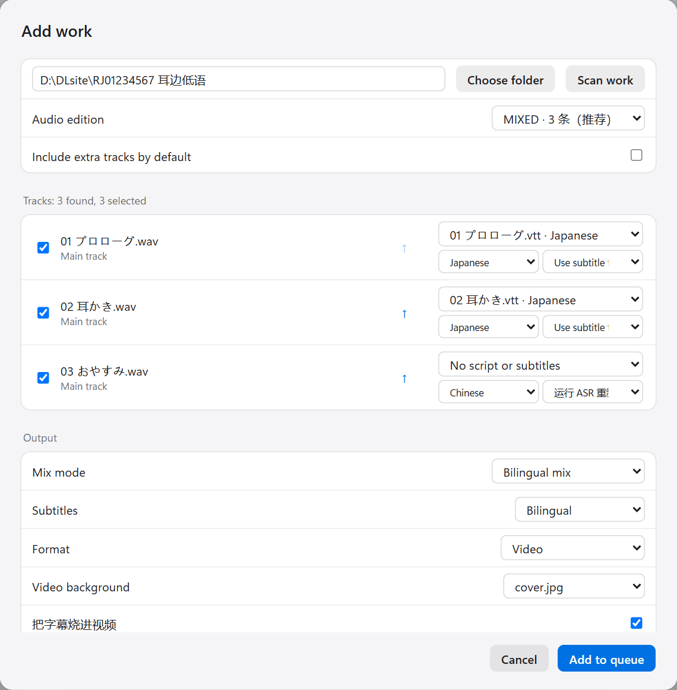
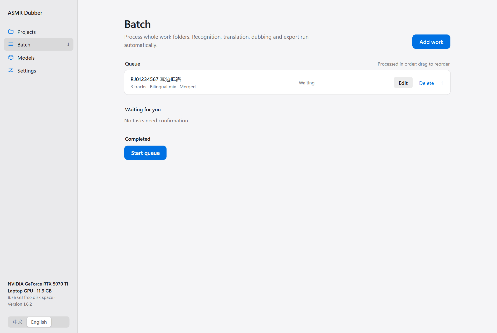
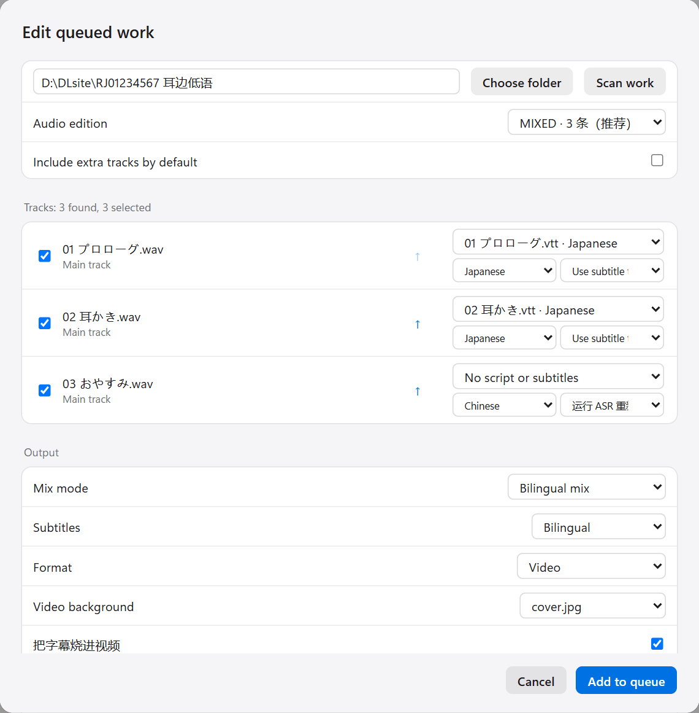
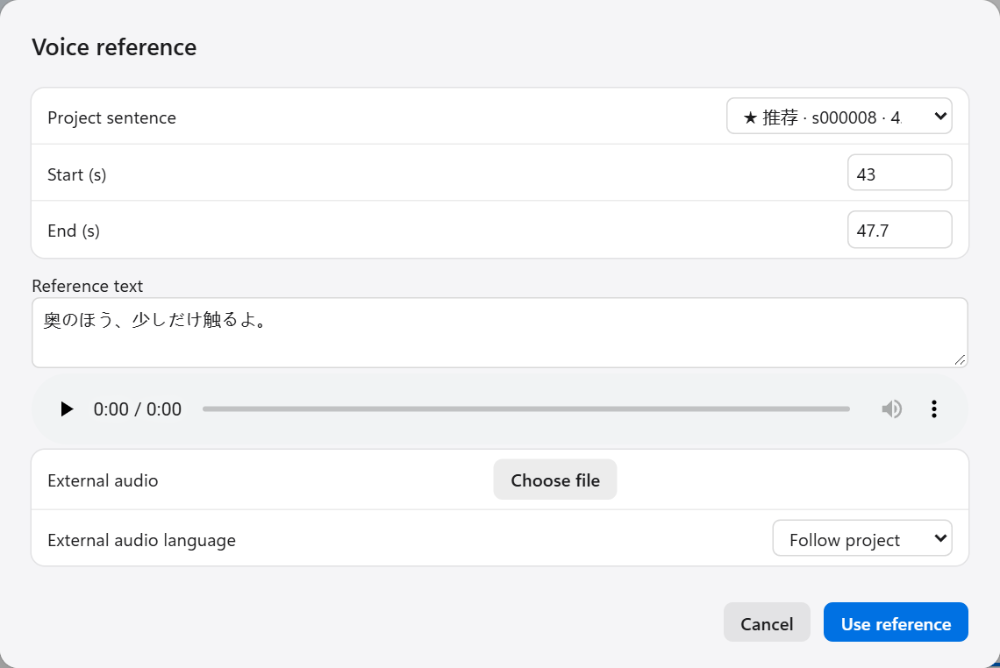
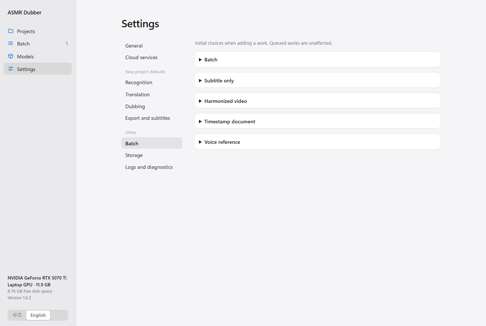

English | [中文](../BATCH.md)

[← All docs](INDEX.md)

# Batch processing

A work usually has several tracks. The Batch page takes a whole work folder and runs recognition, translation, dubbing and export on every track, one after another, without you watching. At the end it can merge all tracks into one file, or produce a video with a cover image.

Do one track by hand first with the [user guide](USER_GUIDE.md), so you know the models, the translation provider and the voice all work. Then use batch.

## 1. Add a work

Click **Batch** on the left, then **Add work** at the top right.

### Choose the folder

Enter the path of the work folder at the top (or click **Choose folder**), then click **Scan work**. The folder must already be extracted.

The program finds the audio, subtitles and cover images inside. If the work ships in several formats such as WAV and MP3, pick one under **Audio edition**.

Bonus tracks, samples and free talks are skipped by default. Tick the option below to include them.

### Check each track

The track list shows everything that will be processed. Each track has its own settings:

- **The tick on the left**: untick tracks you do not want.
- **The arrow**: change the order. Merging follows this order.
- **The first dropdown**: which subtitle file this track uses. The program matches by file name; correct it if it guessed wrong. Choose **No script or subtitles** if there is none.
- **Language**: the language of the subtitles (or of the audio).
- **The last dropdown**: how to use the subtitles.
  - **Use subtitle text and timing (no ASR)**: skip recognition and use the subtitles as they are. Choose this when the subtitles have timing.
  - **Run ASR to retime**: run recognition for timing and take the text from the script. Choose this when the script has no timing, or its timing is unreliable.

Take a few seconds on every track. A subtitle matched to the wrong track makes everything after it wrong.

### Choose what to make

| Option | Meaning |
|---|---|
| **Mix mode** | See the table below |
| **Subtitles** | Bilingual, translation only, original only |
| **Format** | **Audio** produces audio only. **Video** adds a still image. **Harmonized video** is described below |
| **Video background** | Which image from the work to use, or a black background |
| **Burn subtitles into the video** | Draw the subtitles on the picture |
| **Multiple tracks** | **Merge into one** joins all tracks into a single file. **Separate tracks** exports each on its own. **Both** does both |

There are five kinds of result:

| Result | What you get |
|---|---|
| Bilingual mix | The original plus the dub |
| Replacement mix (experimental) | The original voice removed, leaving background and dub. Needs a vocal separation model |
| Bilingual and replacement mixes | Both. Recognition, translation and dubbing run only once |
| Original audio and subtitles, no dubbing | No dub, just subtitles for the original |
| Subtitle files only | SRT and LRC files, no audio |

**Harmonized video** lowers the original audio and delays the original, the dub and the subtitles together by a set amount. How much is set under **Settings → Batch → Harmonized video**.

Click **Add to queue** when everything is set. You can add more works and start them all together.

## 2. Start

Works in the queue are processed from top to bottom. Before starting you can:

- Click **Edit** to change any option for a work.
- Click **Delete** to remove it from the queue. Nothing in the work folder is deleted.
- Drag, or click the arrow, to reorder.

Click **Start queue** to begin.

One thing to remember: **the recognition, translation and dubbing settings are recorded at the moment a work is added to the queue.** Changing the defaults in Settings afterwards does not affect works already queued. To apply new settings, click **Edit** and save again.

## 3. Confirm the voice reference

With a cloning model, the program picks one sentence from each work as the voice reference. When it reaches that point it pauses for you, and a **Preview and choose** button appears under **Waiting for you**.

Listen to its pick. Click **Use reference** if you are happy with it, or choose another sentence. See [the dubbing section of the user guide](USER_GUIDE.md#choose-a-voice-reference) for what makes a good reference.

If you do not respond, it continues with its own pick when the wait ends (60 seconds by default). Whether it waits, and for how long, is set under **Settings → Batch → Voice reference**. Turn the wait off if you plan to leave it running overnight.

## 4. Collect the results

Finished works appear under **Completed**. Click **Open folder** to see the files.

Results are placed in a new folder inside the work folder (named `AutoFlow输出` by default; you can change the name in Settings). The original files are not modified.

If a work fails, read its log first. Fix the problem and click **Resume**. Tracks and sentences that already finished are not redone.

To redo a completed work from scratch, edit it and tick **Reprocess**. This overwrites the earlier results, so copy anything you want to keep.

## 5. Batch defaults

**Settings → Batch** holds the initial options for adding a work. Changes apply only to works added afterwards.

| Group | Contents |
|---|---|
| Batch | Output folder name, default format, default merge mode, default video background, whether to include bonus tracks, whether to translate folder names and track titles |
| Subtitle only | Default subtitle content and how subtitle files are named |
| Harmonized video | How much to lower the original, how long to delay, whether the original-audio video also gets burned-in subtitles |
| Timestamp document | Optional text added to the timestamp document that comes with a merged result |
| Voice reference | Whether to wait for you and for how long |

Recognition, translation and dubbing use the settings under **Settings → New project defaults**. See [Settings and storage](CONFIGURATION.md).
