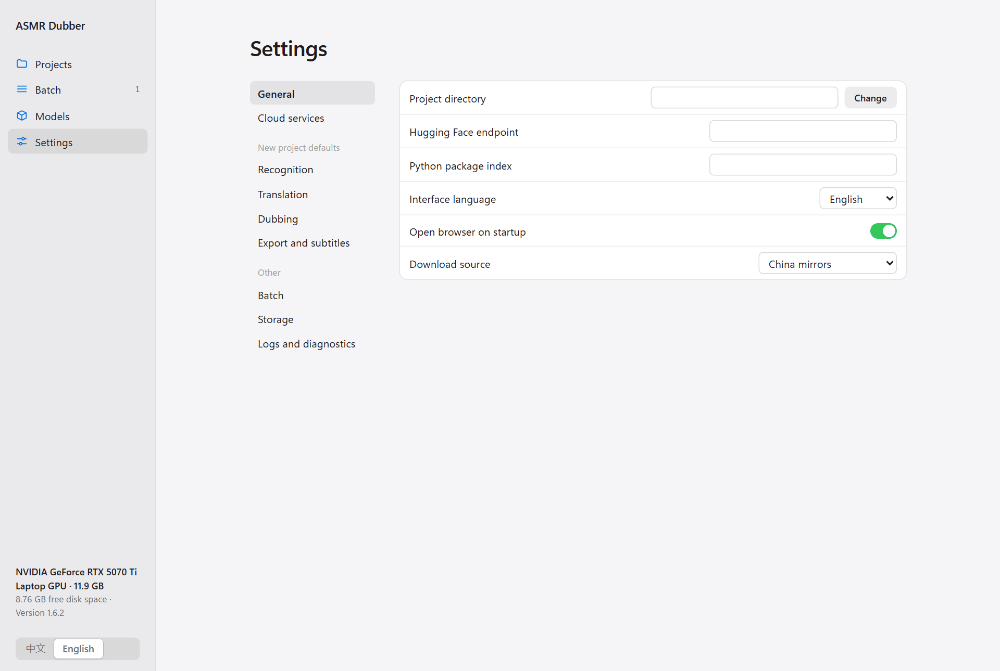
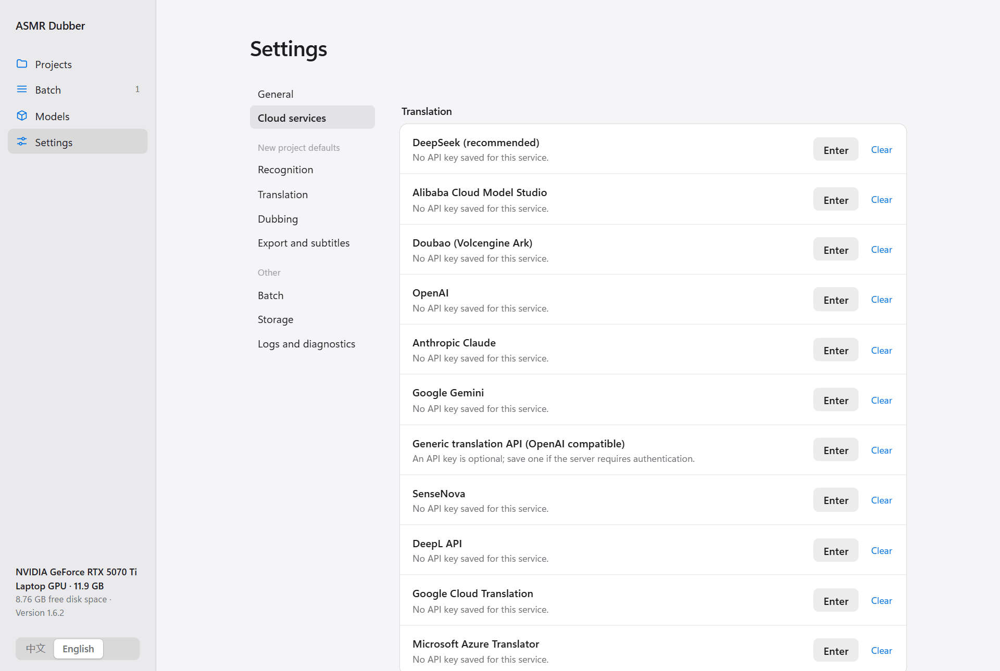
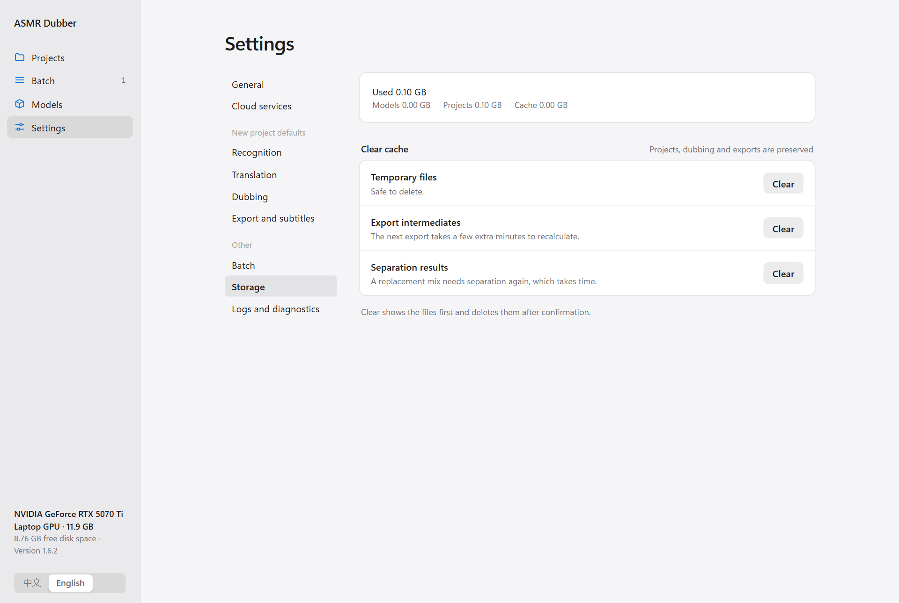

English | [中文](../CONFIGURATION.md)

[← All docs](INDEX.md)

# Settings and storage

## Where to change settings

There are two places to change settings, and they cover different things:

| Where | What it affects |
|---|---|
| Inside a project, in the right panel | **Only that project** |
| **Settings → New project defaults** | **Only projects created afterwards.** Existing projects do not change |

When you create a project, it gets a copy of the defaults as they are at that moment. From then on it has its own settings and no longer follows the defaults.

So:

- To change the project you are working on, change it inside the project.
- To change how future projects start, change the defaults.
- To change both, change both.

Every setting saves automatically; there is no Save button. Number and text boxes save when you click somewhere else.

## General settings



| Setting | Notes |
|---|---|
| Project directory | Where new projects are stored. Empty means `.asmr-dubber/projects` inside the program folder. Point it at another drive if space is tight |
| Interface language | 中文 or English. The switch at the bottom left does the same. It only changes the interface, not the recognition or dubbing language |
| Open browser on startup | Turn off if you do not want a browser window on every start |
| Download source | China mirrors or international sources. The same setting as the switch on the Models page |
| Hugging Face endpoint, Python package index | Mirror addresses for models and dependencies. Normally left empty |

## New project defaults

There are four pages: recognition, translation, dubbing, and export with subtitles. Each matches the panel of the corresponding project step exactly.


Common options are shown directly. The rest are folded into groups by purpose; click a group to expand it. Which groups appear depends on the model you chose: the IndexTTS2 parameters only show when IndexTTS2 is selected, and disappear with Edge TTS.

The meaning, default and range of every parameter are in the [parameter reference](PARAMETERS.md).

## Cloud service keys

Enter them under **Settings → Cloud services**. Keys are global and shared by all projects.



- Click **Enter** to add a key and **Clear** to remove it.
- Once entered, the full key is never shown again.
- Keys are stored in plain text in `.asmr-dubber/config/secrets.json`. Delete that file before giving the program folder to anyone.

How to get keys and which model names to use is covered in [Models and services](BACKENDS.md).

## Freeing disk space

After a few projects, intermediate files take up a fair amount of space. **Settings → Storage** clears them.



The top shows how much models, projects and caches use. Three categories can be cleared:

| Category | What it is | After clearing |
|---|---|---|
| Temporary files | Copies left over from processing | No effect. Safe to clear |
| Export intermediates | Intermediate results of mixing and spatial following | The next export takes a few minutes longer to recompute |
| Separation results | The separated voice and background | The next replacement mix has to separate again, which is slow |

Clicking **Clear** does not delete right away. The program scans first and lists the projects and files it would remove. Nothing is deleted until you click **Confirm cleanup**.

**Never cleared**: the original audio, sentences and translations, each sentence's dub, exported results, and models.

Models are deleted separately on the Models page. To delete a whole project, remove its folder from the project directory.

You cannot clear anything while a task is running.

## Where your data is

By default everything is in the `.asmr-dubber` folder inside the program directory:

```text
.asmr-dubber/
  projects/   your projects, one folder each
  config/     settings and API keys
  models/     models
  runtimes/   the runtime for each model
  cache/      download cache
  logs/       logs
  temp/       temporary files
```

A project folder contains a copy of the original audio, the sentences and translations (`project.json`), every sentence's dub, and the exported audio and subtitles.

**To back up a project**, copy its whole folder. `project.json` alone is not enough.

**To back up everything**, copy the whole `.asmr-dubber` folder. If you changed the project directory, back that location up as well.

## Access from another computer

By default only the local machine can reach the interface. To open it from another device on your network (for example, the program runs on a desktop with a GPU and you work from a laptop), give it a listen address at startup:

```bash
# Linux
bash scripts/linux/run-ui.sh --host 0.0.0.0
```

```powershell
# Windows
.\scripts\windows\run-cli.ps1 ui --host 0.0.0.0 --port 7860
```

A username and password are then required. The username is `asmr` by default, and a random password is generated at startup and printed in the startup window. For a fixed password, set the environment variables `ASMR_DUBBER_UI_USERNAME` and `ASMR_DUBBER_UI_PASSWORD` before starting.

Do not expose it directly to the public internet.

## Environment variables

For custom deployments. Most people never need these.

| Variable | Purpose |
|---|---|
| `ASMR_DUBBER_HOME` | Move the whole data directory elsewhere |
| `ASMR_DUBBER_PROJECTS` | Change only the project directory |
| `ASMR_DUBBER_FFMPEG` | Use a specific FFmpeg |
| `ASMR_DUBBER_ALLOW_EXTERNAL_DOWNLOADS=1` | Allow international download sources for this run |
| `ASMR_DUBBER_UI_USERNAME`, `ASMR_DUBBER_UI_PASSWORD` | Username and password for remote access |
| `ASMR_DUBBER_MAX_UPLOAD_SIZE` | Upload size limit, 20gb by default |
| `MODELSCOPE_API_TOKEN` | Token for private model repositories |
