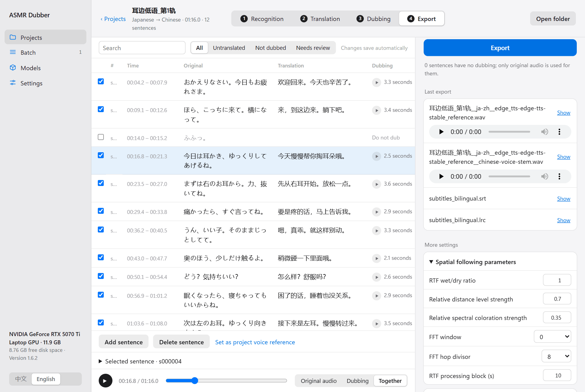
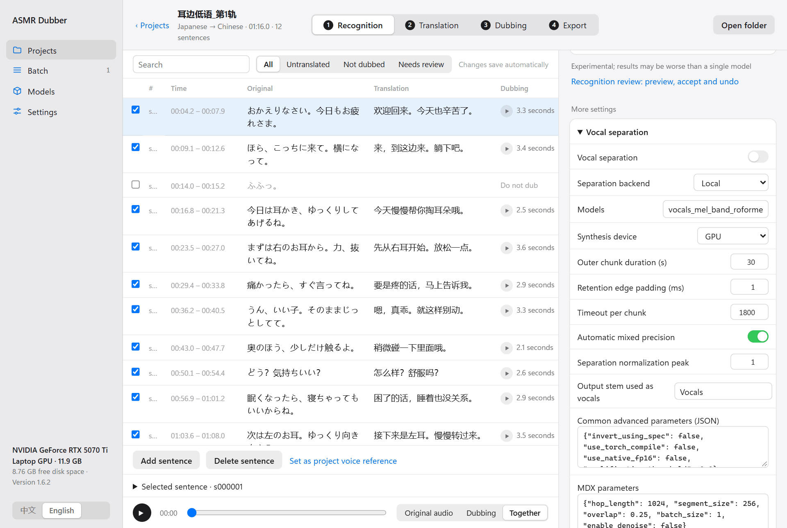

English | [中文](../EXPERIMENTAL_AUDIO.md)

[← All docs](INDEX.md)

# Mixing and spatial following

Once the dub exists, everything about combining it with the original is set on the **Export** step. Changing these settings only requires exporting again, never dubbing again, so feel free to experiment.

## Four kinds of result

| Result | Contains | Good for |
|---|---|---|
| Bilingual mix | The complete original plus the dub | Most cases. Nothing of the original is lost and the dub sits on top |
| Replacement mix (experimental) | The background with the voice removed, plus the dub | When you do not want to hear the original language |
| Dub track only | Only the dub, no original and no background | Mixing it yourself in other software |
| Subtitles only | No audio | When you just want translated subtitles |

The first two are chosen under **Mix mode**. The dub track is saved through **Audio output layout**. Subtitles only is chosen under **Output**.

## Spatial following

In these works the voice often moves: from the left ear to the right, from far to near. An ordinary dub sits in the centre and sounds detached from the original.

With spatial following on, the program analyses the left-right position and distance of each original line and places the matching dub line in the same spot. Older versions and some documents call this RTF (original spatial cue transfer).

Turning the switch on is usually enough. If it sounds wrong, expand **Spatial following parameters**:

| Parameter | What it does | How to adjust |
|---|---|---|
| Strength | Overall strength. 0 is off, 1 follows fully | Lower it if the movement is exaggerated |
| Distance strength | How much the dub gets nearer and farther with the original | Lower it if the dub volume jumps around |
| Tone coloration strength | How much of the original's tone colours the dub | Lower it if the dub sounds muffled or off |
| FFT window, FFT hop divisor | How fine the analysis is | Normally leave alone |
| Processing block | How much audio is processed at once | Lower it if you run out of memory |

Two limits:

- **The original must be stereo.** Mono audio carries no position, so the switch does nothing useful.
- If an original line is too short or too quiet to analyse, that line is placed near the centre. The log says "RTF downgraded". This is not an error.

## Dub timing

Expand **Dubbing timing**:

**Dub offset (ms)**: how long after the original line the dub starts. The default is 500, so the dub comes in half a second after the original starts and the two voices do not land exactly on top of each other. Positive delays the dub, negative brings it forward.

**When the dub is longer than the line**: a translation is often longer than the original line, so the next line is due before this one finishes. There are two ways to handle it:

- **Keep timing and speed up if needed**: each line starts at its original time and speaks faster if it would not fit. The speed-up is capped (**Maximum speed-up on overlap**, 1.8× by default). Past the cap, the line overlaps the next one slightly.
- **Play the next line after the previous one ends**: no speed-up and no overlap. Later lines are pushed back, so the dub drifts further behind the original and the result can be longer than the source.

The first mode suits most cases. If many lines are sped up noticeably, the better fix is to go back to the translation step and shorten the translations.

## Volume

Expand **Volume**.

**Volume processing** has three modes:

- **Follow source loudness** (default): a quiet original line gets a quiet dub, a loud one a loud dub. This sounds the most natural.
- **Uniform volume**: every dub line is brought to the same level. Use it when the original's volume swings wildly and drags the dub with it.
- **Keep original volume**: the dub stays as loud as the model produced it.

If the dub is too loud or too quiet overall, change **Relative to original** or **Final gain adjustment**. The unit is decibels: positive is louder, negative quieter.

To change the volume of one sentence only, see [Changing a single sentence](USER_GUIDE.md#8-changing-a-single-sentence).

**Output protection** holds the peak limiter that prevents clipping. You rarely need to touch it.

## Replacement mix: removing the original voice

The replacement mix first splits the original into voice and background with a vocal separation model, then keeps the background and adds the dub.

This is experimental. Its problems, up front:

- Separation is never perfectly clean. Traces of the original voice are often audible.
- Whispers, breathing and close-mic effects can be removed along with the voice.
- Separation is slow.

If you only want to understand the content, the bilingual mix is usually the better choice.

To make a replacement mix:

**1. Download a vocal separation model** from the Models page.

**2. Turn on vocal separation in the project.** On the **Recognition** step, expand **Vocal separation** under **More settings** and turn on the switch.

**3. Choose the replacement mix when exporting.** On the **Export** step, set **Mix mode** to **Replacement mix** and click **Export**. The first export runs separation and takes a while.

### Putting some of the original back

The replacement mix removes all of the voice, but you may want to keep some of it, such as laughter and sighs. Those sentences have no dub, so removing them leaves a gap.

With the replacement mix selected, **Original vocal reinsertion** appears under **More settings**:

- **Undubbed sentences**: puts back the original voice for every sentence that has no dub.
- **Manual selection**: you list the sentences to put back.
- **No reinsertion**: removes everything.

You can also control this per sentence: select a row, expand **Selected sentence**, and change **Original vocals (separation only)**.

### Separating in the cloud

Without a GPU, separation can be sent to a cloud service (Replicate, or an endpoint you host). Under **Vocal separation**, change **Separation backend** to Replicate or the self-hosted option, and enter the key under **Settings → Cloud services**. This uploads your audio to that service and may cost money.

## What needs redoing

| You changed | Redo |
|---|---|
| Spatial following, dub timing, volume, output protection | Export only |
| Bilingual mix to replacement mix | Export only (the first time waits for separation) |
| Turned vocal separation on or off | Running recognition again is recommended, because the audio it listens to has changed |
