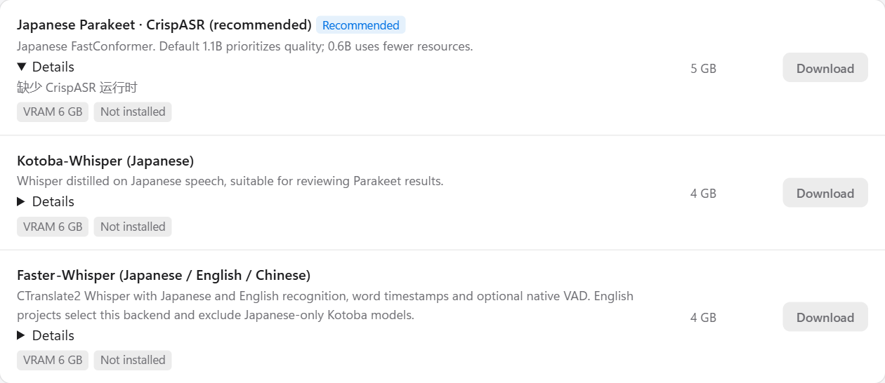
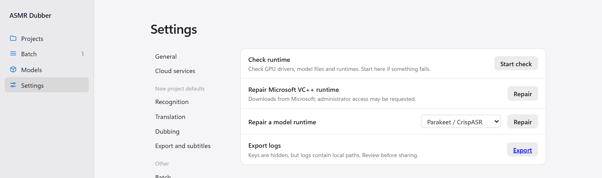

English | [中文](../INSTALLATION.md)

[← All docs](INDEX.md)

# Installation and models

There is no installer. Extract the archive, double-click, and it runs. Models are not included in the archive; you download the ones you need from inside the interface.

## What your computer needs

| | Minimum | Recommended |
|---|---|---|
| System | Windows 10 / 11 (64-bit), or x86_64 Linux | |
| GPU | Works without one | NVIDIA GPU with 8 GB of VRAM or more |
| Disk | 5 GB (online dubbing only) | 40 GB or more (recognition plus voice cloning) |

Without an NVIDIA GPU, recognition runs on the CPU, which is slow, and dubbing uses the built-in Edge TTS, which cannot clone a voice. AMD and Intel GPUs are not used for acceleration.

## Windows

### 1. Download and extract

Download the archive from [Releases](https://github.com/EveningStudy/asmr-dubber/releases/latest) and **extract all of it** to a short, writable folder such as `D:\ASMR-Dubber`.

Common mistakes:

- Do not run it from inside the archive. Extract first.
- Do not put it under `C:\Program Files`, deep inside the desktop, or in a synced folder such as OneDrive.
- Keep the path short. Long paths cause "the file is there but cannot be found" errors.

If your Windows settings offer an "Enable long paths" switch, turn it on (Settings → System → Advanced → File Explorer):


### 2. Start

Double-click `ASMR-Dubber.exe`.

If Windows shows "Windows protected your PC" on the first run, click "More info" and then "Run anyway".


A black window appears and scrolls log lines. **Leave it open.** Closing it stops the program. The first start takes a few minutes to prepare the runtime; later starts are much faster.

When it is ready, the interface opens in your browser. If it does not, go to `http://127.0.0.1:7860` yourself.


On a fresh install, the top of this page lists three things to prepare under **Before you start**. Dubbing already works through the built-in Edge TTS. The other two are covered next.

### 3. Download models

Click **Models** on the left.


The top of the page shows your GPU, free disk space, and how much space models are using.

**If you are not sure what to pick, click "Download both".** It installs:

- **Parakeet**: Japanese recognition, about 5 GB.
- **IndexTTS2**: voice-cloning dubbing, about 20 GB, needs an NVIDIA GPU.

How long it takes depends on your connection. IndexTTS2 is large. You can click **Pause** during a download and **Resume** later; it continues where it stopped. The same applies if the connection drops.

**Details** under each model expands to show its installation status.



#### Which models do I need

| What you want to do | Download |
|---|---|
| Dub Japanese audio in a voice like the original | Parakeet + IndexTTS2 (this is "Download both") |
| Dub Japanese audio without a GPU | Parakeet. Use the built-in Edge TTS for dubbing |
| Work with English or Chinese audio | Faster-Whisper. Parakeet only understands Japanese |
| Dub from subtitles you already have | IndexTTS2 only, or nothing at all with Edge TTS |
| Make a replacement mix (original voice removed) | Also a vocal separation model |

You will not need these most of the time. Download them when you do:

- **ASMR speech detection**: finds the parts with speech before recognition. Useful for audio with long silences.
- **Qwen3 alignment**: recalculates the start and end of each sentence so subtitles and dubbing line up better.
- **Vocal separation**: only needed for the replacement mix.
- **Kotoba-Whisper**: another Japanese recognition model to compare against Parakeet.
- **IndexTTS-2.5**: a newer cloning model with more languages. Needs 10 GB of VRAM or more.

#### Slow or failed downloads

The switch at the top right selects **China mirrors** or **International sources**. China mirrors use ModelScope and are usually faster inside China. International sources use Hugging Face and GitHub.

If a download fails, click **Download** again. What was already downloaded is kept.

#### Deleting a model

Installed models have a **Delete** link. It removes the model files only and never touches your projects or exports. You cannot delete a model while a task is running.

#### Offline installation

On a computer without internet access, place ASMR Dubber model packs (ZIP files) as they are in the `model-packs` folder inside the program directory, then click **Import offline model packs** at the top right of the Models page. Do not extract or rename them.

### 4. Add a translation key

See [the first section of the user guide](USER_GUIDE.md#1-before-you-start-add-a-translation-key). After that you are ready to go.

## Linux and WSL2

64-bit x86_64 Linux is supported and verified on Ubuntu 24.04 and WSL2. macOS and ARM are not supported.

You need `bash`, `curl`, `tar` and `getconf`. From the source directory:

```bash
bash scripts/linux/setup.sh Core
bash scripts/linux/run-ui.sh
```

The first line prepares the runtime and only needs to run once. The second starts the interface; run it every time. Models are downloaded from the **Models** page as on Windows.

To use a GPU, install the NVIDIA driver first and check that `nvidia-smi` works.

To reach the interface from another computer, see [Settings and storage](CONFIGURATION.md#access-from-another-computer).

## Updating, moving and uninstalling

**Automatic update**: the bottom left of the interface shows whether a new version is available. Click it and the program downloads and installs the update, then asks you to restart. Your projects, models and settings are not touched. If GitHub cannot be reached, a manual download link is shown instead.

**Manual update**: close the program, extract the new version to a new folder, then copy the whole `.asmr-dubber` folder from the old one into it. That folder holds your projects, models and settings. The first start of the new version rechecks the runtime and is slower than usual.

**Moving**: close the program, move the whole folder, and start it again. The first start rechecks the runtime here too.

**Backing up**: copy the whole `.asmr-dubber` folder. Note that `config/secrets.json` inside it stores your API keys in plain text.

**Uninstalling**: delete the program folder. Nothing is written elsewhere on your system.

## If something goes wrong

**Settings → Logs and diagnostics** can check the runtime and export logs.



For specific errors, see [Troubleshooting](TROUBLESHOOTING.md).
