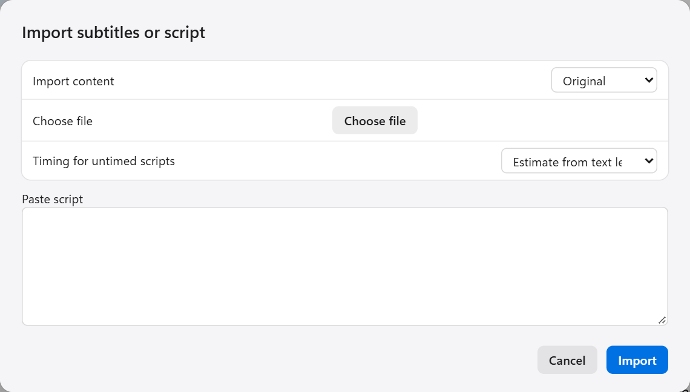

English | [中文](../SUBTITLE_WORKFLOW.md)

[← All docs](INDEX.md)

# Subtitles and scripts

If the work comes with subtitles or a script, the model does not have to listen for the words. Existing text is more accurate and faster.

## What to do with what you have

| You have | Choose when creating the project | Then |
|---|---|---|
| Timed original-language subtitles (SRT, VTT, ASS, LRC) | I have original subtitles | Translate → dub → export |
| Timed translated subtitles | I have translated subtitles | Dub → export |
| An untimed original-language script (TXT) | I have an untimed script | Recognise → translate → dub → export |
| Nothing | Automatic recognition | Recognise → translate → dub → export |

With any of the three subtitle options, the import dialog opens automatically once the project is created.

## Importing subtitles

You can also import into an existing project at any time. On the **Recognition** step, click **Choose file** next to **Import subtitles or script**.

- **Import content**: whether this text is the **Original** or the **Translation**. A translation goes straight into the translation column and skips the translation step.
- **Choose file**: pick the subtitle file. Or skip the file and paste the text into the box below.
- **Timing for untimed scripts**: only matters when the text has no timing. See the next section.

Click **Import**.

> **Note**: importing replaces every sentence in the project. Think twice if you have already proofread it.

After importing, spot-check a few lines. Click a row and the player jumps to that time, so you can hear whether the text matches the audio.

About the formats:

- SRT, VTT and ASS give a start and an end for every line. These are the most reliable.
- LRC only has start times. The end is inferred from the next line.
- Subtitles do not need to cover every second. Music, pauses and breathing normally have none.

## When the script has no timing

Many works ship a TXT script with words only and no timing per line. There are three ways to give it timing:

| Method | Needs | Result |
|---|---|---|
| **Run recognition, then match the script with an LLM** (recommended) | A recognition model and a translation key | Recognition provides the timing of each sentence, then the script text is matched onto it. Timing comes from recognition and text from the script, taking the best of both |
| **Qwen3 alignment** | The Qwen3 alignment model | Finds each script line directly in the audio. Japanese and English originals only |
| **Estimate from text length** | Nothing | Spreads time by character count. Only a starting point; you must adjust every line yourself |

Whichever you use, check the result. Look for missing lines and for wrong starts and ends.

Lines that could not be matched keep the recognition result and are marked for review. Click **Needs review** above the table to see only those.

## Subtitles only, no dubbing

If you just want translated subtitles:

1. Run recognition and translation as usual.
2. Skip dubbing and go straight to **Export**.
3. Set **Output** to **Subtitles only** and choose what the subtitles contain.
4. Click **Export**.

You get both SRT and LRC files.

Characters per line and minimum display time are under **Subtitle layout** in **More settings** on the export step.

## Which subtitles each track uses in batch

In batch processing the program matches a subtitle file to each track by file name. You can check and correct each one in the Add work dialog. See [Batch processing](BATCH.md#check-each-track).

- If every track has timed subtitles, choose **Use subtitle text and timing (no ASR)** and no recognition model is needed.
- If they are all translated subtitles, translation is not needed either.
- Do not mix Japanese and English original subtitles within one work.
