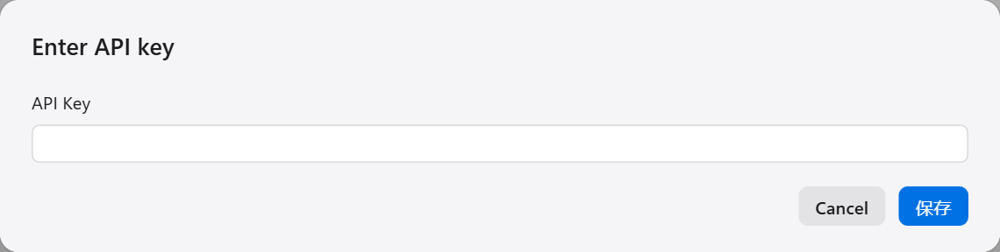
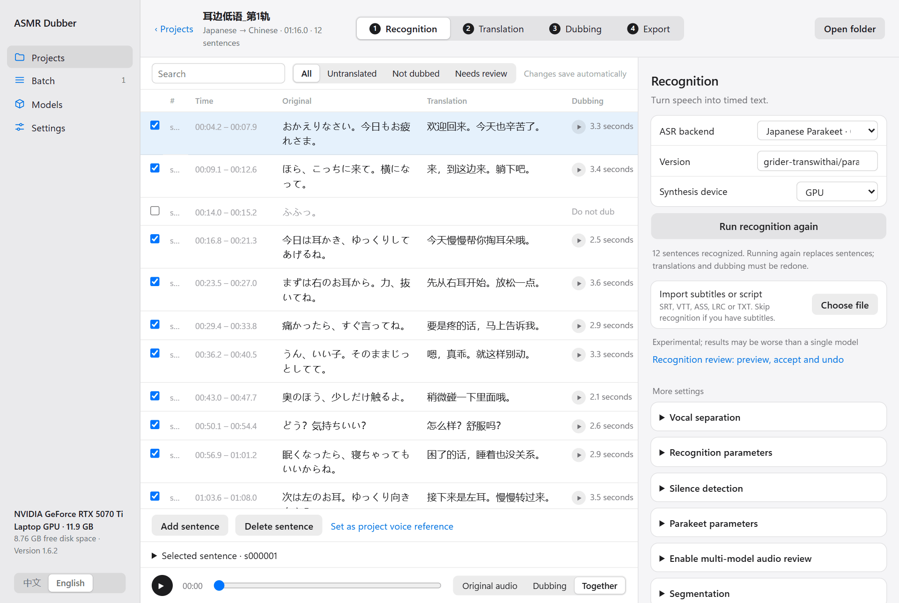
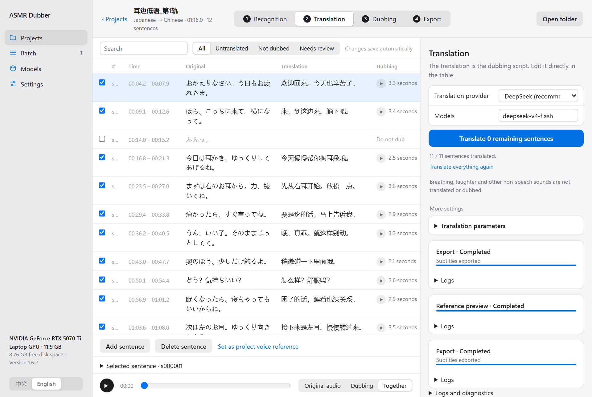
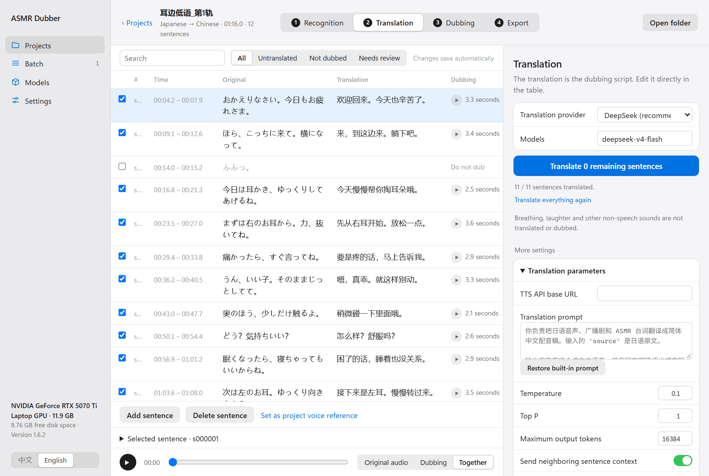
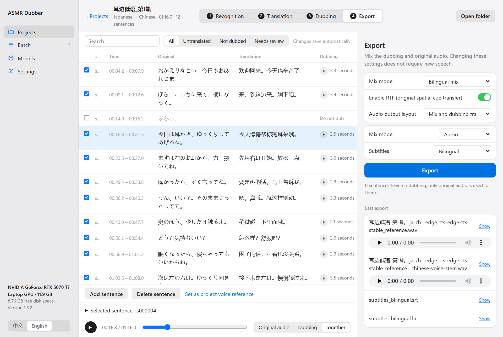
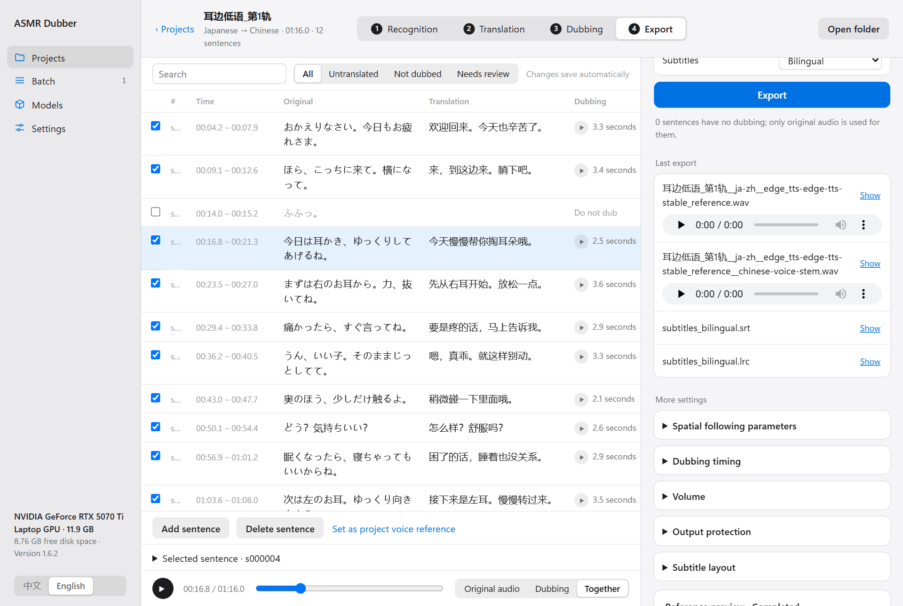
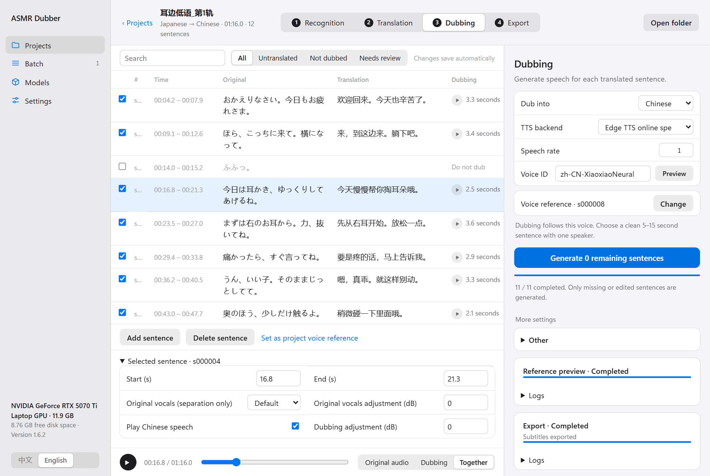
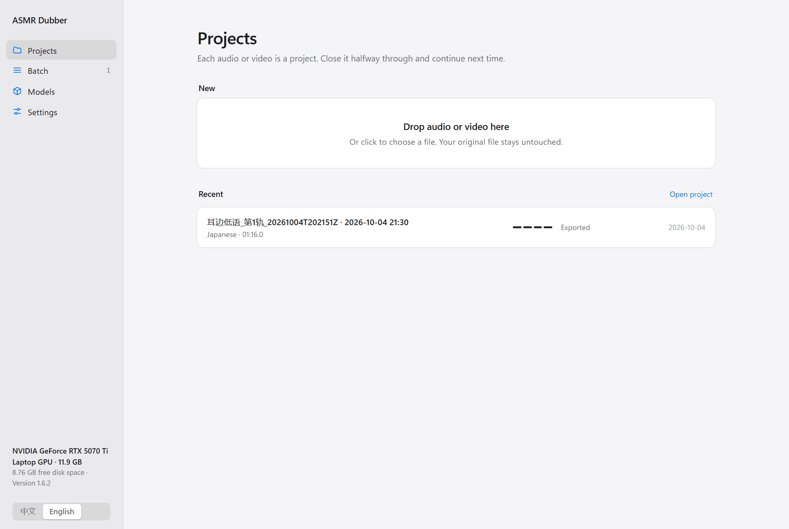

English | [中文](../USER_GUIDE.md)

[← All docs](INDEX.md)

# User guide

This guide takes one audio file all the way to a finished dub, using the most common case, Japanese into Chinese, as the example. English or Chinese originals, or dubbing into English, follow exactly the same steps; only the languages you pick and the recognition model differ.

Following it takes about twenty minutes, most of which is waiting for models to run.

Before you start, get the program running and download a recognition model and a dubbing model as described in [Installation and models](INSTALLATION.md).

**Contents**

1. [Before you start: add a translation key](#1-before-you-start-add-a-translation-key)
2. [Create a project](#2-create-a-project)
3. [The workspace](#3-the-workspace)
4. [Step one: Recognition](#4-step-one-recognition)
5. [Step two: Translation](#5-step-two-translation)
6. [Step three: Dubbing](#6-step-three-dubbing)
7. [Step four: Export](#7-step-four-export)
8. [Changing a single sentence](#8-changing-a-single-sentence)
9. [Stopping and picking up later](#9-stopping-and-picking-up-later)
10. [Where to go next](#10-where-to-go-next)

## 1. Before you start: add a translation key

Translation uses a large language model service, so you need an account and an API key with one of them. DeepSeek is the default: it is cheap and good enough.

Open **Settings → Cloud services** and click **Enter** next to the provider you use.

Paste the key and click **Save**.

You can skip this step in two cases:

- You already have translated subtitles and do not need translation.
- The audio is already in the target language and you only want to re-voice it.

## 2. Create a project

Go to **Projects** and drop an audio or video file onto the **New** area, or click it to choose a file.

After the file uploads, this dialog appears:

- **Audio language**: the language spoken in the original.
- **Dub into**: the language you want, Chinese or English.
- **Where does the text come from?**: choose **Automatic recognition** if you have no subtitles. If you have subtitles or a script, see [Subtitles and scripts](SUBTITLE_WORKFLOW.md).

Click **Create**. The program copies your file into the project folder. The original file is never modified.

## 3. The workspace

An open project looks like this:

- **At the top** are the four steps: Recognition, Translation, Dubbing, Export. A finished step gets a filled number. You can click any step at any time to go back and change things.
- **On the left** is the sentence table. Each row is one sentence with its time, original text, translation and dubbing status. Click into the original or the translation to edit it.
- **On the right** are the settings and action buttons for the current step. The common ones are at the top and the rest are under **More settings**.
- **At the bottom** is the player. Switch between the original audio, the dub, or both together.

Settings changed in the right panel belong to this project only. They save automatically; there is no Save button.

## 4. Step one: Recognition

Recognition turns the speech into text with timing.

1. Check **ASR backend**. Use Parakeet for Japanese and Faster-Whisper for English or Chinese.
2. Click **Run recognition again**. The button has this name even on the first run.
3. Wait. An hour of audio takes a few minutes on a GPU.

When it finishes, sentences appear in the table. Spend a few minutes reading the original text and fixing obvious mistakes. Translation works from this text, so an error here carries through every later step.

If sentences are split badly (one sentence cut in half, or two stuck together), expand **Segmentation** and **Silence detection** under **More settings**, adjust them, and run recognition again.

> **Note**: running recognition again replaces every existing sentence. Translations and dubbing already made have to be redone. Make sure the original text is right before moving on.

## 5. Step two: Translation

Click **Translation** at the top.

1. Check that **Translation provider** is the one you entered a key for.
2. Click **Translate N remaining sentences**.

The translations fill into the table. **The translation is the script the dub will read**, so it is worth reading carefully:

- If a line reads badly, click into the cell and rewrite it.
- A long translation makes a long dub, which may have to be sped up to fit. Try to keep each translation about as long as the original line.
- Laughter, breathing and other sounds with no real content are not translated. An empty translation there is normal.

**Translate remaining** only fills in sentences that have no translation and leaves your edits alone. **Translate everything again** retranslates every sentence, including the ones you edited by hand, and asks for confirmation first.

To fit the translation to the work, expand **Translation parameters** and describe the characters, how they address each other, and the tone in **Translation prompt**. Context size and other parameters are here as well. **Restore built-in prompt** undoes your changes.

## 6. Step three: Dubbing

Click **Dubbing** at the top.

### Choose a dubbing model

- **IndexTTS2**: imitates the original voice. Needs an NVIDIA GPU. Use this when you want it to sound like the same person speaking another language.
- **Edge TTS**: Microsoft's online voices. Free, no GPU needed, but the voices are fixed and cannot imitate the original.
- For other cloud services, see [Models and services](BACKENDS.md).

### Choose a voice reference

A cloning model such as IndexTTS2 needs to know which voice to imitate. The program recommends a sentence automatically, and you can click **Change** to pick your own.

Pick a sentence under **Project sentence** and play it. A good reference is:

- 5 to 15 seconds long
- a single speaker
- normal speech, not pure breath or laughter
- over weak background music and effects

Entries marked ★ are the ones the program considers suitable. Entries marked ⚠ are too short. You can also click **Choose file** to use audio from outside the project. Click **Use reference** when done.

### Generate

Click **Generate N remaining sentences**. The program works through them one at a time and shows progress on the right.

A finished sentence gets a play button and a duration at the right edge of the table. Click it to hear that sentence.

**Generate remaining** only generates sentences that have no dub yet and sentences whose translation changed. If you are unhappy with a line, edit its translation and click the button again. You never need to start over.

## 7. Step four: Export

Click **Export** at the top.

From top to bottom:

- **Mix mode**: **Bilingual mix** is the original plus the dub. **Replacement mix** removes the original voice and keeps only the dub. It is experimental; see [Mixing and spatial following](EXPERIMENTAL_AUDIO.md).
- **Spatial following**: when on, the dub follows the left-right position and distance of the original voice. Recommended for stereo works.
- **Audio output layout**: besides the mix, you can save a separate track with only the dub, for further work in other software.
- **Output**: **Audio** exports normally. **Subtitles only** produces no audio.
- **Subtitles**: bilingual, translation only, original only, or none.

Click **Export**. The files appear under **Last export**, where you can listen to them right away or click **Download** to save a copy elsewhere.

**Open folder** at the top right shows every exported file.

When you change the settings on this step (volume, dub timing, spatial following strength), you only need to click **Export** again. No dubbing is redone. See [Mixing and spatial following](EXPERIMENTAL_AUDIO.md) for those settings.

If export reports that a sentence has no translation, that sentence has original text but an empty translation. Fill it in, or untick the sentence, and export again.

## 8. Changing a single sentence

Click a row in the table to select it. Buttons appear below the table, and **Selected sentence** expands to show detailed controls for that sentence:

| To do this | Do this |
|---|---|
| Change the original or the translation | Click into the cell and edit. It saves when you click elsewhere |
| Leave this sentence undubbed | Untick the box at the far left of the row |
| Adjust when the sentence starts and ends | Change **Start (s)** and **End (s)** |
| Make this sentence's dub louder or quieter | Change **Dubbing adjustment (dB)**. Positive is louder, negative is quieter |
| Leave the dub out of the export but keep what was generated | Untick **Play dub** |
| Add a sentence that was missed | Click **Add sentence** |
| Remove this sentence | Click **Delete sentence** |
| Use this sentence as the voice reference | Click **Set as project voice reference** |

Above the table you can search, or show only **Untranslated** or **Not dubbed** sentences to see what is left. Long projects show 50 sentences per page, with paging below the table.

What needs redoing after a change:

| You changed | Next |
|---|---|
| The translation of a sentence | Click **Generate remaining** on the dubbing step, then export |
| The dubbing model or the voice reference | Dub everything again, then export |
| Volume, dub timing, spatial following, subtitle layout | Export again |
| Ran recognition again | Translation and dubbing must both be redone |

## 9. Stopping and picking up later

- **To stop a running task**: click **Pause** next to the task on the right. What is already done is kept.
- **To continue**: click **Resume**, or click that step's button again. Only the rest is processed.
- **After closing and reopening the program**: the project is listed under **Recent** on the Projects page. Click it to return to where you were.

Closing the black window that appeared at startup stops the program. Closing the browser tab does not; open `http://127.0.0.1:7860` again to come back.

## 10. Where to go next

- A whole work folder to process: [Batch processing](BATCH.md)
- You have subtitles or a script: [Subtitles and scripts](SUBTITLE_WORKFLOW.md)
- The dub and the original do not sit well together: [Mixing and spatial following](EXPERIMENTAL_AUDIO.md)
- Different models or services: [Models and services](BACKENDS.md)
- Something went wrong: [Troubleshooting](TROUBLESHOOTING.md)
