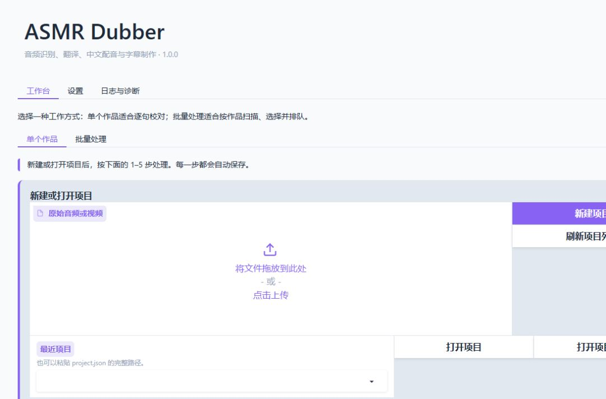
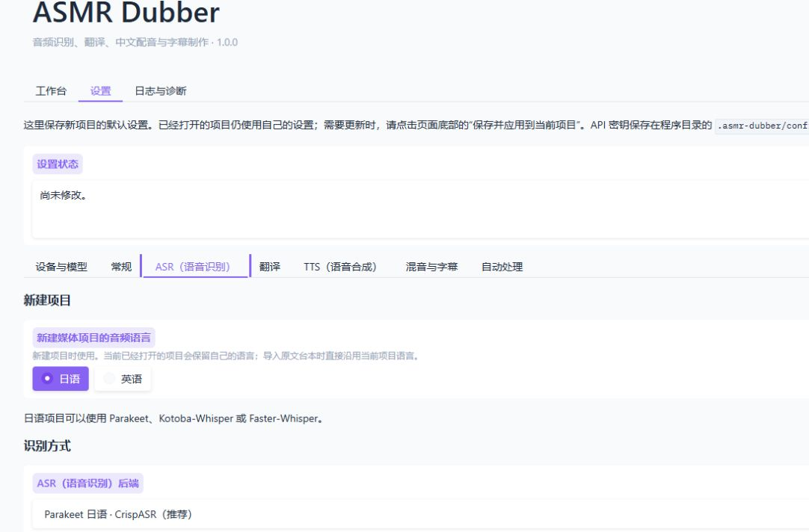
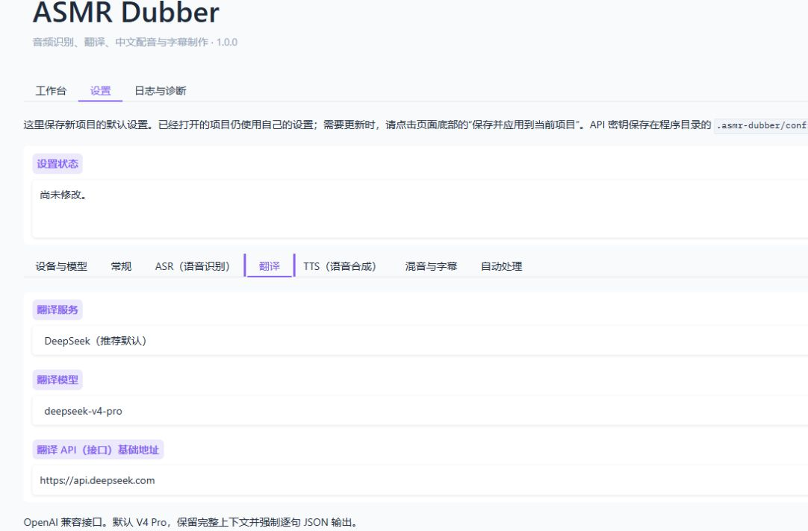
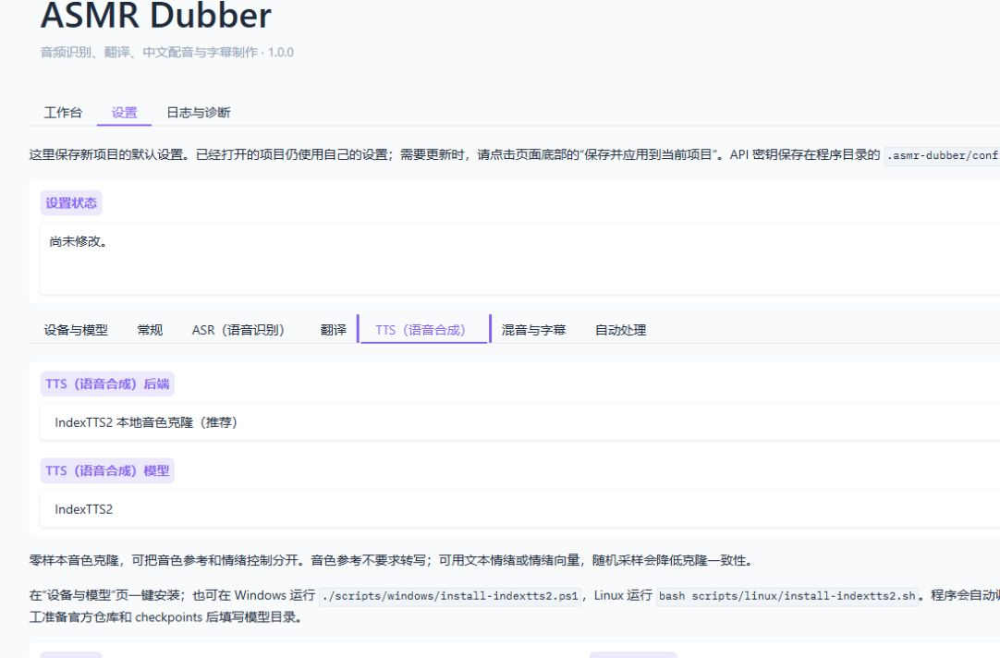
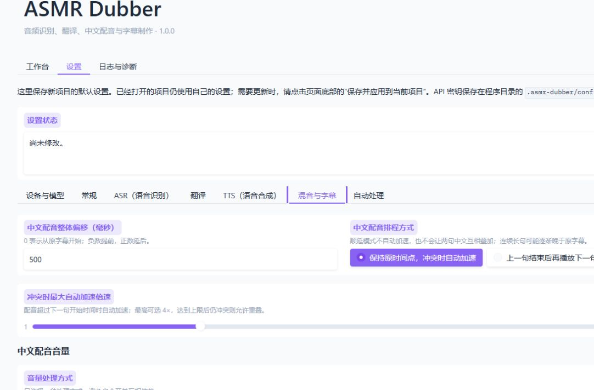
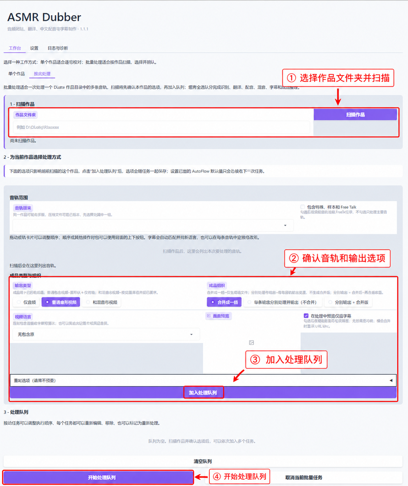

[中文](../USER_GUIDE.md) | English

[Documentation index](INDEX.md) · [README](../../README.en.md)

# User guide

## Start

Run Setup once, then the launcher. Keep the terminal open while using the local web UI. Check Devices & models before selecting local backends. Interface language can be switched with 中文 / English; source-language and output-language settings are independent.

## 1. Create or open

Choose source language and upload audio/video, then Create project. The source is copied into the project. To resume, open a recent project or its `project.json`.

Import timed source subtitles to skip ASR. Import timed Chinese subtitles to skip both ASR and body translation. Untimed scripts need estimated timing or ASR-assisted matching. Import replaces the sentence timeline, not the original media; back up important edits first.

## 2. Recognize

Choose a backend/model in ASR settings, save to Current project/Both and run ASR. Japanese supports Parakeet, Kotoba and Faster-Whisper; local English uses Faster-Whisper. A generic ASR API uploads audio to your configured endpoint.

VAD may miss quiet whispers. Default is no VAD preprocessing; backend VAD and the optional Japanese ASMR VAD are alternatives. Qwen3 alignment repositions existing text without verifying its accuracy.

Multi-model review is optional and experimental. Review proposals before translation; it may be worse than a single model. [Illustrated instructions](AUDIO_REVIEW_TUTORIAL.md).

An untimed script uses a different path: LLM quote matching against ASR intervals. If retries cannot establish a reliable match, the existing sentence survives with a manual-review note. Check diagnostics; do not treat a completed batch as a fully corrected transcript.

## 3. Edit and translate

Edit source text/timestamps in the sentence table, then save. The table pages 50 sentences at a time; paging retains all drafts. Clearing both texts deletes a row. Translation preserves sentence IDs and order; nonverbal content may have empty Chinese text.

Configure translation provider, model, endpoint and key. Keys use a separate Save button. LLM providers support structured script matching; DeepL/Google/Microsoft machine translation do not.

Japanese and English translation prompts are stored separately. Keep names/terminology concise. Do not paste credentials or unrelated instructions into prompts.

## 4. Voice reference

Choose a clean representative project sentence or external reference. A unified reference improves voice consistency; per-sentence references follow local delivery but may vary more. Reference requirements depend on the TTS backend. GPT-SoVITS and some other APIs need the exact reference transcript.

## 5. Synthesize and mix

Select TTS backend/model, save and synthesize Chinese speech. Existing valid sentence caches are reused. Editing Chinese text invalidates the affected synthesis; gain, offset, scheduling and RTF changes require only remixing.

IndexTTS2 and optional IndexTTS-2.5 use separate runtimes. Speaker and emotion references are independent. Edge TTS requires internet, no key, and does not clone voices. MiMo supports preset, cloned or designed voices depending on model. MiniMax uses an account voice ID; cloning is managed on its platform. External model servers are not started by this application.

### Timing and loudness

Fit-window mode speeds up only conflicting Chinese sentences, up to the configured limit; residual overlap may remain. Sequential mode avoids Chinese-on-Chinese overlap by delaying subsequent sentences and may extend the result. Global offset applies to Chinese speech, not source media.

Choose source-relative loudness, a uniform RMS target or raw TTS level. Peak protection remains active. Raising levels aggressively can amplify noise; louder is not automatically better.

### Separation and RTF

Separation and Chinese replacement are experimental, not recommended, and disabled by default. Enable separation before ASR if recognition should use the vocal stem. Replacement requires it; ordinary bilingual mixing does not.

RTF is independently enabled in Mixing & subtitles and uses original stereo cues. Short/silent references degrade to bounded level placement rather than aborting the mix.

The table's rightmost controls mute/adjust each original vocal or Chinese sentence. Original controls require separation. Chinese playback differs from Process Chinese: muting it retains text/cache. Save and remix. [Details](EXPERIMENTAL_AUDIO.md).

## 6. Subtitles

Choose bilingual, source or Chinese subtitles, and source or dubbing timing. SRT/LRC are written; video projects may also produce a subtitled video. For no audio/video deliverables, use AutoFlow's subtitle-files-only mode.

Line width accepts 8–500 characters. This wraps each cue without merging sentences. For an existing project save to Current project/Both, then regenerate. Minimum duration and reading-speed limits may extend display time beyond imported ends.

## Batch processing

Scan a work folder, inspect selected tracks, ordering, subtitle associations and languages, choose output, then add to the queue. Drag tracks/tasks or use their move controls. Scanning and queueing are distinct; save per-work options before execution.

Layouts: merged, per-track, or per-track plus merged. The combined output can reuse per-track work. Audio/video mode, subtitle content and filename policy are separate choices. Source-only subtitle output does not translate the body. All selected tracks need corresponding timed subtitles to bypass ASR completely.

Original-audio hard subtitles optionally add an encoded original-audio video; this costs time/space. Timestamp footer text can appear before or after the timestamp list, with the work title retained first. These AutoFlow rules are read when the queue starts; running tasks retain a snapshot.

Reprocessing finished work requires explicit replacement confirmation. Back up results before using it. Cancel/pause does not delete projects, models or completed outputs.

### Subtitle files only

In Batch processing, select **Subtitle files only**, then bilingual, source or translation. No finished audio or video is produced. Filename rules can preserve the audio basename. For timed subtitle import and ASR bypass conditions, see [Existing-subtitle workflow](SUBTITLE_WORKFLOW.md).

## Recovery and privacy

Keep the full project directory and any configured external project root. Resume from valid caches rather than deleting `.asmr-dubber`. Two browser sessions cannot overwrite newer revisions silently; reopen stale projects.

API keys are plaintext in the portable config directory. LLMs receive text/context; ASR and external voice/separation APIs may receive audio. Check rights and provider privacy terms. Logs and script diagnostics may contain private text; inspect before sharing.
